# Índice

**PARTE 1: RELEVAMIENTO Y PROPUESTA (PP2)**

1. [Introducción](#1-introducción)
   - [1.1 Carta de Presentación](#11-carta-de-presentación)
   - [1.2 Pedido del Usuario](#12-pedido-del-usuario)
2. [Relevamiento](#2-relevamiento)
   - [2.1 Contextual y del Negocio](#21-contextual-y-del-negocio)
   - [2.2 Estructura de la Organización](#22-estructura-de-la-organización)
   - [2.3 Procesos de Negocio](#23-procesos-de-negocio)
   - [2.4 Tecnología](#24-tecnología)
3. [Propuesta](#3-propuesta)
   - [3.1 Diagnóstico y Propuesta](#31-diagnóstico-y-propuesta)
   - [3.2 Propuesta General](#32-propuesta-general)

**PARTE 2: MODELADO Y DESARROLLO DEL SISTEMA (PP3)**

4. [Objetivos, Límites y Alcance](#4-objetivos-límites-y-alcance)
5. [Especificación de Requerimientos](#5-especificación-de-requerimientos)
6. [Análisis y Diseño del producto](#6-análisis-y-diseño-del-producto)
7. [Modelado Ambiental](#7-modelado-ambiental)
8. [Modelado de Paquetes](#8-modelado-de-paquetes)
9. [Modelado de los Casos de Uso](#9-modelado-de-los-casos-de-uso)
10. [Implementación del Software](#10-implementación-del-software)
11. [Integración y Testing](#11-integración-y-testing)
12. [Especificaciones del Sistema](#12-especificaciones-del-sistema)
13. [Trazabilidad](#13-trazabilidad)

---

# PARTE 1: RELEVAMIENTO Y PROPUESTA (PP2)

# 1. Introducción

## 1.1 Carta de Presentación

El Calafate, junio de 2026

A la Dirección de
**Hotel Blanca Patagonia S.A.S.**
Charles Furh 149, El Calafate, Santa Cruz
Presente.-

De nuestra mayor consideración:

Por medio de la presente, los alumnos **Fakiani Octavio** (DNI 44.970.369) y
**Morán Santiago** (DNI 45.693.596), estudiantes de la carrera Analista de
Sistemas del Colegio Universitario IES, nos dirigimos a ustedes para
presentarnos como equipo de desarrollo a cargo del proyecto de tesis «Sistema de
Gestión de Hotelería».

El objetivo de este trabajo es relevar, analizar y diseñar un sistema
informático integral que acompañe y mejore los procesos actuales de gestión de
reservas, estadías, facturación y reportes del hotel.

A lo largo del proyecto trabajaremos en contacto con el personal del
establecimiento para garantizar que la solución propuesta se ajuste a las
necesidades reales de la organización.

Agradecemos desde ya la confianza depositada en nuestro equipo y quedamos a
disposición para cualquier consulta.

Atentamente,

Fakiani Octavio — Morán Santiago
Estudiantes de Analista de Sistemas

## 1.2 Pedido del Usuario

El Hotel Blanca Patagonia, representado por su director **Franco Theo Cheli**,
solicita formalmente al grupo de análisis el relevamiento, diseño e
implementación de un Sistema Integral de Gestión Hotelera que comprenda los
siguientes módulos:

1. **Gestión de reservas y estadías**: realizar, consultar y cancelar reservas
   en línea.
2. **Check-in / check-out con facturación.**
3. **Registro de consumos y servicios adicionales.**
4. **Gestión de huéspedes.**
5. **Reportes de ocupación y facturación.**

El sistema deberá integrarse con la pasarela de pagos para cobros con tarjeta y
con el servicio de notificaciones por correo electrónico. Deberá ser accesible
desde cualquier dispositivo con conexión a internet, reemplazando las planillas
de cálculo y el sistema Winpax actualmente en uso.

**Datos de la contraparte**

| Campo | Dato |
|---|---|
| Comitente | Blanca Patagonia S.A.S. |
| CUIT | 30-71845915-6 |
| Director | Franco Theo Cheli — DNI 44.695.595 · CUIL 20-44.695.595-1 |
| Equipo de proyecto | Fakiani Octavio (DNI 44.970.369) · Morán Santiago (DNI 45.693.596) |

**Fuente:** documento PP2 — Relevamiento y Propuesta, secciones 1.1 y 1.2.

---

# 2. Relevamiento

## 2.1 Contextual y del Negocio

### Datos de la empresa

| Campo | Detalle |
|---|---|
| Razón social | Blanca Patagonia S.A.S. |
| CUIT | 30-71845915-6 |
| Nombre de fantasía | Blanca Patagonia |
| Rubro | Hotelería · Turismo · Gastronomía |
| Categoría | Hostería boutique 4 estrellas + complejo de cabañas |
| Dirección | Charles Furh 149, El Calafate, Santa Cruz, Argentina |
| Teléfono | +54 (2902) 493370 |
| Correo | blancapatagonia@cotecal.com.ar |
| Sitio web | www.blancapatagonia.com |

El hotel está en el centro de El Calafate, a pocas cuadras del Lago Argentino y
a unos 80 km del Glaciar Perito Moreno. La ciudad es el principal punto de acceso
al Parque Nacional Los Glaciares, declarado Patrimonio de la Humanidad.

**Distribución de los espacios físicos**

- **Hostería boutique:** habitaciones Single, Doble Standard, Doble Superior,
  Triple y Suite Principal. Todas con vista al Lago Argentino e hidromasaje.
- **Complejo de cabañas:** unidades de 1, 2 y 3 dormitorios, con capacidad de
  hasta 7 personas.
- **Recepción y lobby:** atención al huésped, check-in, check-out y oficina
  administrativa.
- **Restaurante:** desayuno buffet incluido en la tarifa; menú a la carta para
  almuerzo y cena.
- **Área de excursiones:** coordinación de traslados y contratación de
  excursiones al Parque Nacional.

### Historia de la empresa

El hotel nació como un proyecto de alojamiento boutique orientado al turismo de
alto valor en El Calafate, ciudad que creció de forma acelerada desde la apertura
del Aeropuerto Internacional Malvinas Argentinas, en el año 2000.

| Período | Hito | Descripción |
|---|---|---|
| 2000–2005 | Fundación | Apertura de la hostería boutique con capacidad reducida. Primeras habitaciones Standard y Superior |
| 2005–2010 | Crecimiento | Incorporación de suites e hidromasaje. Primeros paquetes turísticos con operadoras del Parque Nacional |
| 2010–2015 | Cabañas | Desarrollo del complejo de cabañas. Captación del segmento familiar y corporativo |
| 2015–2020 | Digitalización parcial | Implementación de Winpax, planillas de cálculo y canales de venta informales |
| 2020–2024 | Pandemia | Impacto del COVID-19. Reconversión hacia turismo nacional premium. Recuperación desde 2022 |
| 2025–2026 | Modernización | Inicio del proyecto de sistema integral. Objetivo: eliminar los procesos manuales |

### Mercado

**Productos y servicios comercializados**

| Línea | Producto | Descripción | Precio aproximado |
|---|---|---|---|
| Alojamiento | Single / Doble Standard | Vista al lago, desayuno incluido | USD 120–177 |
| Alojamiento | Doble Superior | Vista panorámica, hidromasaje | USD 139–195 |
| Alojamiento | Suite Principal | Piso alto, vista de 180° al lago | USD 190–225 |
| Cabañas | 1 a 3 dormitorios | Hasta 7 personas, equipamiento completo | USD 130–340 |
| Paquetes | Perito Moreno | Alojamiento + traslado + entrada al Parque | Desde USD 320 |
| Paquetes | Todo Glaciares | 4 noches + excursiones | Desde USD 750 |
| Gastronomía | Restaurante | Desayuno incluido; menú a la carta | Variable |
| Adicionales | Excursiones | Navegación Upsala, Spegazzini, traslados | USD 75–220 |

**Distribución de reservas por canal** (datos reales de marzo de 2026)

| Canal | Participación |
|---|---|
| Booking.com | 66 % |
| Expedia | 13 % |
| Directas (particulares) | 21 % |

**Principales competidores en El Calafate**

- Hotel Posada Los Álamos — 5 estrellas, segmento ultra-premium.
- Design Suites Calafate — 4 estrellas boutique, competidor directo.
- Los Sueños de Calafate — 3-4 estrellas, propuesta familiar.
- Plataformas de venta en línea (Booking, Airbnb, Expedia), que afectan la tasa
  de ocupación directa.

### Dimensionamiento

Los datos siguientes surgen del informe gerencial de marzo de 2026 entregado por
la administración del hotel.

| Indicador | Dato | Observación |
|---|---|---|
| Habitaciones de hostería | ~20 unidades | Single, Doble Std, Doble Sup, Triple, Suite |
| Cabañas | 8–12 unidades | De 1, 2 y 3 dormitorios |
| Pernoctes | 1.175 | Marzo de 2026 |
| Habitaciones ocupadas | 530 | Marzo de 2026 |
| Ocupación promedio | 86 % | Temporada alta |
| Tarifa promedio | USD 131 | Por noche vendida |
| Captación mensual | 351 reservas | USD 132.479 en el mes |
| Ventas del restaurante | ARS 11.923.925 | Ingreso gastronómico mensual |
| Ingresos totales | USD 88.052 | ARS 123.273.529 a un tipo de cambio de 1400 |
| Comisión Booking | ARS 13.260.237 | **10,76 % de los ingresos totales** |
| Comisión Expedia | ARS 392.596 | 0,32 % de los ingresos totales |
| Reputación | Booking 8,8/10 | Google 4,3/5 · Expedia 8,8/10 |

Dos números de esta tabla explican por sí solos el proyecto: el hotel factura
USD 88.052 al mes y le paga a un solo canal de venta el equivalente al **10,76 %
de ese total**. Y sostiene una ocupación del 86 % con la disponibilidad
controlada a mano en una planilla.

**Costos operativos unitarios** informados por la administración:

| Concepto | Costo |
|---|---|
| Limpieza por habitación ocupada | ARS 1.257 |
| Desayuno por persona | ARS 3.333 |
| Mantenimiento por habitación | ARS 5.454 |

## 2.2 Estructura de la Organización

El hotel opera con una estructura funcional reducida, típica de una pequeña
empresa hotelera del interior del país. La dirección está a cargo de Franco Theo
Cheli, que supervisa directamente las áreas operativas.

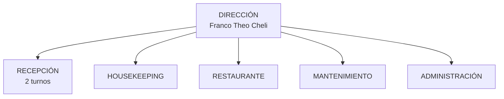
```mermaid
flowchart TB
    D["DIRECCIÓN<br/>Franco Theo Cheli"]
    R["RECEPCIÓN<br/>2 turnos"]
    H["HOUSEKEEPING"]
    RE["RESTAURANTE"]
    M["MANTENIMIENTO"]
    A["ADMINISTRACIÓN"]
    D --> R
    D --> H
    D --> RE
    D --> M
    D --> A
```

**Figura 1.** Organigrama funcional del Hotel Blanca Patagonia.

**Descripción de las áreas**

| Área | Función | Dato de gestión |
|---|---|---|
| **Recepción** | Es el área central. Recibe a los huéspedes, gestiona las reservas —hoy con Winpax y planillas—, hace el check-in y el check-out, y coordina con las demás áreas | Funciona en 2 turnos |
| **Housekeeping** | Limpieza y preparación de habitaciones | ARS 1.257 por habitación ocupada |
| **Restaurante** | Desayuno buffet incluido en la tarifa y menú a la carta | ARS 11.923.925 de ingreso mensual; desayuno a ARS 3.333 por persona |
| **Mantenimiento** | Reparaciones y conservación del edificio | ARS 5.454 promedio por habitación |
| **Administración** | Facturación, pagos a proveedores, comisiones de los canales de venta y reportes gerenciales | — |

## 2.3 Procesos de Negocio

Los procesos siguientes describen cómo trabaja el hotel **antes** del sistema.
Para cada uno se incluye su descripción, los problemas detectados en el
relevamiento y su cursograma.

### 2.3.1 Proceso de reserva (actual)

**Descripción**

1. El huésped contacta al hotel por teléfono, por correo o a través de un canal
   de venta en línea (Booking o Expedia).
2. El recepcionista verifica la disponibilidad **a mano**, consultando planillas
   de cálculo o el sistema Winpax.
3. Si hay disponibilidad, registra la reserva en Winpax con los datos del
   huésped, las fechas y el tipo de habitación.
4. Se le pide al huésped el pago de la primera noche como seña, dentro de los 5
   días posteriores.
5. Si la reserva viene por un canal de venta, la plataforma gestiona el cobro y
   le envía la confirmación al huésped directamente; el hotel solo recibe la
   notificación.
6. Si es una reserva directa, el recepcionista envía un correo **manual** con
   los datos bancarios para la transferencia de la seña.
7. Una vez recibido el pago, marca la reserva como confirmada en la planilla.

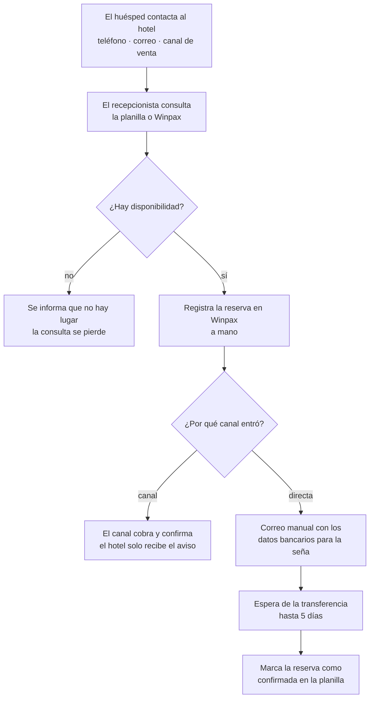
```mermaid
flowchart TB
    A["El huésped contacta al hotel<br/>teléfono · correo · canal de venta"]
    B["El recepcionista consulta<br/>la planilla o Winpax"]
    C{"¿Hay disponibilidad?"}
    D["Se informa que no hay lugar<br/>la consulta se pierde"]
    E["Registra la reserva en Winpax<br/>a mano"]
    F{"¿Por qué canal entró?"}
    G["El canal cobra y confirma<br/>el hotel solo recibe el aviso"]
    H["Correo manual con los<br/>datos bancarios para la seña"]
    I["Espera de la transferencia<br/>hasta 5 días"]
    J["Marca la reserva como<br/>confirmada en la planilla"]
    A --> B --> C
    C -- no --> D
    C -- sí --> E --> F
    F -- canal --> G
    F -- directa --> H --> I --> J
```

**Figura 2.** Cursograma del proceso de reserva actual.

**Problemas detectados**

| # | Problema | Consecuencia |
|---|---|---|
| P-1 | La verificación de disponibilidad es manual | Riesgo de sobreventa cuando dos recepcionistas consultan la planilla al mismo tiempo |
| P-2 | No hay confirmación automática en reservas directas | El recepcionista escribe cada correo a mano; si se olvida, el huésped no tiene nada por escrito |
| P-3 | Las reservas telefónicas no quedan registradas hasta que alguien las carga | Ventana en la que la habitación figura libre estando comprometida |
| P-4 | Las promociones no se aplican solas | Descuentos inconsistentes según quién atienda |

### 2.3.2 Proceso de check-in (actual)

**Descripción**

1. El huésped llega al hotel y se presenta en recepción.
2. El recepcionista busca la reserva en Winpax o en la planilla.
3. Se le pide un documento de identidad y se completa la ficha de registro **en
   papel**.
4. Se le asigna la habitación y se le entrega la llave.
5. El recepcionista actualiza la planilla marcando la habitación como ocupada.

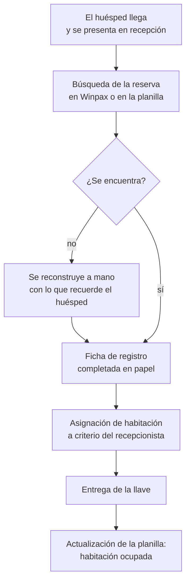
```mermaid
flowchart TB
    A["El huésped llega<br/>y se presenta en recepción"]
    B["Búsqueda de la reserva<br/>en Winpax o en la planilla"]
    C{"¿Se encuentra?"}
    D["Se reconstruye a mano<br/>con lo que recuerde el huésped"]
    E["Ficha de registro<br/>completada en papel"]
    F["Asignación de habitación<br/>a criterio del recepcionista"]
    G["Entrega de la llave"]
    H["Actualización de la planilla:<br/>habitación ocupada"]
    A --> B --> C
    C -- no --> D --> E
    C -- sí --> E
    E --> F --> G --> H
```

**Figura 3.** Cursograma del proceso de check-in actual.

**Problemas detectados**

| # | Problema | Consecuencia |
|---|---|---|
| P-5 | La ficha de registro es en papel | Buscar los datos de un huésped anterior implica revisar carpetas |
| P-6 | La asignación de habitación es manual, sin criterio sistematizado | Habitaciones que quedan sin usar mientras se ocupan otras que convenía reservar |

### 2.3.3 Proceso de check-out y facturación (actual)

**Descripción**

1. El huésped se presenta en recepción para el check-out.
2. El recepcionista busca sus consumos en las notas del restaurante y en los
   registros de frigobar, **todo en papel**.
3. Suma los consumos al costo del alojamiento.
4. Descuenta la seña pagada.
5. Cobra el saldo (efectivo, tarjeta o transferencia).
6. Emite una factura **a mano**.
7. Actualiza la planilla marcando la habitación como libre.

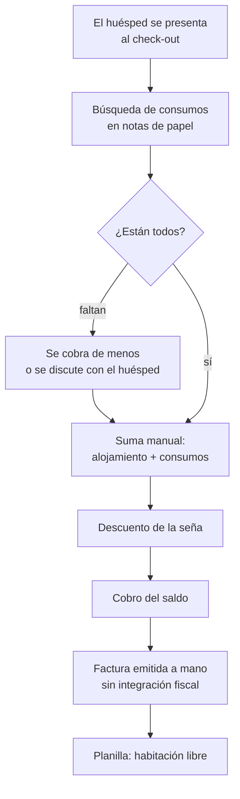
```mermaid
flowchart TB
    A["El huésped se presenta<br/>al check-out"]
    B["Búsqueda de consumos<br/>en notas de papel"]
    C{"¿Están todos?"}
    D["Se cobra de menos<br/>o se discute con el huésped"]
    E["Suma manual:<br/>alojamiento + consumos"]
    F["Descuento de la seña"]
    G["Cobro del saldo"]
    H["Factura emitida a mano<br/>sin integración fiscal"]
    I["Planilla: habitación libre"]
    A --> B --> C
    C -- faltan --> D --> E
    C -- sí --> E
    E --> F --> G --> H --> I
```

**Figura 4.** Cursograma del proceso de check-out y facturación actual.

**Problemas detectados**

| # | Problema | Consecuencia |
|---|---|---|
| P-7 | Los consumos se registran en notas sueltas | Se pierden o se duplican; el hotel cobra de menos y no se entera |
| P-8 | La facturación es manual y no está integrada | Errores de suma y ninguna trazabilidad fiscal |
| P-9 | No hay cálculo automático del total | El recepcionista suma con calculadora frente al huésped |

### 2.3.4 Proceso de limpieza de habitaciones (actual)

**Descripción**

1. La gobernanta arma a mano el listado de habitaciones a limpiar, mirando la
   planilla de salidas del día.
2. Reparte el listado entre las mucamas, en papel.
3. Cada mucama limpia y avisa verbalmente al terminar.
4. Recepción se entera del estado de una habitación preguntando.

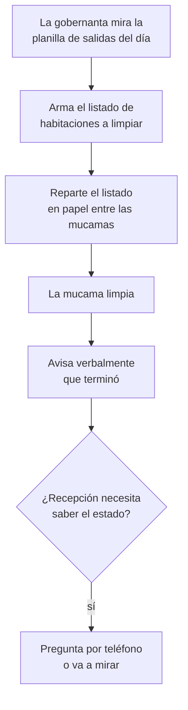
```mermaid
flowchart TB
    A["La gobernanta mira la<br/>planilla de salidas del día"]
    B["Arma el listado de<br/>habitaciones a limpiar"]
    C["Reparte el listado<br/>en papel entre las mucamas"]
    D["La mucama limpia"]
    E["Avisa verbalmente<br/>que terminó"]
    F{"¿Recepción necesita<br/>saber el estado?"}
    G["Pregunta por teléfono<br/>o va a mirar"]
    A --> B --> C --> D --> E --> F
    F -- sí --> G
```

**Figura 5.** Cursograma del proceso de limpieza actual.

**Problemas detectados**

| # | Problema | Consecuencia |
|---|---|---|
| P-10 | El orden de limpieza no considera las llegadas del día | Una habitación con llegada a las 15:00 puede quedar para el final del turno |
| P-11 | El estado de la habitación solo existe verbalmente | Recepción no puede confirmarle a un huésped si su habitación está lista |

## 2.4 Tecnología

### 2.4.1 Tecnología existente en la empresa

| Categoría | Elemento | Descripción y estado |
|---|---|---|
| Software | **Winpax** | Sistema de gestión hotelera heredado. Solo funciona en Windows. Sin acceso web ni integración con pasarelas de pago. Se usa sobre todo para el registro de reservas y la gestión básica de estadías |
| Software | **Planillas de cálculo** | Control de disponibilidad, registro de consumos y confección manual de reportes. Propensas a errores humanos, sin acceso concurrente seguro y sin trazabilidad |
| Software | **Booking.com** | Canal de venta en línea que aporta el 66 % de las reservas. Comisión equivalente al 10,76 % de los ingresos totales |
| Software | **Expedia** | Canal secundario (13 %). Comisión del 0,32 % de los ingresos totales |
| Software | **Correo electrónico** | Comunicación con huéspedes. Envío manual de confirmaciones |
| Hardware | PC de escritorio | 2 equipos en recepción, uno por turno, con Windows |
| Hardware | Impresora | 1 multifunción para facturas y fichas de registro |
| Conectividad | WiFi + red cableada | WiFi para huéspedes, red cableada interna para las PC de recepción |
| Conectividad | Internet | Servicio por fibra óptica, estable para la zona |

**Sobre Winpax.** Es un sistema construido sobre Oracle Forms, de alrededor del
año 2000. Cubre el registro de reservas y la gestión básica de estadías, pero es
de escritorio, exige Windows, no se puede usar desde fuera del hotel y no tiene
ningún punto de integración con servicios externos. Un dato del relevamiento que
condicionó el diseño del sistema nuevo: **Winpax guardaba en su base el número de
tarjeta, su vencimiento, el código de autorización y el PIN**.

### 2.4.2 Tecnología existente en el mercado (aplicable)

| Tecnología | Tipo | Aplicación posible |
|---|---|---|
| React | Biblioteca de interfaz | Construir la interfaz web del portal de reservas y del panel de administración |
| Next.js | Framework web con renderizado en servidor | Unificar interfaz y servidor en un solo proyecto, con componentes de servidor |
| Node.js + Express | Servidor de aplicación | API del sistema y lógica de negocio |
| PostgreSQL | Base de datos relacional | Reservas, huéspedes, habitaciones, pagos. Admite restricciones de exclusión sobre rangos de fecha |
| Supabase | Plataforma sobre PostgreSQL | Base gestionada, autenticación, seguridad por fila y almacenamiento, sin montar servidores propios |
| Tailwind CSS | Framework de estilos | Interfaz adaptable a cualquier dispositivo |
| Stripe / MercadoPago | Pasarela de pago | Cobro con tarjeta al confirmar la reserva |
| Servicios de correo transaccional | Envío de correo | Confirmaciones y avisos automáticos al huésped |
| Web Service de facturación electrónica | Integración fiscal | Emisión de comprobantes autorizados con código de autorización |
| Administradores de canales | Integración con canales de venta | Sincronización en dos direcciones con Booking, Expedia y Airbnb con una sola integración |
| Git + GitHub | Control de versiones | Trabajo colaborativo del equipo y automatización de la verificación |
| Vercel | Alojamiento y despliegue | Publicar la aplicación con acceso desde cualquier lugar |

**Fuente:** documento PP2 — secciones 2.1 a 2.4 y Anexos A, B y D;
`docs/modernizacion-winpax.md` para el detalle de Winpax.

---

# 3. Propuesta

## 3.1 Diagnóstico y Propuesta

El diagnóstico se organiza por problema detectado. Cada fila enlaza el problema
del relevamiento con la solución que se construyó y con el mecanismo concreto que
la garantiza.

| # | Diagnóstico | Propuesta | Cómo queda garantizado |
|---|---|---|---|
| D-1 | La disponibilidad se verifica a mano en planillas: hay riesgo de vender dos veces la misma habitación (P-1, P-3) | Consulta de disponibilidad en línea y bloqueo de la unidad al crear la reserva | Una **restricción de exclusión en la base de datos** rechaza cualquier superposición. La garantía no depende del programa |
| D-2 | Las reservas directas (21 % del total) no reciben confirmación automática (P-2) | Envío automático del correo de confirmación con el código de reserva y el detalle | Circuito de plantillas de correo detrás de un adaptador. **El proveedor real está pendiente de contratación** |
| D-3 | No hay canal de venta propio: el 66 % de las reservas entra por Booking, con una comisión del 10,76 % de los ingresos | Portal de reservas propio, sin necesidad de que el huésped cree una cuenta | Portal público operativo: búsqueda, cotización, reserva y confirmación por código |
| D-4 | Los consumos del huésped se registran en papel y se pierden (P-7) | Registro digital de consumos asociado a la estadía, con precio congelado | Cada línea guarda el precio del momento de la carga; un cambio de catálogo no altera cuentas ya cerradas |
| D-5 | La facturación es manual y no está integrada (P-8, P-9) | Cuenta consolidada y factura calculada por el sistema, con IVA discriminado | La letra del comprobante se deriva de la condición fiscal de las partes; la numeración es correlativa. **El código de autorización del organismo es simulado** |
| D-6 | No hay reportes gerenciales: se arman a mano mes a mes | Indicadores calculados sobre los datos de la operación | Ocupación, tarifa promedio diaria, ingreso por habitación disponible, ranking y rentabilidad por canal, y satisfacción del huésped |
| D-7 | Winpax solo funciona en Windows y no se puede usar fuera del hotel | Aplicación web accesible desde cualquier navegador, incluido el teléfono | Interfaz adaptable, con área de toque ampliada y tableros pensados para el celular en housekeeping |
| D-8 | La política de cancelación se gestiona caso por caso | Política cargada como datos editables, con el cargo calculado por tramos | El sistema **calcula e informa** el cargo. **El cobro efectivo no está implementado**: es una decisión de riesgo comercial pendiente del hotel |
| D-9 | La asignación de habitaciones y el orden de limpieza dependen de quién esté de turno (P-6, P-10, P-11) | Grilla de ocupación con el estado de cada unidad y tablero de limpieza ordenado por prioridad real | «Sucia con llegada hoy» es urgente; «sucia con salida hoy» es alta. El motivo se escribe al lado de cada tarea |
| D-10 | Winpax guardaba números de tarjeta y PIN | El sistema **no guarda ningún dato de tarjeta** | Solo se registran el medio de pago y el identificador que devuelve la pasarela. Hay una prueba que lo fija como contrato |

## 3.2 Propuesta General

Se propone —y se construyó— un **Sistema Integral de Gestión Hotelera** para el
Hotel Blanca Patagonia, implementado como aplicación web accesible desde
cualquier dispositivo con conexión a internet.

El sistema se organiza en **dos vistas separadas**, y esa separación es una
decisión de producto, no una consecuencia técnica:

- **Panel interno de gestión**, con inicio de sesión y permisos por puesto de
  trabajo. Es donde el personal del hotel opera.
- **Portal público de reservas**, sin cuenta. Es donde el huésped busca, cotiza y
  reserva.

Lo que cambia para cada área:

| Área | Antes | Después |
|---|---|---|
| **Recepción** | Consulta la planilla para saber si hay lugar; carga la reserva a mano; suma los consumos con calculadora | Ve la grilla de ocupación con el estado de cada habitación; el sistema cotiza y bloquea la unidad al crear la reserva; la cuenta se consolida sola |
| **Gerencia** | Arma los reportes a mano mes a mes | Consulta ocupación, tarifa promedio, ingreso por habitación disponible y rentabilidad por canal, calculados sobre la operación real |
| **Housekeeping** | Recibe un listado en papel y avisa verbalmente | Ve en el teléfono las habitaciones asignadas ordenadas por prioridad, con el motivo escrito, y cierra cada una con un botón |
| **Administración** | Controla comisiones y proveedores en planillas | Cuentas corrientes de agencias, cuentas por pagar con antigüedad de saldos y conciliación de la comisión del canal |
| **Huésped** | Reserva por Booking, con comisión para el hotel, o espera un correo escrito a mano | Reserva en el sitio del hotel, con precio final e IVA incluido, y recibe su código en el momento |

**Módulos principales**

1. **Reservas y estadías.** Búsqueda de disponibilidad, cotización por temporada,
   alta desde el mostrador y desde el portal, reservas de grupo, ciclo de vida
   completo, reprogramación, cambio de habitación y cancelación con política.
2. **Check-in / check-out.** Registro digital del ingreso y del egreso, con la
   ficha del huésped en el sistema y no en papel.
3. **Consumos y punto de venta.** Catálogo por departamento, carga por comanda
   con control de stock y cuenta del huésped con reparto en dos folios.
4. **Pagos y facturación.** Seña, saldo y reembolso; cuenta consolidada; factura
   con IVA discriminado y numeración correlativa.
5. **Housekeeping y mantenimiento.** Estado de limpieza, asignación de mucamas,
   tablero móvil por prioridad, órdenes correctivas y planes preventivos.
6. **Canales de venta.** Reservas entrantes de Booking, mensajes, reseñas y
   contabilidad de la comisión.
7. **Administración comercial.** Cuentas corrientes de agencias, cuentas por
   pagar a proveedores y contratos con firma electrónica.
8. **Reportes de gestión.** Indicadores hoteleros y exportación a planilla.

**Tecnología adoptada y por qué**

| Tecnología | Justificación |
|---|---|
| **Next.js 16** con renderizado en servidor y TypeScript | Unifica interfaz y servidor en un solo proyecto y un solo despliegue. Evita construir a mano la capa de API, la sesión y la infraestructura que el proyecto no necesita programar |
| **PostgreSQL** gestionado por **Supabase** | Es la pieza que hace posible resolver la sobreventa con una restricción de exclusión sobre rangos de fecha. Además aporta autenticación y seguridad por fila sin montar servidores |
| **Tailwind CSS 4** | Interfaz adaptable, con un sistema de diseño propio y sin arrastrar una biblioteca de componentes |
| **Vitest** | Pruebas del dominio sin base de datos, que es lo que permite verificar las reglas de negocio de forma barata |
| **Vercel** | Despliegue con acceso desde cualquier lugar y costo inicial bajo |

Esta elección se aparta de la que anticipaba la PP2 —React con un servidor
Express propio—. El motivo está registrado como decisión de arquitectura: se
conserva el mismo lenguaje y la misma base relacional, pero se evita escribir y
mantener la autenticación, la capa de API y el acceso a datos, que en un proyecto
de este tamaño es código repetitivo y superficie de error.

**Costos de licenciamiento**

| Componente | Costo estimado | Observación |
|---|---|---|
| Next.js, PostgreSQL, Tailwind, Vitest | USD 0 | Tecnologías de código abierto |
| Alojamiento (Vercel) | USD 0–20 / mes | Plan inicial gratuito, escalable según tráfico |
| Base de datos (Supabase) | USD 0–25 / mes | Plan gratuito para arrancar; el plan pago agrega copias de seguridad con punto de recuperación |
| Pasarela de pago | Comisión por transacción | Sin costo fijo mensual |
| Servicio de correo | USD 0–15 / mes | Plan gratuito hasta cierto volumen |
| Dominio y certificado | USD 10–15 / año | Dominio propio del hotel |
| Administrador de canales | USD 50–150 / mes | **Opcional.** Es lo que haría falta para que la sincronización con Booking sea en dos direcciones y evite la sobreventa |
| Facturación electrónica | A definir | Requiere certificado digital sobre el CUIT del hotel |

**Fuente:** documento PP2 — sección 3; `docs/decisiones/0001`, `0002`, `0004`,
`0012`, `0019`, `0021`; `docs/modernizacion-winpax.md`.

---

# PARTE 2: MODELADO Y DESARROLLO DEL SISTEMA (PP3)

# 4. Objetivos, Límites y Alcance

## 4.1 Objetivo general

Construir un sistema de gestión hotelera para el Hotel Blanca Patagonia que
reemplace Winpax y las planillas de cálculo, garantice por diseño que una
habitación no se pueda vender dos veces, digitalice el circuito completo de la
estadía —reserva, ingreso, consumos, pagos, egreso y facturación— y le dé al
hotel un canal de venta propio que reduzca su dependencia de los canales de venta
en línea.

## 4.2 Objetivos específicos

| # | Objetivo | Criterio de verificación | Estado |
|---|---|---|---|
| OE-1 | Eliminar la posibilidad de sobreventa | Dos reservas activas superpuestas sobre la misma unidad son rechazadas por el motor de base de datos. Verificado con dos altas concurrentes | Cumplido |
| OE-2 | Sustituir la verificación manual de disponibilidad | Consulta en línea por tipo de alojamiento y rango de fechas, desde el mostrador y desde el portal | Cumplido |
| OE-3 | Registrar los consumos en el sistema y no en papel | Toda venta queda asociada a la estadía con el precio congelado al momento de la carga | Cumplido |
| OE-4 | Cerrar la cuenta con un comprobante calculado | La factura consolida alojamiento y consumos, discrimina el IVA y deriva la letra del comprobante | Cumplido con autorización simulada |
| OE-5 | Separar el acceso por puesto de trabajo | Cuatro roles con permisos por área, verificados en cada pantalla y en cada escritura, y respaldados por 90 políticas de seguridad de fila | Cumplido |
| OE-6 | Dar al hotel un canal de venta propio | Portal público operativo: búsqueda, cotización, reserva y confirmación por código | Cumplido |
| OE-7 | Entregar los indicadores sin trabajo manual | Ocupación, tarifa promedio diaria, ingreso por habitación disponible, ranking y rentabilidad por canal, y satisfacción del huésped | Cumplido |
| OE-8 | Reflejar en el panel las reservas de Booking | Las reservas del canal aterrizan en una zona de recepción y se incorporan bajo control de un operador | Cumplido, de solo lectura |
| OE-9 | Hacer el sistema usable desde el teléfono | Navegación móvil, área de toque ampliada y tablero de limpieza pensado para el celular | Cumplido |
| OE-10 | Dejar el trabajo verificable | 1292 pruebas automatizadas, ejecutadas en integración continua con la base de datos real levantada | Cumplido |

## 4.3 Alcance funcional

El panel interno se organiza en **21 áreas**. Dieciocho están activas; tres
quedaron apagadas por decisión del hotel, con su código, sus tablas y sus pruebas
intactos.

| Área | Qué hace | Estado |
|---|---|---|
| Inicio | Tablero de entrada con los indicadores y accesos del rol | Activa |
| Ocupación | Grilla de unidades por día, resumen diario y filtros por bloque y piso | Activa |
| Reservas | Alta individual y de grupo, ficha completa, ciclo de vida, cuenta, factura, reprogramación y cambio de unidad | Activa |
| Huéspedes | Padrón, historial, condición frente al IVA, marca de huésped preferencial | Activa |
| Punto de venta | Carga de consumos por comanda, grilla por departamento y control de stock | Activa |
| Servicio de cocina | Lista de desayuno del día y resumen de lo vendido, para imprimir | Activa |
| Housekeeping | Estado de limpieza, asignación de mucamas y tablero móvil por prioridad | Activa |
| Mantenimiento | Órdenes correctivas y planes preventivos con generación automática | Activa |
| Canales de venta | Reservas entrantes de Booking, mensajes, reseñas y comisión | Activa |
| Agencias | Cuenta corriente, convenio, descuento y etapa de negociación | Activa |
| Proveedores | Cuentas por pagar, vencimientos y antigüedad de saldos | Activa |
| Contratos | Redacción, envío y firma electrónica por token | Activa |
| Avisos | Comunicaciones internas al personal | Activa |
| Reportes | Indicadores hoteleros y exportación | Activa |
| Configuración | Tarifas, temporadas, catálogo, stock, cotización de divisas y ubicación de las unidades | Activa |
| Usuarios | Alta, rol y baja del personal | Activa |
| Respaldos | Exportación de datos operativos y registro de la última | Activa |
| Ayuda | Manual de uso filtrado por rol | Activa |
| Auditoría | Consulta del rastro de operaciones sensibles | **Apagada** |
| Conversaciones | Mensajería interna del personal | **Apagada** |
| Objetos perdidos | Registro y devolución | **Apagada** |

Apagar la pantalla de auditoría **no detiene el registro**: la tabla sigue
escribiendo el rastro. Se ocultó la vista, no la traza, porque un registro que se
deja de escribir pierde el valor de estar ahí cuando hay que revisar algo que ya
pasó.

El **portal público** comprende: búsqueda de disponibilidad con cotización,
reserva sin cuenta, confirmación por token, catálogo de alojamientos con precios
por temporada, asistente de consultas basado en reglas, encuesta de satisfacción
por token y portal de socios —agencias y proveedores— también por token.

## 4.4 Límites

El sistema termina donde empieza la responsabilidad de un tercero.

1. **No mueve dinero.** Registra pagos y calcula saldos; la ejecución del cobro
   con tarjeta es de la pasarela. La integración existe como contrato de
   software, con proveedor simulado.
2. **No emite comprobantes con validez fiscal.** El modelo fiscal está completo,
   pero el código de autorización es simulado.
3. **No envía correo real.** Las plantillas y el circuito están; el proveedor
   vigente registra el envío sin despacharlo.
4. **No publica disponibilidad hacia los canales de venta.** La integración con
   Booking es de una sola dirección: trae reservas, no informa cupo. Es una
   limitación del canal, declarada en el código y en la pantalla.
5. **No respalda la base de datos.** Eso lo hace la plataforma. El sistema
   exporta los datos operativos, con su alcance explicitado dentro del archivo.
6. **No cobra el cargo por cancelación.** Lo calcula y lo informa; no lo asienta.

Quedan fuera la operación del restaurante como tal, la liquidación de sueldos y
la contabilidad general.

## 4.5 Fuera de alcance, declarado

| Tema | Situación | Motivo |
|---|---|---|
| Despliegue en producción | Pendiente | Requiere las cuentas del hotel en los servicios de alojamiento y base de datos |
| Cobro real con tarjeta | Adaptador con simulador | Credenciales del hotel y dinero real |
| Envío real de correo | Adaptador con simulador | Credenciales de un tercero |
| Facturación autorizada | Modelo completo, autorización simulada | Certificado digital sobre un CUIT real, con trámite presencial, y numeración que una vez emitida no se deshace |
| Firma con valor legal | Adaptador con proveedor local | El circuito y la constancia están; la validez jurídica la da un tercero |
| Publicación de cupo a Booking | No existe | Requiere ser socio de conectividad certificado o contratar un administrador de canales. Es una contratación del hotel |
| Cobro de la política de cancelación | Se calcula y se informa; no se asienta | Decisión de riesgo comercial del hotel. Documentada con cinco opciones evaluadas |
| Repositorio documental con archivos | No existe | Introduce un modelo de permisos paralelo al de la base; es una etapa propia |
| Seguridad por campo | No existe: es por área | Exigiría un rol de base de datos por cada rol de negocio |
| Multi-propiedad | No existe | El negocio real es una sola propiedad |
| Migración de datos históricos | Pendiente | Tarea de puesta en marcha |
| Exención de IVA al turista del exterior | No implementada | Anotada como consecuencia diferida al modelar la estructura tarifaria |
| Política de contenido en el navegador | No aplicada | Una política mal calibrada rompe la aplicación de forma difícil de diagnosticar |
| Revisión individual de las 90 políticas de seguridad de fila | Pendiente | Que estén activas en las 43 tablas no dice qué permite cada una |
| Atomicidad de los flujos de varios pasos de reservas | Parcial | Un fallo a mitad de camino avisa, pero deja datos incompletos |

## 4.6 Supuestos y restricciones

**Del negocio**

- El hotel publica sus tarifas **en dólares** y cobra en pesos a la cotización de
  venta del día de pago. El dólar es la moneda base.
- Hay **dos precios** por tipo y temporada: neto para agencias y rack para
  mostrador. El canal define cuál se aplica.
- Las tarifas se publican **sin IVA**; el impuesto se calcula sobre el neto.
- Los períodos son **cerrados a la izquierda y abiertos a la derecha**: del 10 al
  13 son tres noches y el 13 la habitación está libre.
- La política de cancelación está cargada como datos editables.
- El inventario físico exacto y la tarifa rack de las cabañas quedan **pendientes
  de confirmación con el hotel**.

**Técnicas**

- **La integridad crítica vive en la base de datos.** La imposibilidad de
  sobrevender, la unicidad de la factura por reserva y el descarte del aviso de
  pago repetido son restricciones del motor.
- Los cuatro roles de la aplicación operan sobre un único rol de base de datos
  autenticado. Eso acota lo que las políticas pueden expresar: filtran filas, no
  columnas.
- La interfaz de consulta **corta en mil filas sin avisar**. Toda lectura de una
  tabla completa va por el mecanismo de paginado interno.
- Los proveedores externos se eligen por configuración. En producción, si falta
  la definición el sistema **no arranca**, a propósito.

**Fuente:** `CLAUDE.md`, `AGENTS.md`, `docs/roadmap.md`, `lib/domain/permisos.ts`,
`docs/decisiones/0003`, `0004`, `0013`, `0018`, `0019`, `0021`, `docs/PENDIENTES.md`.

---

# 5. Especificación de Requerimientos

## 5.1 Actores

| Actor | Rol en el sistema | Acceso |
|---|---|---|
| **Administración** | Configura el sistema completo: tarifas, temporadas, catálogo, usuarios, respaldos. Único rol con las 21 áreas | Usuario y contraseña |
| **Gerencia** | Reportes, indicadores, agencias, proveedores y contratos. Ve el estado de los respaldos pero no exporta el archivo | Usuario y contraseña |
| **Recepción** | Operación diaria: reservas, huéspedes, punto de venta, cuenta, canales | Usuario y contraseña |
| **Housekeeping** | Estado de limpieza y desperfectos de las unidades asignadas | Usuario y contraseña |
| **Huésped** | Consulta, reserva, ve su reserva, responde la encuesta | Sin cuenta. Token en la dirección |
| **Agencia / Proveedor** | Consulta su cuenta corriente y firma contratos | Sin cuenta. Token en la dirección |
| **Canal de venta** | Origen de reservas, mensajes y reseñas | Feed público o archivo del extranet |
| **Pasarela de pagos** | Avisa pagos acreditados | Firma verificada |
| **Sistema** | Tareas programadas que corren sin intervención | Secreto compartido o tarea interna de la base |

Un usuario nuevo nace **sin rol y desactivado**, y el valor de rol vacío queda
fuera de la lista de roles válidos, de modo que la sesión se descarta.

## 5.2 Requerimientos funcionales

### Módulo 1 — Reservas y estadías

| ID | Nombre | Descripción | Actor | Prioridad |
|---|---|---|---|---|
| RF-01 | Consultar disponibilidad | Buscar unidades libres por tipo y rango de fechas | Recepción · Huésped | Alta |
| RF-02 | Cotizar la estadía | Precio noche por noche, admitiendo cruce de temporadas, con promoción e IVA | Recepción · Huésped | Alta |
| RF-03 | Reservar desde el mostrador | Alta con huésped, ocupantes, condiciones comerciales y asignación de unidad | Recepción | Alta |
| RF-04 | Reservar desde el portal | Alta sin cuenta, con código de reserva | Huésped | Alta |
| RF-05 | Reservar un grupo | Varias unidades en una operación, con titular único | Recepción | Media |
| RF-06 | Consultar el listado | Diez vistas de trabajo, con búsqueda, filtros, paginado, saldo y exportación | Recepción · Gerencia | Alta |
| RF-07 | Consultar la ficha | Huésped, período, unidad, ocupantes, plan, garantía, segmento, voucher y desglose fiscal | Recepción | Alta |
| RF-08 | Avanzar el estado | Confirmar, ingresar, egresar, cancelar o registrar no-show, respetando las transiciones | Recepción | Alta |
| RF-09 | Cancelar con política | Calcular e informar el cargo según los días de anticipación | Recepción | Alta |
| RF-10 | Reprogramar | Cambiar el período con la misma verificación de superposición | Recepción | Media |
| RF-11 | Cambiar de unidad | Mudar la estadía, con aviso si la reserva está marcada «no mover» | Recepción | Media |
| RF-12 | Consultar por token | El huésped ve su confirmación sin poder enumerar las ajenas | Huésped | Alta |
| RF-13 | Recordatorios de llegada | Despachar el aviso a quienes llegan | Recepción | Baja |

### Módulo 2 — Ocupación

| ID | Nombre | Descripción | Actor | Prioridad |
|---|---|---|---|---|
| RF-14 | Ver la grilla | Unidades por día, estado con letra y color, y resumen diario con ocupadas, libres, llegadas, salidas, pasajeros y porcentaje | Recepción · Gerencia | Alta |
| RF-15 | Filtrar y ordenar | Por bloque, piso, categoría y estado de limpieza, en el orden del recorrido físico | Recepción · Housekeeping | Media |
| RF-16 | Reservar desde una celda | Abrir el alta ya posicionada en la unidad y el día | Recepción | Media |

### Módulo 3 — Huéspedes

| ID | Nombre | Descripción | Actor | Prioridad |
|---|---|---|---|---|
| RF-17 | Administrar el padrón | Alta y edición con documento, contacto, nacionalidad, condición frente al IVA y marca de preferencial | Recepción | Alta |
| RF-18 | Buscar e historial | Búsqueda por apellido, documento o correo, con las estadías anteriores | Recepción | Alta |
| RF-19 | Exportar listados | Bajar a planilla cualquier listado, respetando los filtros | Recepción · Gerencia | Media |

### Módulo 4 — Consumos, punto de venta y cuenta

| ID | Nombre | Descripción | Actor | Prioridad |
|---|---|---|---|---|
| RF-20 | Administrar el catálogo | Alta, precio, stock y departamento de cada producto | Administración | Media |
| RF-21 | Cargar una comanda | Varias líneas desde una grilla por departamento, con buscador sin acentos, total en vivo y número de comanda | Recepción | Alta |
| RF-22 | Anular una comanda | Baja de las líneas por su número | Recepción | Media |
| RF-23 | Cargar consumo desde la reserva | Consumo puntual con precio congelado | Recepción | Alta |
| RF-24 | Administrar la cuenta | Detalle por departamento, dos folios con reparto línea por línea, anticipos y cargo manual en otra moneda | Recepción · Administración | Alta |

### Módulo 5 — Pagos y facturación

| ID | Nombre | Descripción | Actor | Prioridad |
|---|---|---|---|---|
| RF-25 | Registrar un pago | Seña, saldo o reembolso, por medio, con paso automático a pagada al saldar | Recepción | Alta |
| RF-26 | Recibir el aviso de la pasarela | Aceptar la notificación verificando firma y descartando repetidos | Pasarela | Alta |
| RF-27 | Emitir la factura | Consolidar, derivar la letra, discriminar el IVA y asignar la numeración correlativa | Recepción · Administración | Alta |
| RF-28 | Imprimir el comprobante | Vista imprimible de la factura | Recepción | Media |
| RF-29 | Administrar la cotización | Consultar la vigente y cargarla a mano si la fuente no responde | Administración | Media |

### Módulo 6 — Housekeeping y mantenimiento

| ID | Nombre | Descripción | Actor | Prioridad |
|---|---|---|---|---|
| RF-30 | Marcar el estado de limpieza | Limpia, sucia, inspeccionada o bloqueada | Housekeeping · Administración | Alta |
| RF-31 | Asignar mucamas | Repartir las unidades entre el personal | Administración · Gerencia | Media |
| RF-32 | Trabajar desde el teléfono | Tarjetas ordenadas por prioridad real, con el motivo escrito y un botón por tarjeta | Housekeeping | Alta |
| RF-33 | Registrar un desperfecto | Abrir una orden, opcionalmente desde la grilla con la unidad ya elegida | Recepción · Housekeeping | Media |
| RF-34 | Mantenimiento preventivo | Planes recurrentes y generación de las órdenes del día | Administración | Baja |

### Módulo 7 — Canales de venta

| ID | Nombre | Descripción | Actor | Prioridad |
|---|---|---|---|---|
| RF-35 | Sondear el canal | Leer el calendario publicado y dejar lo encontrado en la zona de recepción | Sistema · Recepción | Alta |
| RF-36 | Importar el informe | Subir el archivo del extranet, advirtiendo cuántas fechas fueron ambiguas | Recepción | Alta |
| RF-37 | Incorporar una entrante | Convertirla en reserva del hotel o descartarla, viendo el motivo si el sistema no pudo | Recepción | Alta |
| RF-38 | Configurar el mapeo | Adaptar el lector a los nombres de columna del canal | Administración | Baja |
| RF-39 | Mensajes y reseñas | Cargar y responder los mensajes y las reseñas, vinculándolas a la reserva | Recepción | Baja |
| RF-40 | Contabilizar la comisión | Devengarla por reserva y conciliarla contra la factura mensual | Administración · Gerencia | Media |

### Módulo 8 — Administración comercial

| ID | Nombre | Descripción | Actor | Prioridad |
|---|---|---|---|---|
| RF-41 | Administrar agencias | Convenio, descuento, condición fiscal, cuenta corriente y etapa comercial | Gerencia | Media |
| RF-42 | Administrar proveedores | Comprobantes por pagar, vencimientos, pagos y antigüedad de saldos | Administración | Media |
| RF-43 | Portal de la contraparte | Acceso por token a su cuenta y a la firma de contratos | Agencia · Proveedor | Media |
| RF-44 | Gestionar contratos | Redactar, enviar a firmar, verificar la integridad del texto y controlar la vigencia | Gerencia | Media |

### Módulo 9 — Gestión y configuración

| ID | Nombre | Descripción | Actor | Prioridad |
|---|---|---|---|---|
| RF-45 | Consultar indicadores | Ocupación, tarifa promedio diaria, ingreso por habitación disponible, ingresos cobrados, facturado, reservas por estado, ranking y rentabilidad por canal, y satisfacción | Gerencia | Alta |
| RF-46 | Exportar series | Bajar los indicadores a planilla | Gerencia | Media |
| RF-47 | Tablero de inicio | Indicadores y accesos según el rol de quien entra | Todos los internos | Media |
| RF-48 | Buscador global | Reservas, huéspedes, unidades y agencias, limitado a lo que el rol puede ver | Recepción · Gerencia | Media |
| RF-49 | Configurar tarifas y temporadas | Precios por tipo y temporada, y rangos de fecha | Administración | Alta |
| RF-50 | Configurar la ubicación física | Bloque, piso y orden de recorrido de cada unidad | Administración | Baja |
| RF-51 | Administrar usuarios | Crear, asignar rol y dar de baja revocando el acceso | Administración | Alta |
| RF-52 | Exportar datos operativos | Generar el respaldo, ver qué incluye y cuándo fue el último | Administración | Media |
| RF-53 | Publicar avisos | Comunicar al personal, con fijado | Gerencia · Recepción | Baja |
| RF-54 | Partes de cocina | Lista de desayuno del día y resumen de lo vendido | Recepción | Media |
| RF-55 | Consultar la ayuda | Manual paso a paso, filtrado por rol | Todos los internos | Media |

### Módulo 10 — Portal público

| ID | Nombre | Descripción | Actor | Prioridad |
|---|---|---|---|---|
| RF-56 | Catálogo de alojamientos | Listado y detalle por tipo, con capacidad, servicios y precio por temporada con IVA | Huésped | Media |
| RF-57 | Asistente de consultas | Respuestas construidas con los datos reales del sistema; lo no reconocido se registra para seguimiento | Huésped | Baja |
| RF-58 | Encuesta de satisfacción | Accesible por token, generada al cerrar la estadía | Huésped | Baja |

## 5.3 Requerimientos no funcionales

| ID | Categoría | Requerimiento | Cómo está resuelto |
|---|---|---|---|
| RNF-01 | Seguridad | Ningún dato personal accesible sin autorización | Seguridad de fila activa en las 43 tablas, con 90 políticas. Sin sesión solo se ve el catálogo |
| RNF-02 | Seguridad | El precio neto de agencia no puede verse desde internet | Dos funciones de cotización; a la que conoce el neto se le revocó la ejecución para el rol público, y el privilegio sobre esa columna |
| RNF-03 | Seguridad | La autorización se verifica en el servidor | Guarda de acceso por área en cada pantalla y en cada escritura. Entrar a la dirección a mano no sirve |
| RNF-04 | Seguridad | La credencial privilegiada nunca llega al navegador | El cliente que la usa está marcado como exclusivo de servidor |
| RNF-05 | Seguridad | Las entradas públicas resisten el abuso automatizado | Límite por origen: 5 reservas por hora, 10 intentos de acceso cada 15 minutos, 3 encuestas por hora. Cada número con su justificación escrita |
| RNF-06 | Seguridad | Un usuario nuevo no recibe privilegios | Nace sin rol y desactivado, y ese valor queda fuera de los roles válidos |
| RNF-07 | Seguridad | Encabezados de protección en toda respuesta | Cinco encabezados: tipo de contenido, marco, referencia de origen, permisos de dispositivo y transporte seguro |
| RNF-08 | Seguridad | Un aviso de pago no se aplica dos veces | Identificador único en la base: el repetido choca y se descarta |
| RNF-09 | Seguridad | Las operaciones sensibles dejan rastro | Registro de solo agregado sobre pagos, tarifas y cambios de estado, por disparadores en la base |
| RNF-10 | Rendimiento | Ninguna lectura se trunca en silencio | La interfaz de datos corta en mil filas; las lecturas completas usan el paginado interno |
| RNF-11 | Rendimiento | Las consultas por fecha no recorren la tabla entera | Índice de exclusión sobre el rango, columnas de fecha generadas y 9 índices sobre claves foráneas |
| RNF-12 | Usabilidad | Nada oculto | Prohibido esconder acciones tras un desplegable; alta y edición en pantalla propia con botón visible |
| RNF-13 | Usabilidad | Todo campo con etiqueta visible | Ninguna entrada se identifica solo por su texto de ejemplo |
| RNF-14 | Usabilidad | Ninguna escritura falla en silencio | Toda operación revisa el error: informa, corta con motivo o registra sin interrumpir. De 38 casos que lo descartaban hoy quedan cero |
| RNF-15 | Usabilidad | Doble envío imposible | El botón se bloquea al primer clic; lo irreversible pide confirmación |
| RNF-16 | Accesibilidad | Uso desde el teléfono | Área de toque ampliada y letra fija en los campos bajo entrada táctil; columnas secundarias plegadas; nunca desplazamiento horizontal en tablas |
| RNF-17 | Accesibilidad | La información no depende del color | Cada estado de la grilla lleva letra además de color, y descripción no visual |
| RNF-18 | Accesibilidad | Se respeta la preferencia de movimiento reducido | Las transiciones se anulan cuando el sistema operativo lo indica |
| RNF-19 | Mantenibilidad | Las reglas se prueban sin base de datos | 48 módulos de reglas puras sin dependencias de infraestructura |
| RNF-20 | Mantenibilidad | Los bordes con terceros son reemplazables | Siete adaptadores con interfaz estable e implementación elegida por configuración |
| RNF-21 | Mantenibilidad | El esquema evoluciona de forma reproducible | 57 migraciones numeradas que no se editan una vez aplicadas |
| RNF-22 | Mantenibilidad | Cada cambio queda verificado | Un comando corre estilo, tipos, pruebas y compilación; el pipeline lo repite |
| RNF-23 | Disponibilidad | Se puede saber si el sistema está en pie | Punto de consulta de salud que responde según si la base contesta |
| RNF-24 | Disponibilidad | Una cotización vencida no bloquea el cobro | Cadena de respaldo de cuatro niveles; el valor viejo se usa avisando |
| RNF-25 | Disponibilidad | Un proveedor mal configurado no degrada en silencio | Fuera de producción cae al simulador; en producción, la variable ausente detiene el arranque |
| RNF-26 | Trazabilidad | Todo importe convertido guarda su cotización | El cargo en otra moneda registra importe original, moneda y valor usado |

## 5.4 Reglas de negocio

| ID | Regla | Dónde se garantiza |
|---|---|---|
| RN-01 | Dos reservas activas no pueden superponerse sobre la misma unidad | Restricción de exclusión en la base. Es la garantía central |
| RN-02 | Cuatro estados ocupan inventario: pendiente, confirmada, pagada y en casa | Máquina de estados y condición de la restricción |
| RN-03 | La pendiente sin seña expira a los cinco días y libera la unidad | Tarea diaria en la base |
| RN-04 | Cancelación: más de 14 días sin cargo; 14 a 7 la primera noche; menos de 7 el total; no-show el total | Umbrales editables, resueltos por el dominio |
| RN-05 | El cargo por cancelación se calcula y se informa, **no se cobra ni se asienta** | Limitación conocida, pendiente de decisión del hotel |
| RN-06 | Dos precios por tipo y temporada: neto y rack | Dos columnas en la tabla de tarifas |
| RN-07 | El canal define el precio: el portal vende a rack, las agencias y los canales a neto | Campo de tipo de tarifa en la reserva |
| RN-08 | Las tarifas se guardan sin IVA; el impuesto se calcula sobre el neto | Motor de precios |
| RN-09 | Toda pantalla que muestre un precio a un huésped le suma el IVA | Función obligatoria del catálogo público |
| RN-10 | Una estadía que cruza temporadas se tarifa noche por noche | Motor de precios sobre noches individuales |
| RN-11 | Dólar como moneda base; peso a la cotización de **venta** del día de pago | Decisión de moneda y proveedor de cotización |
| RN-12 | Una cotización manual reciente le gana a una automática vieja: gana la más fresca | Resolución de la cotización vigente |
| RN-13 | Los ocupantes se derivan del desglose: adultos más menores. Los bebés no ocupan plaza | Función de alta de reserva, único origen de estadías |
| RN-14 | Las camas extra amplían la capacidad de la unidad | Validación de capacidad |
| RN-15 | La noche del check-out no cuenta como ocupada | Períodos abiertos a la derecha |
| RN-16 | El desayuno se sirve la mañana siguiente a cada noche dormida: quien sale hoy desayuna, quien entra hoy no | Módulo de servicio de cocina |
| RN-17 | El precio del consumo se congela al cargarlo | Copia del precio en la línea |
| RN-18 | El departamento se copia en la línea, no se deriva del producto al consultar | Columna propia en la línea |
| RN-19 | La cuenta se cierra con la **factura**, no con el check-out | Reglas de facturabilidad |
| RN-20 | Una reserva no puede tener dos facturas | Restricción de unicidad en la base |
| RN-21 | La letra del comprobante y la discriminación del IVA se **derivan** de la condición fiscal de las partes | Dominio fiscal, con la condición guardada en la contraparte |
| RN-22 | El IVA se obtiene por diferencia sobre el total, para que neto más impuesto cierren | Desglose fiscal |
| RN-23 | La numeración fiscal es correlativa y **sin huecos**; la de comandas es una secuencia y **sí los admite** | Contador transaccional para facturas, secuencia para comandas |
| RN-24 | La suma de los folios es igual al total de la cuenta | El total se calcula sobre todas las líneas, no sumando folios |
| RN-25 | El saldo de un folio nunca es negativo, y un anticipo no se mueve de folio | Reglas de folios |
| RN-26 | Una reserva importada de un canal entra **confirmada**, no pendiente | Si entrara pendiente, la expiración liberaría una unidad vendida |
| RN-27 | El precio lo pone el hotel; el importe del canal es referencia para conciliar | Servicio de importación |
| RN-28 | Lo que llega de un canal **no ocupa inventario** hasta que un operador lo incorpora | Zona de recepción intermedia |
| RN-29 | Un estado desconocido del canal se interpreta como reserva nueva, nunca como cancelada | Interpretarlo mal liberaría una unidad vendida |
| RN-30 | La comisión se registra dos veces a propósito: lo informado y lo facturado. El origen forma parte de la clave | Libro auxiliar por reserva más libro mayor de proveedor |
| RN-31 | Prioridad de limpieza: sucia con llegada hoy es urgente; con salida hoy es alta; bloqueada no genera tarea | Reglas de housekeeping, con el motivo escrito |
| RN-32 | La mucama no inspecciona: solo pasa de sucia a limpia | El destino lo decide el dominio, no el formulario |
| RN-33 | Una mucama solo cierra lo asignado; administración y gerencia, cualquiera | Validación de la acción y política de la base |
| RN-34 | El sistema **no guarda datos de tarjeta** | Ausencia deliberada en el esquema, fijada por una prueba |
| RN-35 | El aislamiento de la contraparte en el portal por token se verifica en el dominio, además del filtro de la consulta | Función de filtrado testeada |
| RN-36 | La jerarquía de departamentos se detiene en dos niveles | Disparador que rechaza el tercero |

**Fuente:** `app/panel/**`, `app/reservar/**`, `lib/domain/*`, `lib/limites.ts`,
`supabase/migrations/0001`–`0057`, `next.config.ts`, `app/globals.css`.

---

# 6. Análisis y Diseño del producto

## 6.1 Arquitectura en capas

El sistema es una única aplicación web con renderizado en el servidor, sobre una
base de datos relacional gestionada. No hay un servidor de API separado: las
pantallas y las operaciones de escritura se ejecutan en el servidor del propio
framework, y la base impone su propia seguridad por fila.

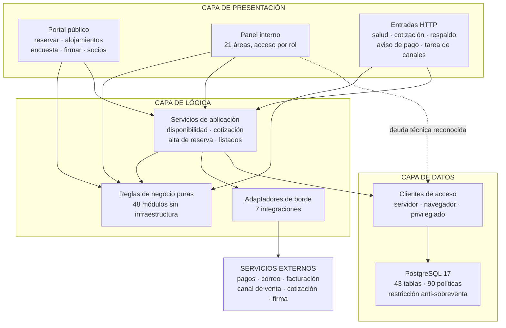
```mermaid
flowchart TB
    subgraph PRES["CAPA DE PRESENTACIÓN"]
        direction LR
        PUB["Portal público<br/>reservar · alojamientos<br/>encuesta · firmar · socios"]
        PAN["Panel interno<br/>21 áreas, acceso por rol"]
        API["Entradas HTTP<br/>salud · cotización · respaldo<br/>aviso de pago · tarea de canales"]
    end
    subgraph LOG["CAPA DE LÓGICA"]
        direction LR
        DOM["Reglas de negocio puras<br/>48 módulos sin infraestructura"]
        SERV["Servicios de aplicación<br/>disponibilidad · cotización<br/>alta de reserva · listados"]
        ADAP["Adaptadores de borde<br/>7 integraciones"]
    end
    subgraph DAT["CAPA DE DATOS"]
        direction LR
        CLI["Clientes de acceso<br/>servidor · navegador · privilegiado"]
        PG["PostgreSQL 17<br/>43 tablas · 90 políticas<br/>restricción anti-sobreventa"]
    end
    EXT["SERVICIOS EXTERNOS<br/>pagos · correo · facturación<br/>canal de venta · cotización · firma"]

    PUB --> DOM
    PAN --> DOM
    API --> DOM
    PUB --> SERV
    PAN --> SERV
    API --> SERV
    SERV --> DOM
    SERV --> ADAP
    SERV --> CLI
    PAN -.->|"deuda técnica reconocida"| CLI
    ADAP --> EXT
    CLI --> PG
```

**Presentación.** Dos frentes separados por decisión de producto: el panel del
personal, con sesión y control de acceso por área, y el portal del huésped, sin
cuenta. A eso se suman cinco entradas HTTP: consulta de salud, cotización
interna, generación del respaldo, recepción de avisos de pago y la tarea
programada de canales.

**Lógica.** Las reglas de negocio viven en 48 módulos que no importan la base de
datos, el framework ni la biblioteca de interfaz. Eso permite verificar la
política de cancelación, el cálculo de precios, la prioridad de limpieza o el
desglose del IVA sin levantar nada. Las pantallas orquestan; no calculan reglas.

**Los siete adaptadores** comparten la misma forma —interfaz estable más
implementación elegida por configuración—, de modo que enchufar un proveedor real
no toca el dominio ni las pantallas:

| Adaptador | Para qué | Implementación vigente |
|---|---|---|
| Pagos | Cobro con tarjeta y avisos de acreditación | Simulador con la forma real de dos pasarelas |
| Correo | Confirmaciones, recordatorios y encuestas | Simulador que registra el envío |
| Firma electrónica | Firma de contratos por la contraparte | Proveedor local con constancia y huella del texto |
| Facturación electrónica | Autorización del comprobante | Simulador que reproduce dos comportamientos reales del organismo |
| Canal de venta | Reservas, mensajes y reseñas de Booking | Lector del informe del extranet y del calendario publicado |
| Cotización de divisas | Valor del dólar del día | Fuente pública, con carga manual como respaldo |
| Asistente | Respuestas a consultas frecuentes del portal | Reglas deterministas sobre los datos del sistema |

Los dos últimos son distintos de los cinco primeros y conviene decirlo: **no
tienen un simulador que mienta**, porque sus fuentes son públicas y sin
credenciales. El respaldo de la cotización es la carga manual, que no inventa
nada.

**Datos.** PostgreSQL con seguridad de fila en todas las tablas. La credencial
privilegiada, que saltea esa seguridad, vive exclusivamente en el servidor y se
usa en los tres lugares donde un actor sin cuenta necesita leer o escribir algo
propio: la reserva del portal, la firma por token y el portal de socios.

**La deuda técnica reconocida** es la flecha punteada: buena parte de las
pantallas del panel accede a los clientes de datos directamente, sin una capa de
servicios intermedia. Está documentada como tal.

## 6.2 Decisiones de diseño

Las decisiones están registradas como documentos numerados. Son **22**: del 0001
al 0021 más el 0023. El número 0022 no existe; es un salto en la numeración.

| Decisión | Qué se resolvió | Por qué |
|---|---|---|
| 0001 · Stack | Aplicación web unificada con renderizado en servidor sobre base gestionada | Conserva el lenguaje y la base relacional que anticipaba la PP2, evitando construir a mano autenticación, API y capa de datos |
| 0002 · Disponibilidad | La no-superposición la garantiza una restricción de exclusión en la base | Es imposible sobrevender aunque dos pedidos lleguen a la vez |
| 0003 · Moneda | Dólar base, peso a cotización configurable | El tarifario está en dólares; aísla la volatilidad en un punto |
| 0004 · Tarifas | Doble precio neto y rack, IVA calculado en el dominio | Refleja la realidad comercial y deja la tarifa reutilizable |
| 0005 · Roles | Autorización en dos capas: permisos en la aplicación, seguridad de fila en la base | Defensa en profundidad; la barrera real es la base |
| 0006 · Pagos | Registro manual operativo, abstracción de pasarela, idempotencia por unicidad | Usable hoy sin credenciales de nadie |
| 0007 · Portal público | Reserva sin cuenta, escritura por un único punto controlado, confirmación por token | El visitante es anónimo y no puede escribir; concentrar esa escritura deja el modelo intacto |
| 0008 · Consumos y factura | Consumo con precio congelado, cuenta consolidada, comprobante imprimible | Operable desde el primer día |
| 0009 · Sistema de diseño | Identidad visual propia, componentes sin estado, filtros por dirección web | Los componentes sin estado no arrastran código al navegador; los filtros en la dirección funcionan sin JavaScript |
| 0010 · Contratos y firma | Ciclo de vida explícito, firma por token, referencia validada por disparador | La contraparte no es usuaria del sistema |
| 0011 · Asistente | Reglas deterministas en lugar de un modelo de lenguaje | Responde con los datos cargados; no puede inventar un precio |
| 0012 · Facturación | Modelo fiscal completo, autorización simulada | La parte propia del negocio queda resuelta y probada |
| 0013 · Alcance ERP | Tres áreas diferidas, con el camino de cada una | Decidir qué queda afuera es parte del trabajo de arquitectura |
| 0014 · Portal de socios | Token en lugar de cuentas | Evita administrar credenciales de terceros para un uso ocasional |
| 0015 · Endurecimiento | Pruebas con base real en el pipeline y sobre las escrituras | Una suite que saltea lo importante deja el semáforo verde sin verificar |
| 0016 · Precio neto | Fuera del alcance público por dos caminos independientes | Era una filtración real de información comercial |
| 0017 · Alta de usuario | Nace sin rol y desactivado; auto-registro apagado | Un valor por omisión que concede algo es una vía de escalada |
| 0018 · Proveedores | En producción, la falta de definición detiene el arranque | Mejor no arrancar que operar con un simulador creyendo que se cobra |
| 0019 · Cancelaciones | **Sin decidir.** Cinco opciones evaluadas con su riesgo | Es una decisión de riesgo comercial del hotel |
| 0020 · Divisas | Fuente pública, valor de venta, respaldo de cuatro niveles | Es lo que dice el tarifario, y el hotel compra al precio de venta |
| 0021 · Canales | Integración de una sola dirección, con la limitación declarada | Callarlo generaría confianza falsa sobre lo más caro que le puede pasar al hotel |
| 0023 · Comisión de canal | Dos capas: devengo por reserva y factura mensual como proveedor | Permite saber cuánto deja el canal neto de comisión |

## 6.3 Modelo de datos

El esquema tiene 43 tablas construidas por 57 migraciones numeradas. El diagrama
muestra las entidades del circuito central; se omiten las de soporte (auditoría,
avisos, encuestas, mantenimiento, fidelidad, respaldos, límites y mensajería).

```mermaid
erDiagram
    tipos_unidad ||--o{ unidades : clasifica
    tipos_unidad ||--o{ tarifas : "tiene precio"
    temporadas ||--o{ temporada_rangos : abarca
    temporadas ||--o{ tarifas : "tiene precio"
    huespedes ||--o{ reservas : titular
    huespedes ||--o{ reserva_huespedes : acompaña
    reservas ||--o{ reserva_huespedes : incluye
    reservas ||--o{ estadias : compone
    reservas ||--o{ pagos : recibe
    reservas ||--o{ consumos : acumula
    reservas ||--o| facturas : cierra
    unidades ||--o{ estadias : "se ocupa en"
    productos_servicios ||--o{ consumos : "se vende como"
    departamentos ||--o{ productos_servicios : agrupa
    departamentos ||--o{ departamentos : "subdivide en"
    promociones ||--o{ reservas : descuenta
    politicas_cancelacion ||--o{ reservas : rige
    agencias ||--o{ reservas : intermedia
    agencias ||--o{ movimientos_cuenta : "debe y paga"
    canal_reservas ||--o| reservas : "se importa como"
    canal_reservas ||--o{ canal_cargos : devenga
    perfiles ||--o{ facturas : emite

    tipos_unidad {
        uuid id PK
        text codigo UK
        text categoria "hosteria | cabana"
        int capacidad_max
    }
    unidades {
        uuid id PK
        uuid tipo_unidad_id FK
        text nombre
        text estado_hk "limpia|sucia|inspeccionada|bloqueada"
        text bloque
        text piso
        uuid asignada_a FK
    }
    temporada_rangos {
        uuid id PK
        uuid temporada_id FK
        daterange rango "sin solape entre temporadas"
    }
    tarifas {
        uuid id PK
        uuid tipo_unidad_id FK
        uuid temporada_id FK
        numeric precio_neto "vedado al rol publico"
        numeric precio_rack
        numeric iva_pct
    }
    huespedes {
        uuid id PK
        text apellido
        text email
        text doc_numero
        text nacionalidad
        text condicion_iva
        boolean vip
    }
    reservas {
        uuid id PK
        text codigo UK
        uuid huesped_id FK
        text estado "7 valores"
        text canal
        text tarifa_tipo "neto | rack"
        numeric subtotal
        numeric iva
        numeric total "con IVA"
        text garantia
        text plan
        boolean no_mover
    }
    estadias {
        uuid id PK
        uuid reserva_id FK
        uuid unidad_id FK
        daterange periodo "EXCLUDE gist: sin solape"
        date check_in "generada"
        date check_out "generada"
        int huespedes "adultos + menores"
        int adultos
        int menores
        int bebes
        int camas_extra
    }
    pagos {
        uuid id PK
        uuid reserva_id FK
        text tipo "senia|saldo|reembolso"
        text medio
        numeric monto
        text external_id UK "idempotencia"
    }
    consumos {
        uuid id PK
        uuid reserva_id FK
        uuid producto_id FK
        uuid departamento_id FK
        int cantidad
        numeric precio_unitario "congelado, USD"
        int comanda
        text folio "A | B"
        numeric cotizacion_usada
    }
    facturas {
        uuid id PK
        uuid reserva_id FK "unica por reserva"
        text tipo_comprobante "A | B | C"
        int punto_venta
        int numero_fiscal "correlativo sin huecos"
        numeric neto
        numeric iva
        numeric total
        text cae "simulado"
    }
    canal_reservas {
        uuid id PK
        text canal
        text external_id UK
        text estado "nueva|importada|error|ignorada"
        numeric importe_canal "referencia"
        numeric comision
    }
```

### La decisión central de integridad

La tabla de estadías lleva una **restricción de exclusión** de PostgreSQL: para
una misma unidad, dos períodos no pueden intersecarse mientras la reserva esté en
un estado que ocupa inventario.

No es una validación que la aplicación ejecuta antes de insertar: es una
condición que el motor comprueba al escribir, dentro de la transacción. La
diferencia es todo. Una verificación en la aplicación tiene la forma «consulto si
está libre, y después inserto», y entre esas dos operaciones hay una ventana en
la que otro pedido puede insertar lo mismo. Es exactamente el problema que el
relevamiento describió como dos recepcionistas consultando la planilla al mismo
tiempo, solo que a velocidad de máquina. La restricción no tiene esa ventana, y
por eso el diagnóstico D-1 se resuelve en la base y no en el código.

La consecuencia es que la aplicación tiene que **traducir el error**: cuando la
base rechaza, hay que convertir ese rechazo en un mensaje que se entienda y
abortar toda la operación sin dejar una reserva huérfana.

Tres consecuencias más del modelo, que no son obvias:

- Las fechas de entrada y salida de la estadía son **columnas generadas** a
  partir del rango. Existen porque la interfaz de consulta no expone las
  funciones de extremo de un rango, y escribir «las que llegan hoy» con
  operadores de rango negados es ilegible y fácil de equivocar. Al ser generadas
  no se pueden escribir, y esa es la garantía de que nunca se desincronizan.
- La cantidad de ocupantes **no tiene una restricción que la ate al desglose**, y
  fue deliberado: habría roto las operaciones de mudanza y reprogramación, que
  tocan la unidad y el período sin mirar el pasaje. La coherencia se garantiza en
  la función de alta, único lugar del sistema donde nacen estadías.
- La jerarquía de departamentos se limita a **dos niveles** con un disparador que
  rechaza el tercero. Un árbol de profundidad arbitraria exigiría consultas
  recursivas en la cuenta del huésped, y el hotel no lo necesita.

## 6.4 Ciclo de vida de la reserva

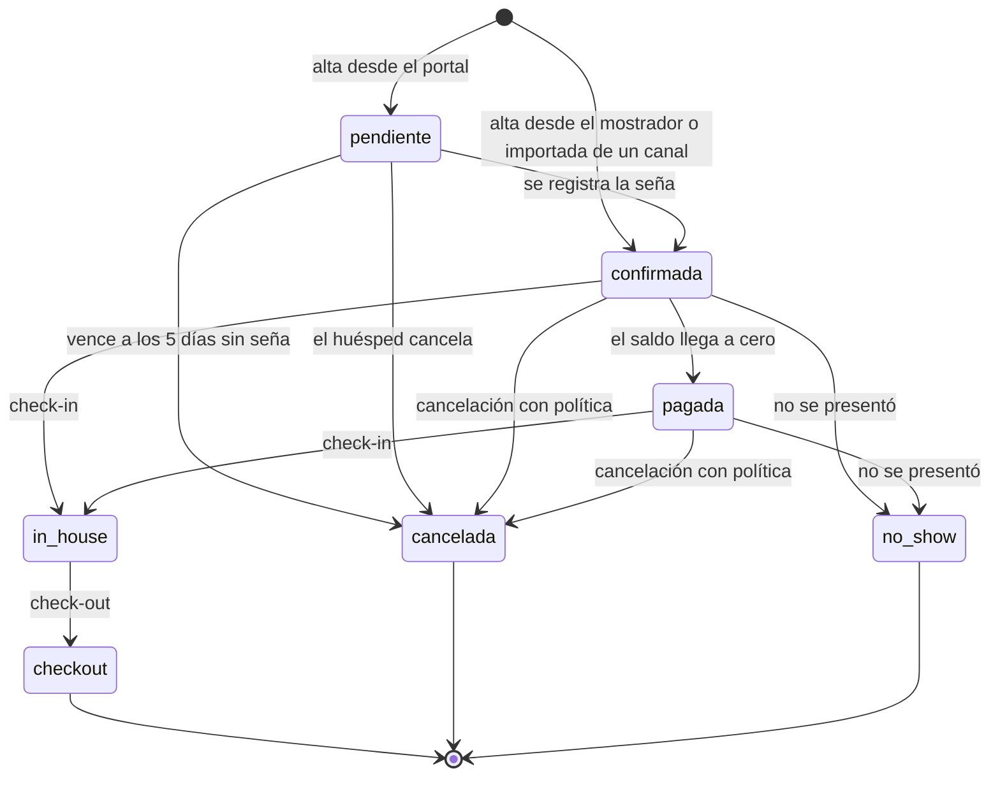
```mermaid
stateDiagram-v2
    [*] --> pendiente : alta desde el portal
    [*] --> confirmada : alta desde el mostrador o importada de un canal
    pendiente --> confirmada : se registra la seña
    pendiente --> cancelada : vence a los 5 días sin seña
    pendiente --> cancelada : el huésped cancela
    confirmada --> pagada : el saldo llega a cero
    confirmada --> in_house : check-in
    confirmada --> cancelada : cancelación con política
    confirmada --> no_show : no se presentó
    pagada --> in_house : check-in
    pagada --> cancelada : cancelación con política
    pagada --> no_show : no se presentó
    in_house --> checkout : check-out
    checkout --> [*]
    cancelada --> [*]
    no_show --> [*]
```

Los cuatro estados pendiente, confirmada, pagada y en casa **ocupan la unidad**.
Los tres finales la liberan.

Un detalle que separa a este sistema de la planilla que reemplaza: **estar
alojado y tener que estar alojado son cosas distintas**. La vista «en el hotel»
consulta el estado, no las fechas. Que el período incluya el día de hoy significa
que la persona *tendría* que estar; que esté lo marca el check-in.

## 6.5 Diseño de la interfaz

El criterio se fijó a partir de quién usa el sistema: personal de recepción y de
limpieza, con distinto grado de familiaridad con una computadora, en dos turnos y
a veces desde un teléfono.

1. **Nada oculto.** No se esconde una acción ni un formulario detrás de un
   desplegable. Se eliminaron los once que había. El alta y la edición van en
   pantalla propia, con un botón visible en el encabezado del listado.
2. **Nada manejado por la dirección web para funcionar, pero todo el estado
   reflejado en ella.** Los filtros, la búsqueda y la página son parámetros de la
   dirección con formularios de consulta: funcionan sin JavaScript y la pantalla
   siempre es reproducible.
3. **Toda entrada con etiqueta visible**, nunca solo con un texto de ejemplo que
   desaparece al escribir.
4. **Al guardar no se redirige en silencio**: se muestra qué pasó y qué se puede
   hacer después.
5. **El botón de envío se bloquea al primer clic**, y lo irreversible pide
   confirmación.
6. **Ninguna escritura falla en silencio.** Había 38 operaciones que descartaban
   el error de la base; hoy no queda ninguna.
7. **En el teléfono, tarjetas y no tablas.** Las columnas secundarias se pliegan
   bajo la principal; no se eliminan, porque el dato importa.
8. **El color nunca es el único portador de información.** Cada estado de la
   grilla lleva una letra además de su color.

La identidad visual se tomó del entorno del hotel: el turquesa del Lago Argentino
como color principal, el violeta de la baya de calafate para los datos
financieros, el naranja del bosque en otoño para lo pendiente y los grises
cálidos de la estepa para el texto.

## 6.6 Estrategia de pruebas

La suite tiene **1292 casos en 79 archivos**, en tres niveles.

| Nivel | Qué verifica | Cantidad | Necesita base |
|---|---|---|---|
| Reglas puras | Precios, cancelación, desglose fiscal, prioridad de limpieza, folios, métricas, validación de CUIT, lector del informe del canal, calendario del canal | 955 ejecutables sin nada levantado | No |
| Escrituras | Que cada operación verifique el rol antes de escribir y revise el error de la base | Incluidas arriba y abajo | Parcial |
| Integración | Restricción anti-sobreventa bajo concurrencia, cotización, alta atómica, expiración de pendientes, políticas de escritura por rol y borde público | 337 | Sí |

Tres decisiones sobre las pruebas:

- **Los casos que necesitan base se saltean si no la hay**, para que la suite
  siga siendo útil sin contenedores. Pero saltear en silencio deja el semáforo
  verde sin haber probado el anti-sobreventa. Por eso una variable convierte, en
  integración continua, la ausencia de base en un **error**.
- Esa protección tiene un hueco documentado: mira si hay base, no si hay clave
  pública. Sin exportarla, los cuatro casos del borde público quedan salteados
  aun con la protección activa.
- **Todo arreglo de un defecto entra con una prueba que fallaba antes.** Varios
  de los defectos encontrados usando el sistema a mano daban resultados
  plausibles y equivocados, del tipo que una prueba detecta y una revisión visual
  no.

**Fuente:** `docs/arquitectura.md`, `docs/modelo-datos.md`,
`docs/decisiones/0001`–`0023`, `supabase/migrations/0005`, `0037`, `0039`,
`0041`, `0045`, `lib/domain/`, `tests/db.ts`, `.github/workflows/ci.yml`.

---

# 7. Modelado Ambiental

## 7.1 Declaración de propósitos

El sistema administra el ciclo completo de alojamiento del Hotel Blanca
Patagonia: registra la reserva —tomada por el mostrador, por el portal propio o
importada de un canal de venta—, garantiza que dos reservas no se superpongan
sobre la misma unidad, controla el ingreso y el egreso del huésped, acumula sus
consumos y sus pagos, cierra la cuenta con un comprobante que discrimina el
impuesto, y produce con esos mismos datos los indicadores con los que la gerencia
decide. En paralelo sostiene la operación que rodea al alojamiento: el estado de
limpieza de cada unidad, los desperfectos, las cuentas corrientes de agencias y
proveedores, y los contratos.

## 7.2 Diagrama de contexto

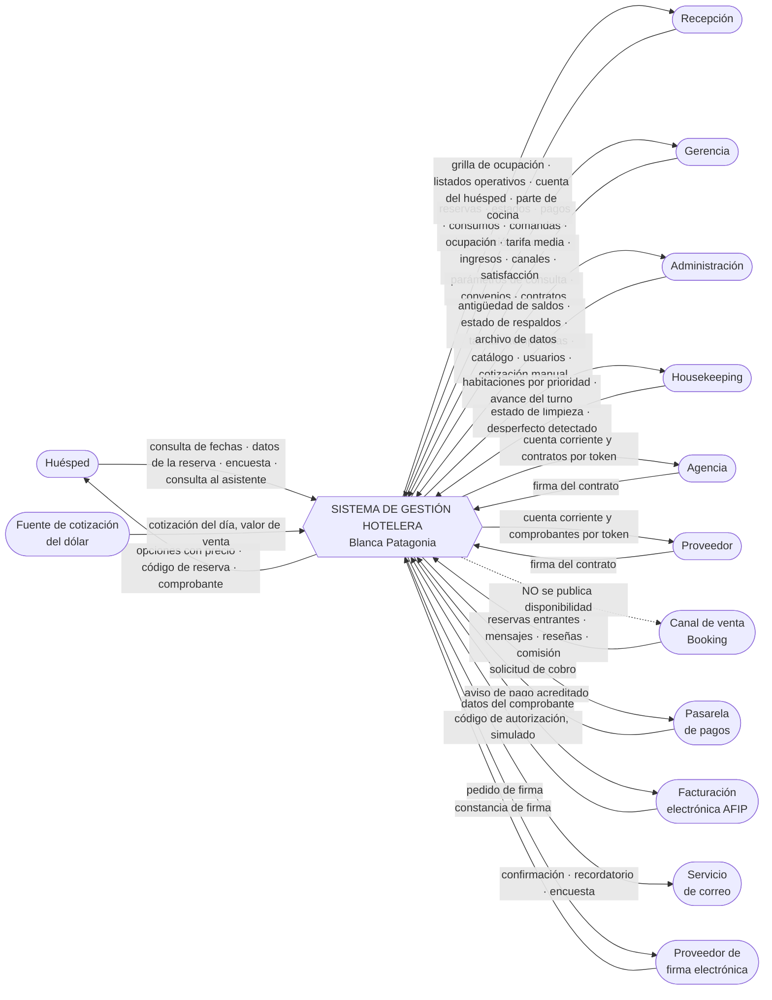
```mermaid
flowchart LR
    HUE(["Huésped"])
    REC(["Recepción"])
    GER(["Gerencia"])
    ADM(["Administración"])
    HK(["Housekeeping"])
    AGE(["Agencia"])
    PRV(["Proveedor"])
    CAN(["Canal de venta<br/>Booking"])
    AFIP(["Facturación<br/>electrónica AFIP"])
    PAS(["Pasarela<br/>de pagos"])
    COR(["Servicio<br/>de correo"])
    COT(["Fuente de cotización<br/>del dólar"])
    FIR(["Proveedor de<br/>firma electrónica"])

    SIS{{"SISTEMA DE GESTIÓN HOTELERA<br/>Blanca Patagonia"}}

    HUE -->|"consulta de fechas · datos de la reserva · encuesta · consulta al asistente"| SIS
    SIS -->|"opciones con precio · código de reserva · comprobante"| HUE
    REC -->|"reservas · estados · pagos · consumos · comandas · importación de canal"| SIS
    SIS -->|"grilla de ocupación · listados operativos · cuenta del huésped · parte de cocina"| REC
    GER -->|"parámetros de consulta · convenios · contratos"| SIS
    SIS -->|"ocupación · tarifa media · ingresos · canales · satisfacción"| GER
    ADM -->|"tarifas · temporadas · catálogo · usuarios · cotización manual"| SIS
    SIS -->|"antigüedad de saldos · estado de respaldos · archivo de datos"| ADM
    HK -->|"estado de limpieza · desperfecto detectado"| SIS
    SIS -->|"habitaciones por prioridad · avance del turno"| HK
    AGE -->|"firma del contrato"| SIS
    SIS -->|"cuenta corriente y contratos por token"| AGE
    PRV -->|"firma del contrato"| SIS
    SIS -->|"cuenta corriente y comprobantes por token"| PRV
    CAN -->|"reservas entrantes · mensajes · reseñas · comisión"| SIS
    SIS -.->|"NO se publica disponibilidad"| CAN
    PAS -->|"aviso de pago acreditado"| SIS
    SIS -->|"solicitud de cobro"| PAS
    SIS -->|"datos del comprobante"| AFIP
    AFIP -->|"código de autorización, simulado"| SIS
    SIS -->|"confirmación · recordatorio · encuesta"| COR
    COT -->|"cotización del día, valor de venta"| SIS
    SIS -->|"pedido de firma"| FIR
    FIR -->|"constancia de firma"| SIS
```

Dos flujos merecen aclaración, porque el diagrama sería engañoso sin ella:

- **La flecha hacia el canal de venta es punteada y dice lo que dice.** El
  sistema recibe reservas de Booking pero **no le informa qué queda libre**. La
  restricción anti-sobreventa protege la base propia, no el inventario publicado
  del otro lado: Booking puede vender una unidad que el mostrador ya vendió. El
  hotel tiene que seguir cerrando fechas a mano en el extranet.
- **Las flechas hacia la pasarela, la facturación, el correo y la firma existen
  como contratos de software, no como conexiones activas.**

## 7.3 Lista de acontecimientos

| # | Acontecimiento | Tipo | Respuesta del sistema |
|---|---|---|---|
| A-01 | Un visitante consulta disponibilidad | Flujo de datos | Devuelve los tipos con lugar y su precio a tarifa de mostrador con IVA, distinguiendo «sin lugar» de «sin precio cargado» |
| A-02 | Un visitante completa la reserva en el portal | Flujo de datos | Verifica el límite por origen, valida, asigna una unidad libre, cotiza y crea la reserva pendiente, que ya bloquea la unidad |
| A-03 | Recepción toma una reserva en el mostrador | Flujo de datos | Crea el huésped si no existe, cotiza y crea reserva y estadía en una sola operación, traduciendo el rechazo por superposición |
| A-04 | Recepción toma una reserva de grupo | Flujo de datos | Crea la reserva grupal con titular único y una estadía por unidad |
| A-05 | Llega el pago de la seña | Flujo de datos | Registra el pago, recalcula el saldo y confirma la reserva |
| A-06 | La pasarela avisa un pago acreditado | Flujo de datos | Verifica la firma, descarta el evento repetido y registra el pago |
| A-07 | El huésped se presenta al check-in | Flujo de datos | Valida la transición, marca la estadía en casa y deja la unidad ocupada |
| A-08 | Se carga un consumo o una comanda | Flujo de datos | Valida el stock, toma el precio del catálogo —nunca del formulario—, imputa las líneas con departamento y número de comanda, y descuenta el stock sin interrumpir si eso falla |
| A-09 | El huésped hace el check-out | Flujo de datos | Valida la transición y libera la unidad. La cuenta **no** se cierra acá |
| A-10 | Se emite la factura | Flujo de datos | Consolida, deriva la letra, discrimina el IVA, asigna la numeración y rechaza el intento si la reserva ya tiene factura |
| A-11 | Se cancela una reserva | Flujo de datos | Calcula el cargo por anticipación, lo informa y libera la unidad. **El cargo no se cobra** |
| A-12 | El huésped no se presenta | Flujo de datos | Marca el no-show y libera la unidad |
| A-13 | Se importa el informe del canal | Flujo de datos | Lee el archivo, advierte cuántas fechas eran ambiguas y deja cada reserva en la zona de recepción sin ocupar inventario |
| A-14 | Recepción incorpora una entrante | Flujo de datos | Busca el huésped por correo, recalcula el precio a tarifa neta, crea la reserva confirmada y devenga la comisión. Si choca con el anti-sobreventa, la entrante queda con el motivo escrito |
| A-15 | Housekeeping marca una habitación limpia | Flujo de datos | Valida que esté asignada a esa persona, cambia el estado —nunca a inspeccionada— y recalcula el avance del turno |
| A-16 | Se detecta un desperfecto | Flujo de datos | Abre la orden y, si corresponde, la unidad deja de generar tarea de limpieza |
| A-17 | Llega la factura mensual del canal | Flujo de datos | Entra como comprobante del canal en su carácter de proveedor y se concilia contra las comisiones devengadas |
| A-18 | Un usuario intenta entrar | Control | Verifica credenciales contra el límite de intentos, resuelve el rol y descarta la sesión si no es válido |
| A-19 | Alguien intenta abrir un área que su rol no tiene | Control | La guarda lo redirige |
| A-20 | El rol anónimo intenta cotizar a precio neto | Control | Se le devuelve el precio de mostrador, en silencio y sin error: un error solo confirmaría que encontró algo |
| A-21 | Se supera el volumen permitido desde un origen | Control | Rechaza con el mensaje del límite |
| A-22 | Vencen cinco días de una pendiente sin seña | Temporal | Tarea diaria a las 03:10: la cancela y libera la unidad |
| A-23 | Amanece un día con preventivos programados | Temporal | Tarea diaria a las 06:00: genera las órdenes que corresponden |
| A-24 | Vence el plazo de un comprobante de proveedor | Temporal | Tarea diaria a las 03:20: lo marca vencido y alimenta la antigüedad de saldos |
| A-25 | Termina la vigencia de un contrato enviado | Temporal | Tarea diaria a las 03:30: lo marca vencido |
| A-26 | Es la hora de sondear el canal | Temporal | Tarea diaria a las 06:00: lee el calendario y deja lo encontrado en la zona de recepción. **No crea reservas** |
| A-27 | Se cierra una estadía | Control | Se genera la encuesta de satisfacción |
| A-28 | Una consulta al asistente no coincide con ninguna regla | Control | Responde con honestidad y la registra para que alguien la atienda |

**Fuente:** `app/reservar/actions.ts`, `app/panel/*/actions.ts`,
`app/api/webhooks/pagos/`, `app/api/cron/canales`,
`supabase/migrations/0011`, `0027`, `0052`, `docs/sincronizacion-automatica.md`.

---

# 8. Modelado de Paquetes

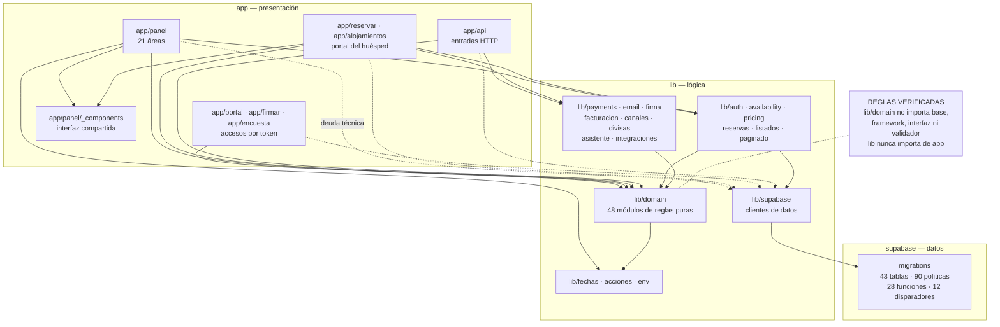
```mermaid
flowchart TB
    subgraph APP["app — presentación"]
        A1["app/panel<br/>21 áreas"]
        A2["app/reservar · app/alojamientos<br/>portal del huésped"]
        A3["app/portal · app/firmar · app/encuesta<br/>accesos por token"]
        A4["app/api<br/>entradas HTTP"]
        A5["app/panel/_components<br/>interfaz compartida"]
    end
    subgraph LIB["lib — lógica"]
        L1["lib/domain<br/>48 módulos de reglas puras"]
        L2["lib/auth · availability · pricing<br/>reservas · listados · paginado"]
        L3["lib/payments · email · firma<br/>facturacion · canales · divisas<br/>asistente · integraciones"]
        L4["lib/supabase<br/>clientes de datos"]
        L5["lib/fechas · acciones · env"]
    end
    subgraph DB["supabase — datos"]
        D1["migrations<br/>43 tablas · 90 políticas<br/>28 funciones · 12 disparadores"]
    end

    A1 --> A5
    A2 --> A5
    A1 --> L1
    A2 --> L1
    A3 --> L1
    A4 --> L1
    A1 --> L2
    A2 --> L2
    A4 --> L3
    A2 --> L3
    A1 --> L5
    A1 -.->|"deuda técnica"| L4
    A2 -.-> L4
    A3 -.-> L4
    A4 -.-> L4
    L2 --> L1
    L2 --> L4
    L3 --> L1
    L1 --> L5
    L4 --> D1

    R["REGLAS VERIFICADAS<br/>lib/domain no importa base,<br/>framework, interfaz ni validador<br/>lib nunca importa de app"]
    R -.- L1
```

| Paquete | Responsabilidad | Depende de |
|---|---|---|
| `app/panel` | Pantallas y escrituras del personal, con guarda por área. 105 archivos usan la interfaz compartida | interfaz compartida · dominio · servicios · clientes de datos |
| `app/reservar`, `app/alojamientos` | Portal del huésped: búsqueda, cotización, reserva, catálogo | dominio · disponibilidad · cotización · asistente · clientes |
| `app/portal`, `app/firmar`, `app/encuesta` | Accesos por token para agencias, proveedores y huéspedes | dominio · cliente privilegiado |
| `app/api` | Entradas HTTP: salud, cotización, respaldo, aviso de pago, tarea de canales | dominio · adaptadores · cliente privilegiado |
| `app/panel/_components` | Componentes de interfaz sin estado ni eventos, e iconografía propia | nada: solo tipos |
| `lib/domain` | **Las reglas del negocio.** 48 módulos: precios, cancelación, estados, permisos, folios, métricas, fiscalidad, housekeeping, canales, divisas, ayuda | solo utilidades de fecha |
| `lib/auth` | Sesión y guarda de acceso por área | dominio de permisos · clientes |
| `lib/availability`, `lib/pricing`, `lib/reservas` | Servicios: disponibilidad, cotización, alta atómica | dominio · clientes |
| `lib/listados`, `lib/paginado` | Búsqueda y filtros seguros; lectura completa sin truncamiento | nada |
| Los siete adaptadores | Bordes con terceros: interfaz estable e implementación por configuración | dominio · selección de proveedor |
| `lib/supabase` | Tres clientes: servidor, navegador y privilegiado | biblioteca de base de datos |
| `lib/acciones` | Manejo uniforme del error de escritura: cortar con motivo o registrar sin interrumpir | nada |
| `supabase/migrations` | El esquema y sus garantías | nada |

Las dos reglas del recuadro **se comprueban con una búsqueda de texto**, y eso es
lo que las hace útiles: una regla de arquitectura que no se puede verificar se
degrada sola. Medidas sobre el código, las dos dan cero violaciones.

**La deuda técnica reconocida** son las flechas punteadas de `app` hacia los
clientes de datos: 74 archivos de presentación arman su consulta directamente en
lugar de pasar por una capa de servicios. El efecto es que la lógica de consulta
queda repartida en las pantallas, lo que ya produjo un defecto sutil —un filtro
sobre una tabla embebida solo acota la fila madre si el embebido es interno; con
un embebido normal el filtro no filtra y tampoco falla—, hoy cubierto por una
prueba.

**Fuente:** `AGENTS.md`, medición de importaciones sobre `app/` y `lib/`.

---

# 9. Modelado de los Casos de Uso

Los casos de uso se agrupan por módulo. Para cada módulo se presenta una **vista
estática** —las clases y entidades que participan— y para cada caso de uso, sus
**requerimientos específicos**, el **prototipo de interfaz**, la **ficha** y la
**vista dinámica** en forma de diagrama de secuencia.

La vista estática se documenta por módulo y no por caso de uso porque los casos
de uso de un mismo módulo operan sobre las mismas entidades: repetir el diagrama
en cada uno agregaría páginas sin agregar información.

## 9.1 Diagrama general de casos de uso

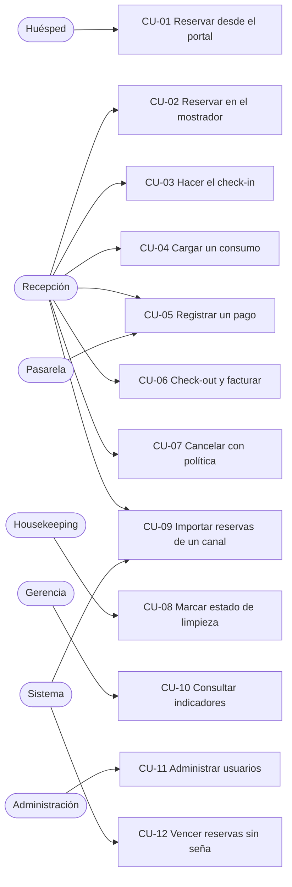
```mermaid
flowchart LR
    HUE(["Huésped"])
    REC(["Recepción"])
    HK(["Housekeeping"])
    GER(["Gerencia"])
    ADM(["Administración"])
    PAS(["Pasarela"])
    SIS(["Sistema"])

    HUE --> CU01["CU-01 Reservar desde el portal"]
    REC --> CU02["CU-02 Reservar en el mostrador"]
    REC --> CU03["CU-03 Hacer el check-in"]
    REC --> CU04["CU-04 Cargar un consumo"]
    REC --> CU05["CU-05 Registrar un pago"]
    REC --> CU06["CU-06 Check-out y facturar"]
    REC --> CU07["CU-07 Cancelar con política"]
    HK --> CU08["CU-08 Marcar estado de limpieza"]
    REC --> CU09["CU-09 Importar reservas de un canal"]
    GER --> CU10["CU-10 Consultar indicadores"]
    ADM --> CU11["CU-11 Administrar usuarios"]
    PAS --> CU05
    SIS --> CU12["CU-12 Vencer reservas sin seña"]
    SIS --> CU09
```

## 9.2 Módulo 1 — Reservas

### 9.2.1 Vista estática del módulo

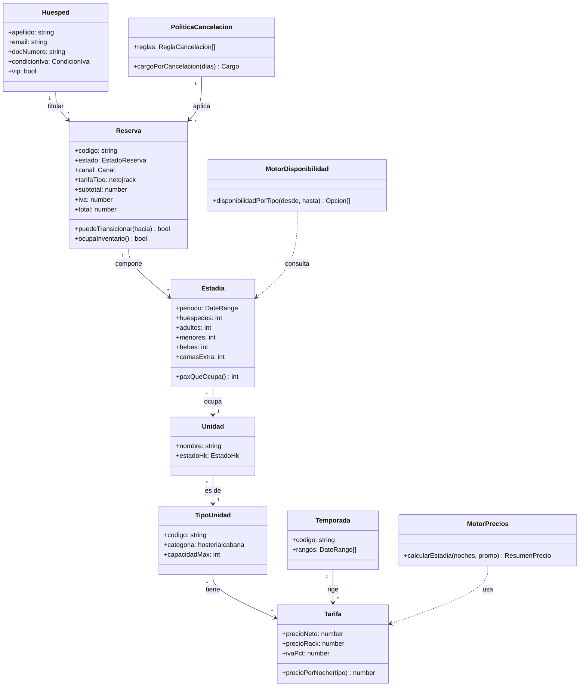
```mermaid
classDiagram
    class Reserva {
        +codigo: string
        +estado: EstadoReserva
        +canal: Canal
        +tarifaTipo: neto|rack
        +subtotal: number
        +iva: number
        +total: number
        +puedeTransicionar(hacia) bool
        +ocupaInventario() bool
    }
    class Estadia {
        +periodo: DateRange
        +huespedes: int
        +adultos: int
        +menores: int
        +bebes: int
        +camasExtra: int
        +paxQueOcupa() int
    }
    class Huesped {
        +apellido: string
        +email: string
        +docNumero: string
        +condicionIva: CondicionIva
        +vip: bool
    }
    class Unidad {
        +nombre: string
        +estadoHk: EstadoHk
    }
    class TipoUnidad {
        +codigo: string
        +categoria: hosteria|cabana
        +capacidadMax: int
    }
    class Tarifa {
        +precioNeto: number
        +precioRack: number
        +ivaPct: number
        +precioPorNoche(tipo) number
    }
    class Temporada {
        +codigo: string
        +rangos: DateRange[]
    }
    class PoliticaCancelacion {
        +reglas: ReglaCancelacion[]
        +cargoPorCancelacion(dias) Cargo
    }
    class MotorPrecios {
        +calcularEstadia(noches, promo) ResumenPrecio
    }
    class MotorDisponibilidad {
        +disponibilidadPorTipo(desde, hasta) Opcion[]
    }

    Huesped "1" --> "*" Reserva : titular
    Reserva "1" --> "*" Estadia : compone
    Estadia "*" --> "1" Unidad : ocupa
    Unidad "*" --> "1" TipoUnidad : es de
    TipoUnidad "1" --> "*" Tarifa : tiene
    Temporada "1" --> "*" Tarifa : rige
    PoliticaCancelacion "1" --> "*" Reserva : aplica
    MotorPrecios ..> Tarifa : usa
    MotorDisponibilidad ..> Estadia : consulta
```

### 9.2.2 CU-01 · Reservar desde el portal público

**Requerimientos específicos**

| RF | Requerimiento |
|---|---|
| RF-01 | Consultar disponibilidad |
| RF-02 | Cotizar la estadía |
| RF-04 | Reservar desde el portal |
| RF-12 | Consultar la reserva por token |
| RNF-05 | Límite de cinco reservas por hora y por origen |
| RN-09 | El precio que ve el huésped incluye el IVA |

**Prototipo de interfaz**

La pantalla de búsqueda es la entrada del portal. El buscador está siempre
visible arriba y el asistente de consultas queda abajo, para que la acción
principal no compita con nada.

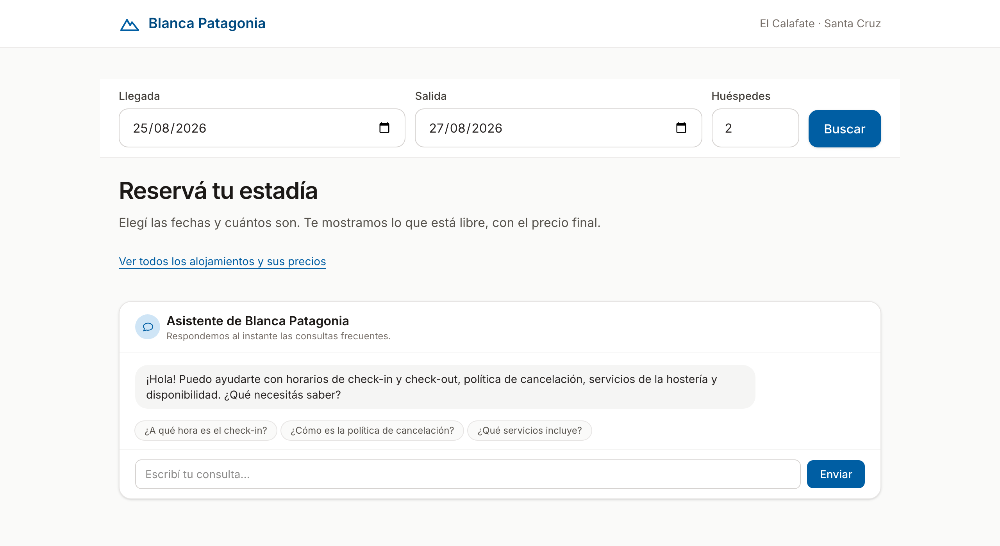

Con fechas cargadas, el sistema devuelve una opción por tipo de alojamiento, con
el precio por noche, el total de la estadía y la aclaración de que el IVA está
incluido. La etiqueta «Última libre en estas fechas» aparece solo cuando queda
una sola unidad de ese tipo.

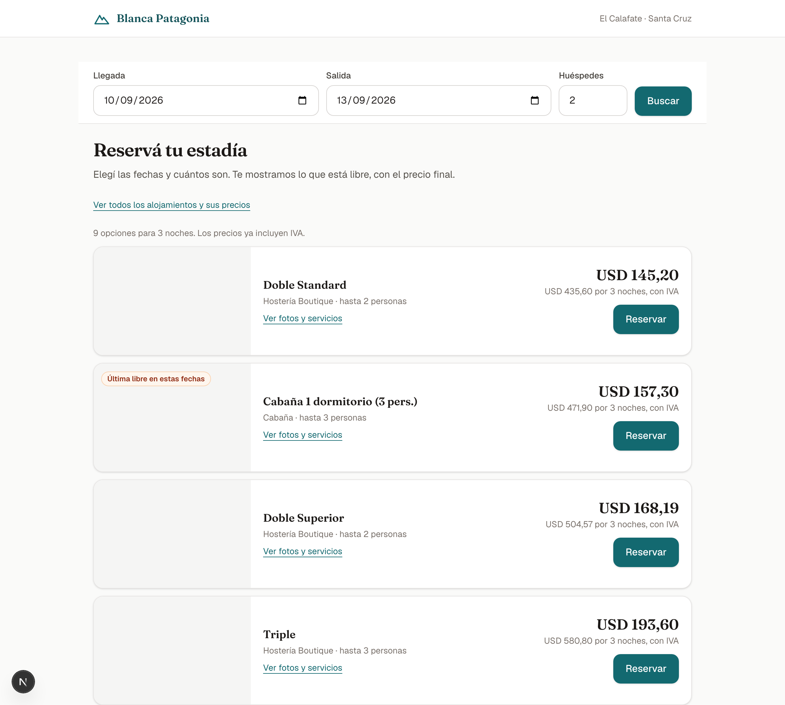

| Elemento | Tipo | Comportamiento |
|---|---|---|
| Llegada / Salida | Campos de fecha con etiqueta visible | Por omisión, hoy y pasado mañana |
| Huéspedes | Campo numérico | Filtra por capacidad del tipo |
| Buscar | Botón primario | Envía por método de consulta: la búsqueda queda en la dirección web |
| Opción de alojamiento | Tarjeta | Nombre, categoría, capacidad, precio por noche y total con IVA |
| Señal de escasez | Etiqueta | Solo si queda una unidad libre de ese tipo |
| Reservar | Botón primario por tarjeta | Lleva al formulario de datos del huésped |
| Estado vacío | Mensaje | Distingue «no hay disponibilidad» de «falta cargar la tarifa» |

**Ficha de caso de uso**

| Campo | Contenido |
|---|---|
| Identificador | CU-01 |
| Nombre | Reservar desde el portal público |
| Actor principal | Huésped, sin cuenta |
| Actores secundarios | Servicio de correo |
| Precondiciones | Hay tarifas cargadas y temporadas que cubren el período. Hay al menos una unidad activa del tipo elegido libre en ese período |
| Postcondiciones | Existe una reserva pendiente, canal web, tarifa de mostrador, con su estadía ocupando la unidad. Si en cinco días no se registra la seña, se cancela sola |
| Reglas asociadas | RN-01, RN-02, RN-03, RN-07, RN-08, RN-09, RN-10, RN-13 |

**Flujo principal**

1. El huésped ingresa fechas de entrada y salida y cantidad de personas.
2. El sistema consulta la disponibilidad por tipo y cotiza cada opción a tarifa de
   mostrador, noche por noche, con el IVA incluido.
3. El sistema muestra las opciones con lugar, su capacidad y su precio.
4. El huésped elige un tipo y avanza al formulario.
5. El huésped ingresa apellido, nombre, correo y teléfono.
6. El sistema verifica el límite de reservas por hora desde ese origen.
7. El sistema valida los datos, crea el huésped si no existe, elige una unidad
   libre, vuelve a cotizar y crea la reserva **pendiente** con su estadía. La
   unidad queda bloqueada en ese instante.
8. El sistema despacha el correo de confirmación.
9. El sistema muestra la confirmación con el código, el detalle, el importe de la
   seña y el plazo para pagarla.

**Flujos alternativos**

- **3a.** Ningún tipo tiene lugar: se informa y se ofrece cambiar las fechas.
- **3b.** Hay lugar pero falta la tarifa de alguna noche: el sistema **no** dice
  «sin disponibilidad». Avisar que el hotel está lleno cuando solo falta cargar un
  precio hace perder la reserva sin que nadie se entere.
- **5a.** El huésped ya existe, identificado por su correo: se reusa su ficha. La
  búsqueda es solo por correo, porque por apellido se fusionarían dos personas
  distintas.

**Excepciones**

- **E1.** La unidad se vendió entre el paso 3 y el 7: la restricción de exclusión
  rechaza la escritura, el sistema aborta toda la operación sin dejar datos a
  medias e informa que ya no está disponible.
- **E2.** Se superó el límite de cinco reservas por hora: se rechaza. Cada reserva
  pendiente bloquea una unidad cinco días.
- **E3.** Datos inválidos —correo mal formado, salida anterior o igual a la
  entrada, más de treinta noches, capacidad insuficiente—: se rechaza con el
  mensaje correspondiente.
- **E4.** Falla el envío del correo: se registra el fallo y **no** se cae la
  reserva, que ya existe y es el dato que importa.

**Vista dinámica**

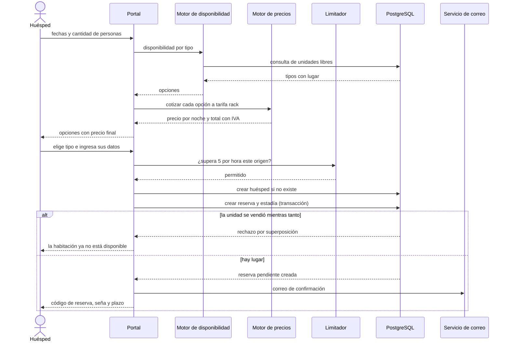
```mermaid
sequenceDiagram
    actor H as Huésped
    participant P as Portal
    participant D as Motor de disponibilidad
    participant C as Motor de precios
    participant L as Limitador
    participant B as PostgreSQL
    participant M as Servicio de correo

    H->>P: fechas y cantidad de personas
    P->>D: disponibilidad por tipo
    D->>B: consulta de unidades libres
    B-->>D: tipos con lugar
    D-->>P: opciones
    P->>C: cotizar cada opción a tarifa rack
    C-->>P: precio por noche y total con IVA
    P-->>H: opciones con precio final
    H->>P: elige tipo e ingresa sus datos
    P->>L: ¿supera 5 por hora este origen?
    L-->>P: permitido
    P->>B: crear huésped si no existe
    P->>B: crear reserva y estadía (transacción)
    alt la unidad se vendió mientras tanto
        B-->>P: rechazo por superposición
        P-->>H: la habitación ya no está disponible
    else hay lugar
        B-->>P: reserva pendiente creada
        P->>M: correo de confirmación
        P-->>H: código de reserva, seña y plazo
    end
```

### 9.2.3 CU-02 · Reservar en el mostrador

**Requerimientos específicos**

| RF | Requerimiento |
|---|---|
| RF-01, RF-02 | Disponibilidad y cotización |
| RF-03 | Reservar desde el mostrador |
| RF-05 | Reservar un grupo |
| RF-17 | Administrar el padrón de huéspedes |
| RN-13, RN-14 | Derivación de ocupantes y capacidad con camas extra |

**Prototipo de interfaz**

El alta va en **pantalla propia**, no en un formulario plegado dentro del
listado, y se organiza en pasos visibles: huésped, período y unidad, ocupantes, y
condiciones comerciales. Todos los campos llevan etiqueta visible y el botón de
guardar se bloquea al primer clic.

| Sección | Campos | Notas |
|---|---|---|
| Huésped | Búsqueda por apellido, documento o correo; alta rápida si no existe | Si se encuentra, se reusa la ficha |
| Período y unidad | Entrada, salida, tipo de alojamiento, unidad | La unidad puede quedar en «asignar una libre» |
| Ocupantes | Adultos, menores, bebés, camas extra, cunas | El sistema muestra el pasaje que ocupa plaza y lo compara con la capacidad |
| Condiciones | Canal, agencia, tipo de tarifa, plan, garantía, segmento, voucher, promoción, política de cancelación | El tipo de tarifa se resuelve solo si hay agencia |
| Resumen | Subtotal, descuento, IVA y total | Se recalcula al cambiar el período |

**Ficha de caso de uso**

| Campo | Contenido |
|---|---|
| Identificador | CU-02 |
| Nombre | Reservar en el mostrador |
| Actor principal | Recepción |
| Precondiciones | Sesión activa con acceso al área de reservas. Tarifas y temporadas cargadas para el período |
| Postcondiciones | Existe una reserva confirmada con su estadía ocupando la unidad y su desglose fiscal guardado |
| Reglas asociadas | RN-01, RN-02, RN-06, RN-07, RN-08, RN-10, RN-13, RN-14 |

**Flujo principal**

1. Recepción abre el alta de reserva.
2. Ingresa o busca al huésped titular.
3. Ingresa el período y elige tipo y unidad, o deja que el sistema asigne una
   libre.
4. Completa el desglose de ocupantes.
5. Completa las condiciones comerciales.
6. El sistema valida que la capacidad alcance para los ocupantes que ocupan plaza.
7. El sistema cotiza noche por noche según el tipo de tarifa y guarda el desglose.
8. El sistema crea la reserva y la estadía en una sola operación de base y deriva
   la cantidad de ocupantes del desglose.
9. El sistema muestra la ficha de la reserva creada.

**Flujos alternativos**

- **3a.** El alta se inició desde una celda libre de la grilla: la unidad y el día
  vienen preseleccionados.
- **5a.** La reserva es de agencia: el tipo de tarifa se resuelve como neto y se
  aplica el descuento del convenio.
- **8a.** Es una reserva de grupo: una reserva con titular único y una estadía por
  unidad.

**Excepciones**

- **E1.** La unidad ya está ocupada en ese período: la restricción rechaza y el
  sistema aborta la operación completa.
- **E2.** La capacidad no alcanza: se rechaza indicando capacidad y plazas
  requeridas. Los bebés no cuentan y las camas extra amplían la capacidad.
- **E3.** No hay tarifa cargada para alguna noche: **no se cotiza en cero**, se
  informa que falta la tarifa. Fue un defecto real —una reserva quedaba en cero
  dólares por faltar las temporadas— y por eso el caso está separado.
- **E4.** El rol no tiene acceso al área: la guarda redirige antes de mostrar nada.

**Vista dinámica**

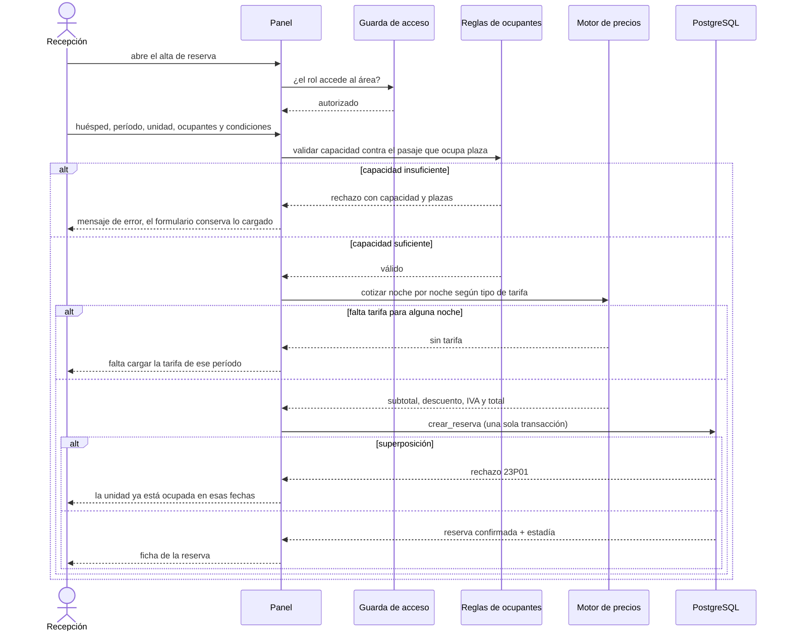
```mermaid
sequenceDiagram
    actor R as Recepción
    participant PA as Panel
    participant G as Guarda de acceso
    participant O as Reglas de ocupantes
    participant C as Motor de precios
    participant B as PostgreSQL

    R->>PA: abre el alta de reserva
    PA->>G: ¿el rol accede al área?
    G-->>PA: autorizado
    R->>PA: huésped, período, unidad, ocupantes y condiciones
    PA->>O: validar capacidad contra el pasaje que ocupa plaza
    alt capacidad insuficiente
        O-->>PA: rechazo con capacidad y plazas
        PA-->>R: mensaje de error, el formulario conserva lo cargado
    else capacidad suficiente
        O-->>PA: válido
        PA->>C: cotizar noche por noche según tipo de tarifa
        alt falta tarifa para alguna noche
            C-->>PA: sin tarifa
            PA-->>R: falta cargar la tarifa de ese período
        else
            C-->>PA: subtotal, descuento, IVA y total
            PA->>B: crear_reserva (una sola transacción)
            alt superposición
                B-->>PA: rechazo 23P01
                PA-->>R: la unidad ya está ocupada en esas fechas
            else
                B-->>PA: reserva confirmada + estadía
                PA-->>R: ficha de la reserva
            end
        end
    end
```

## 9.3 Módulo 2 — Estadía y consumos

### 9.3.1 Vista estática del módulo

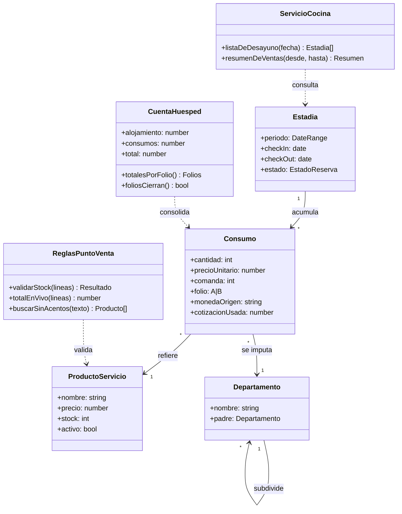
```mermaid
classDiagram
    class Estadia {
        +periodo: DateRange
        +checkIn: date
        +checkOut: date
        +estado: EstadoReserva
    }
    class Consumo {
        +cantidad: int
        +precioUnitario: number
        +comanda: int
        +folio: A|B
        +monedaOrigen: string
        +cotizacionUsada: number
    }
    class ProductoServicio {
        +nombre: string
        +precio: number
        +stock: int
        +activo: bool
    }
    class Departamento {
        +nombre: string
        +padre: Departamento
    }
    class CuentaHuesped {
        +alojamiento: number
        +consumos: number
        +total: number
        +totalesPorFolio() Folios
        +foliosCierran() bool
    }
    class ReglasPuntoVenta {
        +validarStock(lineas) Resultado
        +totalEnVivo(lineas) number
        +buscarSinAcentos(texto) Producto[]
    }
    class ServicioCocina {
        +listaDeDesayuno(fecha) Estadia[]
        +resumenDeVentas(desde, hasta) Resumen
    }

    Estadia "1" --> "*" Consumo : acumula
    Consumo "*" --> "1" ProductoServicio : refiere
    Consumo "*" --> "1" Departamento : se imputa
    Departamento "1" --> "*" Departamento : subdivide
    CuentaHuesped ..> Consumo : consolida
    ReglasPuntoVenta ..> ProductoServicio : valida
    ServicioCocina ..> Estadia : consulta
```

### 9.3.2 CU-03 · Hacer el check-in

**Requerimientos específicos**

| RF | Requerimiento |
|---|---|
| RF-06 | Listado con la vista «llegadas de hoy» |
| RF-08 | Avanzar el estado de la reserva |
| RF-17 | Completar los datos del huésped |
| RF-11 | Cambiar de unidad si la habitación no está en condiciones |

**Prototipo de interfaz**

| Elemento | Comportamiento |
|---|---|
| Chips de vista | «En el hotel», «Llegadas hoy», «Salidas hoy», «Pendientes»… La vista y el filtro de estado se limpian mutuamente, porque aplicar los dos puede dar vacío sin que se entienda por qué |
| Tabla de reservas | Código, huésped, período, unidad, estado, pagado y saldo. Los totales al pie son **de la página, y lo dice** |
| Estado vacío | Enuncia el hecho operativo: «no hay llegadas previstas para hoy» |
| Ficha de la reserva | Datos del huésped, período, unidad, cuenta y los botones de transición que corresponden al estado actual |
| Botón de check-in | Solo aparece si la transición es válida desde el estado actual |

**Ficha de caso de uso**

| Campo | Contenido |
|---|---|
| Identificador | CU-03 |
| Nombre | Hacer el check-in |
| Actor principal | Recepción |
| Precondiciones | Existe una reserva confirmada o pagada. La unidad asignada está disponible físicamente |
| Postcondiciones | La reserva y la estadía están en casa, la unidad figura ocupada y la estadía entra en el circuito de consumos y de desayuno |
| Reglas asociadas | RN-02, RN-16 |

**Flujo principal**

1. Recepción abre la vista de llegadas del día, que incluye a quienes ya se
   registraron y excluye canceladas y no-show.
2. Selecciona la reserva y abre su ficha.
3. Verifica los datos del huésped y completa lo que falte: documento, contacto,
   condición frente al IVA.
4. Confirma el check-in.
5. El sistema valida que la transición sea permitida desde el estado actual.
6. El sistema pasa la reserva y la estadía a **en casa**.
7. El huésped queda habilitado para cargar consumos y aparece en la vista «en el
   hotel» y en la lista de desayuno del día siguiente.

**Flujos alternativos**

- **2a.** La reserva no aparece en llegadas del día: se la busca por código,
  apellido o documento en el buscador global.
- **3a.** La habitación no está en condiciones: se cambia de unidad antes del
  check-in, con la misma verificación de superposición. Si la reserva está marcada
  «no mover», la pantalla lo advierte.

**Excepciones**

- **E1.** La reserva está pendiente: primero hay que confirmarla registrando la
  seña.
- **E2.** La reserva está cancelada, en no-show o ya tiene check-out: son estados
  finales y el sistema no ofrece la transición.
- **E3.** La habitación está bloqueada o en reparación: el sistema lo muestra en
  la grilla y en el tablero de limpieza. Mandar a limpiar una habitación con una
  cañería rota le hace perder el viaje al huésped.

**Vista dinámica**

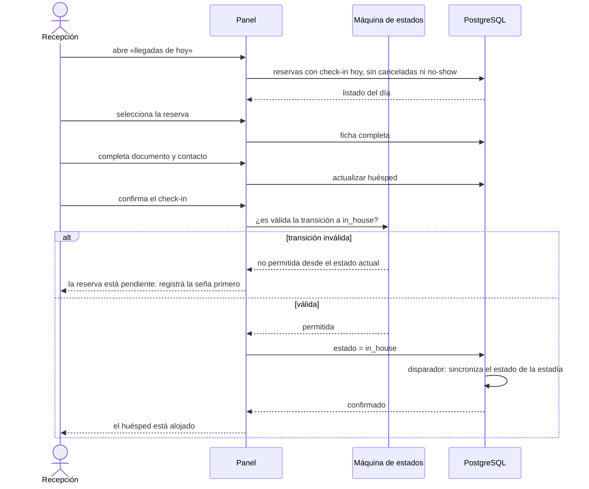
```mermaid
sequenceDiagram
    actor R as Recepción
    participant PA as Panel
    participant MQ as Máquina de estados
    participant B as PostgreSQL

    R->>PA: abre «llegadas de hoy»
    PA->>B: reservas con check-in hoy, sin canceladas ni no-show
    B-->>PA: listado del día
    R->>PA: selecciona la reserva
    PA->>B: ficha completa
    R->>PA: completa documento y contacto
    PA->>B: actualizar huésped
    R->>PA: confirma el check-in
    PA->>MQ: ¿es válida la transición a in_house?
    alt transición inválida
        MQ-->>PA: no permitida desde el estado actual
        PA-->>R: la reserva está pendiente: registrá la seña primero
    else válida
        MQ-->>PA: permitida
        PA->>B: estado = in_house
        B->>B: disparador: sincroniza el estado de la estadía
        B-->>PA: confirmado
        PA-->>R: el huésped está alojado
    end
```

### 9.3.3 CU-04 · Cargar un consumo

**Requerimientos específicos**

| RF | Requerimiento |
|---|---|
| RF-20 | Catálogo de productos con stock y departamento |
| RF-21 | Cargar una comanda con varias líneas |
| RF-22 | Anular una comanda |
| RF-23 | Consumo puntual desde la ficha de la reserva |
| RN-17, RN-18 | Precio congelado y departamento copiado en la línea |

**Prototipo de interfaz**

| Elemento | Comportamiento |
|---|---|
| Selector de estadía | Solo aparecen las personas alojadas hoy |
| Grilla por departamento | Los productos agrupados por sector de venta |
| Buscador | Ignora acentos: «cafe» encuentra «café» |
| Línea agregada | Producto, cantidad, precio unitario y subtotal |
| Total en vivo | Se actualiza al agregar o quitar líneas |
| Cerrar comanda | Botón primario; se bloquea al primer clic |
| Comandas recientes | Últimas comandas con su número, para poder anular |
| Aviso de stock | Aparece **antes** de cobrar, no después |

**Ficha de caso de uso**

| Campo | Contenido |
|---|---|
| Identificador | CU-04 |
| Nombre | Cargar un consumo |
| Actor principal | Recepción |
| Precondiciones | Hay al menos una estadía en casa. El catálogo tiene productos activos con precio |
| Postcondiciones | Las líneas están imputadas a la estadía con su precio congelado, su departamento y su folio, y el stock refleja la venta |
| Reglas asociadas | RN-17, RN-18, RN-23, RN-24 |

**Flujo principal**

1. Recepción abre el punto de venta.
2. Elige la estadía a la que se le carga.
3. Busca los productos en la grilla por departamento.
4. Agrega las líneas con su cantidad. El total se actualiza en pantalla.
5. Cierra la comanda.
6. El sistema valida el stock de cada línea y **toma los precios del catálogo**,
   no del formulario.
7. El sistema pide el número de comanda, después de validar.
8. El sistema inserta todas las líneas en una sola operación, con el precio
   congelado, el departamento copiado y el folio que corresponde.
9. El sistema descuenta el stock.
10. Los cargos aparecen en la cuenta del huésped.

**Flujos alternativos**

- **1a.** Es un consumo puntual: se carga desde la ficha de la reserva.
- **4a.** Hay que cargar algo que no está en el catálogo: se usa el cargo manual
  desde la cuenta detallada, que apunta a un producto reservado para eso.
- **4b.** El cargo es en otra moneda: se registra el importe original, la moneda y
  la cotización usada, y se guarda el equivalente en dólares.

**Excepciones**

- **E1.** No hay stock suficiente: el sistema avisa **antes** de cobrar y no
  inserta nada.
- **E2.** Falla el descuento de stock después de insertar: se registra el fallo y
  **no** se interrumpe. El consumo ya está en la cuenta, y cortar dejaría a quien
  cargó creyendo que no entró cuando sí entró.
- **E3.** Hay que corregir una comanda: se anula por su número. **La anulación no
  repone stock**: la botella igual salió del frigobar; lo que se corrige es a
  quién se le cobra.
- **E4.** Falla una línea: no entra ninguna. Media comanda en la cuenta es peor
  que una comanda rechazada, porque hay que descubrirla para corregirla.
- **E5.** Cargo en moneda extranjera sin cotización disponible: se rechaza. Es la
  única operación del sistema donde una cotización ausente bloquea algo, y es
  correcto: el número en dólares no existe sin ella.

**Vista dinámica**

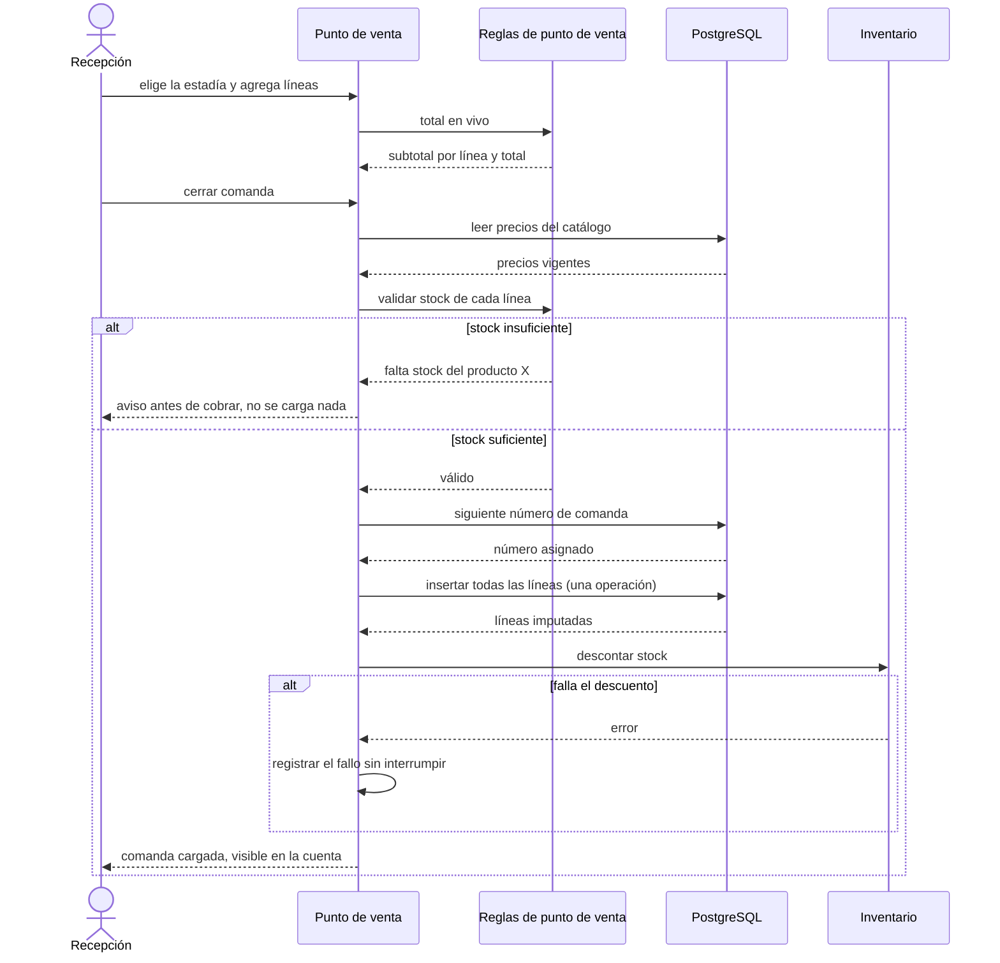
```mermaid
sequenceDiagram
    actor R as Recepción
    participant PV as Punto de venta
    participant RG as Reglas de punto de venta
    participant B as PostgreSQL
    participant I as Inventario

    R->>PV: elige la estadía y agrega líneas
    PV->>RG: total en vivo
    RG-->>PV: subtotal por línea y total
    R->>PV: cerrar comanda
    PV->>B: leer precios del catálogo
    B-->>PV: precios vigentes
    PV->>RG: validar stock de cada línea
    alt stock insuficiente
        RG-->>PV: falta stock del producto X
        PV-->>R: aviso antes de cobrar, no se carga nada
    else stock suficiente
        RG-->>PV: válido
        PV->>B: siguiente número de comanda
        B-->>PV: número asignado
        PV->>B: insertar todas las líneas (una operación)
        B-->>PV: líneas imputadas
        PV->>I: descontar stock
        alt falla el descuento
            I-->>PV: error
            PV->>PV: registrar el fallo sin interrumpir
        end
        PV-->>R: comanda cargada, visible en la cuenta
    end
```

## 9.4 Módulo 3 — Cuenta, pagos y facturación

### 9.4.1 Vista estática del módulo

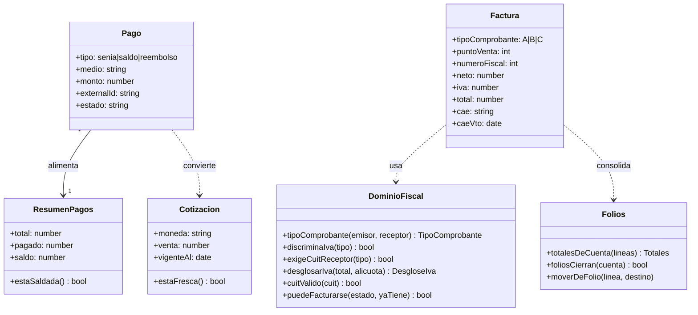
```mermaid
classDiagram
    class Pago {
        +tipo: senia|saldo|reembolso
        +medio: string
        +monto: number
        +externalId: string
        +estado: string
    }
    class ResumenPagos {
        +total: number
        +pagado: number
        +saldo: number
        +estaSaldada() bool
    }
    class Factura {
        +tipoComprobante: A|B|C
        +puntoVenta: int
        +numeroFiscal: int
        +neto: number
        +iva: number
        +total: number
        +cae: string
        +caeVto: date
    }
    class DominioFiscal {
        +tipoComprobante(emisor, receptor) TipoComprobante
        +discriminaIva(tipo) bool
        +exigeCuitReceptor(tipo) bool
        +desglosarIva(total, alicuota) DesgloseIva
        +cuitValido(cuit) bool
        +puedeFacturarse(estado, yaTiene) bool
    }
    class Folios {
        +totalesDeCuenta(lineas) Totales
        +foliosCierran(cuenta) bool
        +moverDeFolio(linea, destino)
    }
    class Cotizacion {
        +moneda: string
        +venta: number
        +vigenteAl: date
        +estaFresca() bool
    }

    Pago "*" --> "1" ResumenPagos : alimenta
    Factura ..> DominioFiscal : usa
    Factura ..> Folios : consolida
    Pago ..> Cotizacion : convierte
```

### 9.4.2 CU-05 · Registrar un pago

**Requerimientos específicos**

| RF | Requerimiento |
|---|---|
| RF-25 | Registrar un pago |
| RF-26 | Recibir el aviso de la pasarela |
| RF-29 | Cotización de divisas para cobros en pesos |
| RNF-08 | El aviso repetido se descarta |

**Prototipo de interfaz**

| Elemento | Comportamiento |
|---|---|
| Resumen de la cuenta | Total, pagado y saldo, siempre visibles en la ficha |
| Tipo de pago | Seña, saldo o reembolso |
| Medio | Efectivo, transferencia o tarjeta |
| Importe | Campo numérico con etiqueta visible |
| Equivalente en pesos | Se muestra con la cotización de venta vigente y la fecha de esa cotización |
| Detalle de pagos | Lista de los pagos registrados con su tipo, medio, importe y fecha |

**Ficha de caso de uso**

| Campo | Contenido |
|---|---|
| Identificador | CU-05 |
| Nombre | Registrar un pago |
| Actor principal | Recepción |
| Actores secundarios | Pasarela de pagos |
| Precondiciones | Existe una reserva con saldo pendiente |
| Postcondiciones | El pago está registrado, el saldo actualizado y el estado ajustado si correspondía. Si vino de la pasarela, el evento no se puede volver a aplicar |
| Reglas asociadas | RN-11, RN-12, RN-34 |

**Flujo principal**

1. Recepción abre la ficha y ve total, pagado y saldo.
2. Elige el tipo de pago.
3. Elige el medio.
4. Ingresa el importe.
5. El sistema registra el pago y recalcula el saldo.
6. Si el saldo llega a cero, la reserva pasa a **pagada** de forma automática.

**Flujos alternativos**

- **1a.** El pago llega por la pasarela: el aviso entra por su dirección, se
  verifica la firma y el pago se registra con el identificador externo que trae.
- **2a.** Es la seña de una reserva pendiente: al registrarla, la reserva pasa a
  confirmada.
- **4a.** El huésped paga en pesos: se convierte con la cotización de venta
  vigente y se guarda el equivalente en dólares junto con la cotización usada.

**Excepciones**

- **E1.** El aviso ya fue procesado: el identificador choca con la restricción de
  unicidad y el evento se descarta. La protección es de la base, no del programa,
  y por eso resiste los reintentos.
- **E2.** La firma no valida: se rechaza. La entrada **falla cerrada**; antes
  tenía el defecto contrario, aceptar cuando no podía verificar.
- **E3.** La cotización disponible está vencida: se usa igual, avisando. La
  alternativa a cobrar con el valor de la mañana es no poder cobrar.

**Vista dinámica**

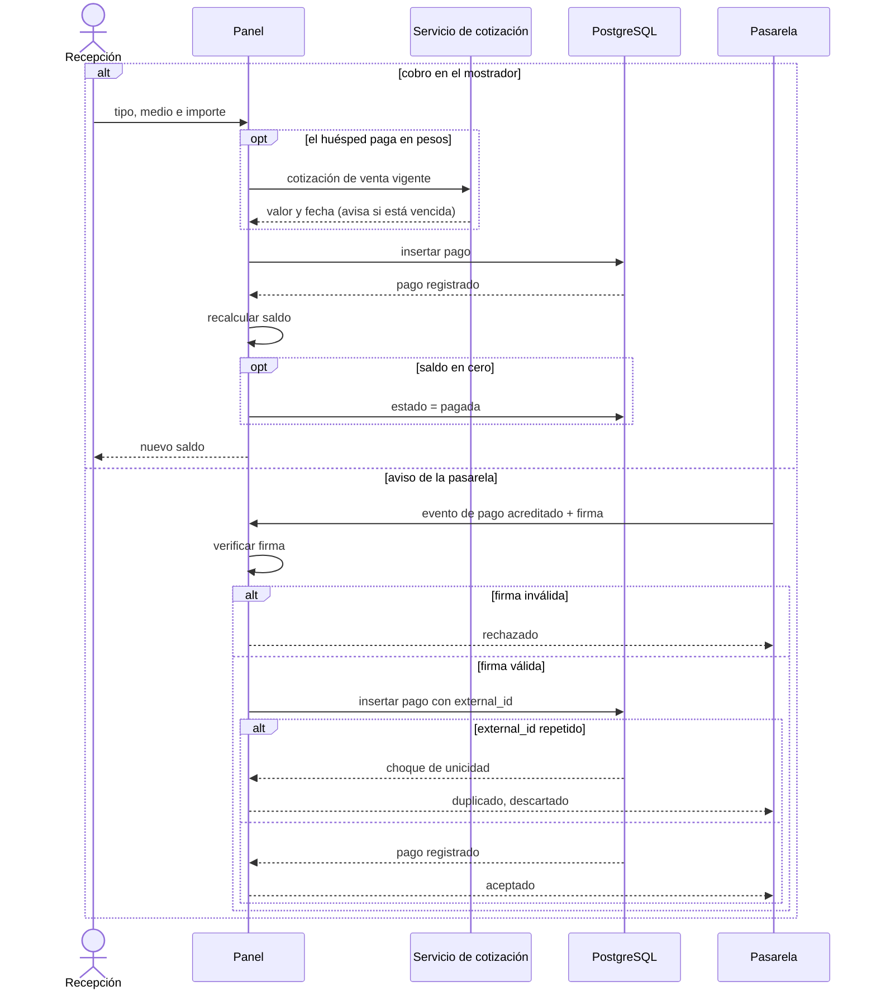
```mermaid
sequenceDiagram
    actor R as Recepción
    participant PA as Panel
    participant CO as Servicio de cotización
    participant B as PostgreSQL
    participant PS as Pasarela

    alt cobro en el mostrador
        R->>PA: tipo, medio e importe
        opt el huésped paga en pesos
            PA->>CO: cotización de venta vigente
            CO-->>PA: valor y fecha (avisa si está vencida)
        end
        PA->>B: insertar pago
        B-->>PA: pago registrado
        PA->>PA: recalcular saldo
        opt saldo en cero
            PA->>B: estado = pagada
        end
        PA-->>R: nuevo saldo
    else aviso de la pasarela
        PS->>PA: evento de pago acreditado + firma
        PA->>PA: verificar firma
        alt firma inválida
            PA-->>PS: rechazado
        else firma válida
            PA->>B: insertar pago con external_id
            alt external_id repetido
                B-->>PA: choque de unicidad
                PA-->>PS: duplicado, descartado
            else
                B-->>PA: pago registrado
                PA-->>PS: aceptado
            end
        end
    end
```

### 9.4.3 CU-06 · Hacer el check-out y facturar

**Requerimientos específicos**

| RF | Requerimiento |
|---|---|
| RF-08 | Avanzar el estado a check-out |
| RF-24 | Cuenta consolidada con folios |
| RF-27 | Emitir la factura |
| RF-28 | Imprimir el comprobante |
| RN-19, RN-20, RN-21, RN-22, RN-23 | Facturabilidad, unicidad, letra derivada, IVA por diferencia y numeración |

**Prototipo de interfaz**

| Elemento | Comportamiento |
|---|---|
| Cuenta consolidada | Alojamiento y consumos agrupados por departamento, con los pagos aplicados |
| Folio A / Folio B | El folio B se oculta si está vacío; mostrarlo sería agregar una columna de ceros a todas las reservas |
| Aviso de folios | Si la suma de los folios no coincide con el total, la pantalla lo advierte arriba con «no factures hasta revisarlo» |
| Botón de check-out | Pide confirmación: no tiene vuelta atrás |
| Botón de emitir factura | Se bloquea al primer clic |
| Comprobante | Vista imprimible con la letra, el punto de venta, el número, el desglose de IVA y el código de autorización |

**Ficha de caso de uso**

| Campo | Contenido |
|---|---|
| Identificador | CU-06 |
| Nombre | Hacer el check-out y facturar |
| Actor principal | Recepción |
| Actores secundarios | Servicio de facturación electrónica |
| Precondiciones | La reserva está en casa. Los consumos están cargados |
| Postcondiciones | La reserva tiene check-out, la unidad quedó libre y existe una única factura con su numeración, su desglose y su código de autorización. Se genera la encuesta de satisfacción. **El código de autorización es simulado** |
| Reglas asociadas | RN-19, RN-20, RN-21, RN-22, RN-23, RN-24 |

**Flujo principal**

1. Recepción abre la vista de salidas del día y selecciona la reserva.
2. Revisa la cuenta consolidada.
3. Registra el pago del saldo si queda algo por cobrar.
4. Confirma el check-out. El sistema valida la transición y libera la unidad.
5. Recepción emite la factura.
6. El sistema determina la letra del comprobante a partir de la condición frente
   al IVA del emisor y del receptor, discrimina el impuesto y calcula el neto por
   diferencia, para que neto más impuesto cierren exactamente con el total.
7. El sistema asigna la numeración correlativa del punto de venta y solicita la
   autorización.
8. El sistema registra la factura con su total, su desglose y el código de
   autorización con su vencimiento.
9. Recepción imprime el comprobante.

**Flujos alternativos**

- **2a.** La cuenta está repartida en dos folios —la empresa paga la habitación y
  el huésped sus consumos—: se revisa cada folio por separado.
- **5a.** Se factura antes del check-out: es válido. Son facturables las reservas
  pagadas, en casa o con check-out hecho. **La cuenta se cierra con la factura, no
  con el check-out.**
- **6a.** El receptor es una agencia responsable inscripta: corresponde
  comprobante A, que exige el CUIT del receptor y muestra el impuesto aparte.
- **6b.** El receptor es consumidor final: corresponde comprobante B, que no
  discrimina el impuesto ni exige CUIT.

**Excepciones**

- **E1.** La reserva ya tiene factura: el intento se rechaza por una restricción
  de unicidad en la base, **no** por una verificación previa. La diferencia
  importa: entre consultar si existe e insertar hay una ventana en la que dos
  operadores simultáneos emitirían dos comprobantes con numeración distinta para
  la misma reserva.
- **E2.** Corresponde comprobante A y el CUIT falta o es inválido: se rechaza. El
  dígito verificador se valida en el sistema, antes de que el organismo lo
  rechace.
- **E3.** Los folios no cierran contra el total: la pantalla lo avisa arriba. El
  total se calcula sobre todas las líneas, no sumando los folios, precisamente
  para que una línea con folio inválido produzca una diferencia visible en lugar
  de desaparecer.
- **E4.** La reserva no está en un estado facturable: el sistema informa el motivo
  —sin consumir, anulada o ya facturada—.

**Vista dinámica**

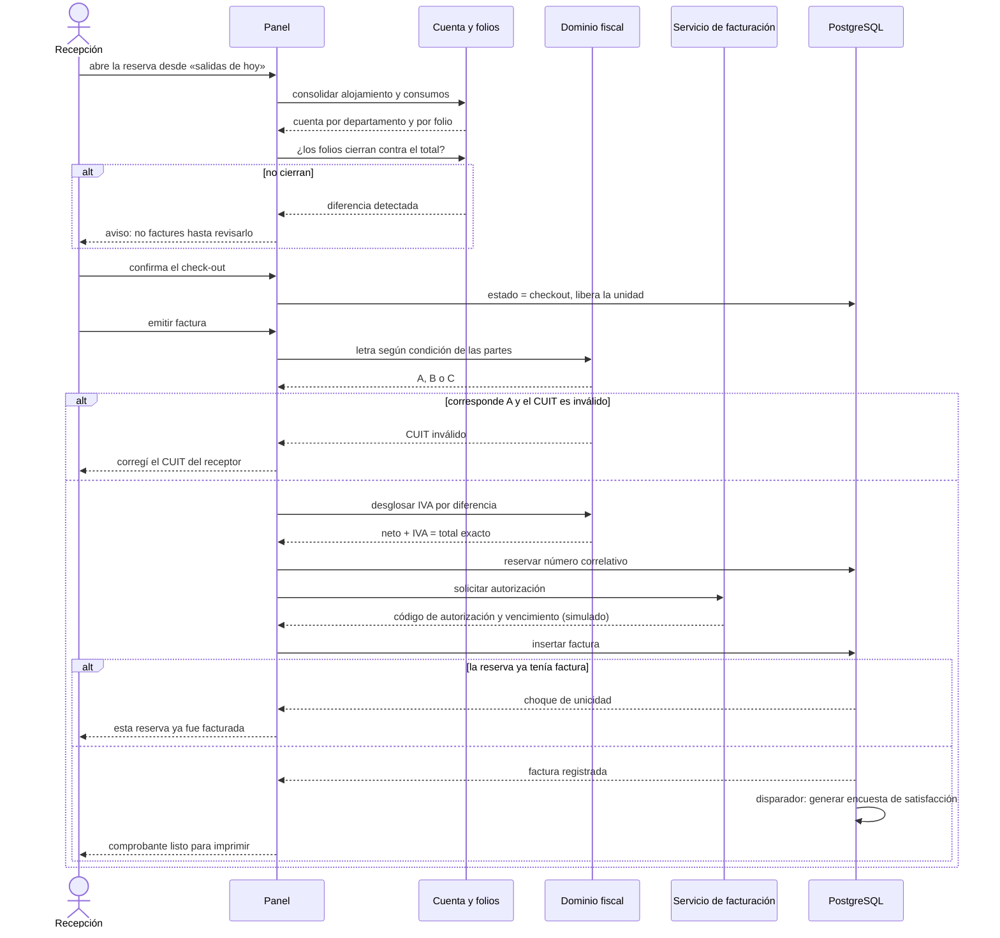
```mermaid
sequenceDiagram
    actor R as Recepción
    participant PA as Panel
    participant CU as Cuenta y folios
    participant DF as Dominio fiscal
    participant FA as Servicio de facturación
    participant B as PostgreSQL

    R->>PA: abre la reserva desde «salidas de hoy»
    PA->>CU: consolidar alojamiento y consumos
    CU-->>PA: cuenta por departamento y por folio
    PA->>CU: ¿los folios cierran contra el total?
    alt no cierran
        CU-->>PA: diferencia detectada
        PA-->>R: aviso: no factures hasta revisarlo
    end
    R->>PA: confirma el check-out
    PA->>B: estado = checkout, libera la unidad
    R->>PA: emitir factura
    PA->>DF: letra según condición de las partes
    DF-->>PA: A, B o C
    alt corresponde A y el CUIT es inválido
        DF-->>PA: CUIT inválido
        PA-->>R: corregí el CUIT del receptor
    else
        PA->>DF: desglosar IVA por diferencia
        DF-->>PA: neto + IVA = total exacto
        PA->>B: reservar número correlativo
        PA->>FA: solicitar autorización
        FA-->>PA: código de autorización y vencimiento (simulado)
        PA->>B: insertar factura
        alt la reserva ya tenía factura
            B-->>PA: choque de unicidad
            PA-->>R: esta reserva ya fue facturada
        else
            B-->>PA: factura registrada
            B->>B: disparador: generar encuesta de satisfacción
            PA-->>R: comprobante listo para imprimir
        end
    end
```

### 9.4.4 CU-07 · Cancelar una reserva aplicando la política

**Requerimientos específicos**

| RF | Requerimiento |
|---|---|
| RF-09 | Cancelar aplicando la política |
| RF-11 | Registrar el no-show |
| RN-04, RN-05 | Tramos de la política y limitación del cobro |

**Ficha de caso de uso**

| Campo | Contenido |
|---|---|
| Identificador | CU-07 |
| Nombre | Cancelar una reserva aplicando la política |
| Actor principal | Recepción |
| Precondiciones | La reserva está pendiente, confirmada o pagada, y tiene una política asociada |
| Postcondiciones | La reserva está cancelada o en no-show y la unidad quedó libre. **No existe ningún asiento del cargo** |
| Reglas asociadas | RN-02, RN-04, RN-05 |

**Flujo principal**

1. Recepción abre la ficha de la reserva.
2. El sistema calcula los días entre hoy y la fecha de entrada.
3. El sistema resuelve el tramo de la política y calcula el importe: sin cargo, la
   primera noche, o el total.
4. El sistema muestra el importe junto al botón de cancelar.
5. Recepción confirma la cancelación.
6. El sistema valida la transición, pasa la reserva a cancelada y **libera la
   unidad**.

**Flujos alternativos**

- **3a.** La estadía cruza un cambio de temporada: la primera noche real no es el
  promedio del total, así que el sistema reparte el total guardado en lugar de
  dividir por la cantidad de noches, que en los dos sentidos daba plata mal
  cobrada.
- **5a.** El huésped no se presentó: se registra el no-show. La política prevé
  cargo total.
- **5b.** Hubo seña: el reembolso de la diferencia se registra como pago de tipo
  reembolso, a mano.

**Excepciones**

- **E1.** La reserva ya está en un estado final: no se ofrece la transición.
- **E2. El cargo calculado no se cobra.** Es la limitación más importante de este
  caso de uso: el importe se informa en pantalla, la reserva se cancela, y no se
  registra un pago, ni un cargo en la cuenta, ni una retención. Está documentado
  con cinco opciones evaluadas y la decisión pendiente del hotel. El riesgo
  declarado es doble: el hotel pierde el ingreso que la política prevé, y se le
  comunica al huésped un cargo que no se produce.

**Vista dinámica**

```mermaid
sequenceDiagram
    actor R as Recepción
    participant PA as Panel
    participant PC as Política de cancelación
    participant MQ as Máquina de estados
    participant B as PostgreSQL

    R->>PA: abre la ficha de la reserva
    PA->>PC: días de anticipación y total de la estadía
    PC-->>PA: tramo aplicable y monto del cargo
    PA-->>R: «se cobraría USD X» junto al botón de cancelar
    R->>PA: confirma la cancelación
    PA->>MQ: ¿transición válida?
    MQ-->>PA: permitida
    PA->>B: estado = cancelada
    B->>B: disparador: la estadía deja de ocupar inventario
    B-->>PA: confirmado
    PA-->>R: reserva cancelada, unidad liberada
    Note over PA,B: El cargo informado NO se asienta.<br/>Limitación conocida y documentada.
```

## 9.5 Módulo 4 — Housekeeping

### 9.5.1 Vista estática del módulo

```mermaid
classDiagram
    class Unidad {
        +nombre: string
        +estadoHk: limpia|sucia|inspeccionada|bloqueada
        +asignadaA: Perfil
        +bloque: string
        +piso: string
        +orden: int
    }
    class ReglasHousekeeping {
        +prioridad(unidad, llegadas, salidas) Prioridad
        +motivo(unidad) string
        +contadoresPorMucama(unidades) Contadores
        +avanceDelTurno(unidades) number
    }
    class OrdenMantenimiento {
        +descripcion: string
        +estado: string
        +prioridad: string
    }
    class PlanPreventivo {
        +periodicidad: string
        +proximaFecha: date
        +generarOrdenes() OrdenMantenimiento[]
    }
    class Perfil {
        +rol: Rol
        +activo: bool
    }

    Unidad "*" --> "1" Perfil : asignada a
    ReglasHousekeeping ..> Unidad : ordena
    Unidad "1" --> "*" OrdenMantenimiento : tiene
    PlanPreventivo ..> OrdenMantenimiento : genera
```

### 9.5.2 CU-08 · Marcar el estado de limpieza de una unidad

**Requerimientos específicos**

| RF | Requerimiento |
|---|---|
| RF-30 | Marcar el estado de limpieza |
| RF-31 | Asignar mucamas |
| RF-32 | Trabajar desde el teléfono por prioridad |
| RN-31, RN-32, RN-33 | Prioridad, quién puede inspeccionar y qué unidades cierra cada persona |

**Prototipo de interfaz**

La vista para el teléfono usa **tarjetas y no una tabla**: una tabla en un
teléfono obliga a desplazarse de costado, que este proyecto prohíbe.

| Elemento | Comportamiento |
|---|---|
| Tarjeta por habitación | Una por unidad asignada, ordenadas por prioridad real |
| Etiqueta de prioridad | «Urgente», «Alta» o sin etiqueta, con el **motivo escrito al lado** |
| Botón por tarjeta | Un solo botón grande: «Marcar limpia» |
| Avance del turno | Cuántas faltan y el porcentaje; las bloqueadas no cuentan en el denominador |
| Orden interno | Numérico dentro de la prioridad: «9» antes que «102», que es el recorrido del pasillo |

**Ficha de caso de uso**

| Campo | Contenido |
|---|---|
| Identificador | CU-08 |
| Nombre | Marcar el estado de limpieza de una unidad |
| Actor principal | Housekeeping |
| Precondiciones | Sesión activa con rol de housekeeping y unidades asignadas |
| Postcondiciones | La unidad quedó en el estado correspondiente y el avance del turno lo refleja |
| Reglas asociadas | RN-31, RN-32, RN-33 |

**Flujo principal**

1. La mucama abre su vista de trabajo desde el teléfono.
2. El sistema muestra una tarjeta por habitación asignada, ordenadas por prioridad
   real y con el motivo escrito.
3. Dentro de cada prioridad, el orden es el del recorrido del pasillo.
4. La mucama termina una habitación y toca el botón de su tarjeta.
5. El sistema valida que esa unidad esté asignada a esa persona.
6. El sistema pasa la unidad a **limpia**.
7. El sistema recalcula el avance del turno.

**Flujos alternativos**

- **1a.** La operación la hace administración o gerencia desde el tablero, que
  permite cualquier transición sobre cualquier unidad.
- **2a.** La habitación está bloqueada o en reparación: no genera tarea y no
  cuenta en el denominador del avance. Si además hay una llegada prevista, el
  problema es de recepción.

**Excepciones**

- **E1.** La mucama intenta marcar una habitación de otra persona: se rechaza. La
  gobernanta sí puede cerrar cualquiera.
- **E2.** La mucama intenta marcarla como inspeccionada: no existe esa opción
  desde el teléfono. **El destino lo decide el sistema, no el formulario**: si
  pudiera, el control de calidad lo firmaría quien hizo el trabajo.
- **E3.** El rol de housekeeping intenta modificar otros datos de la unidad: la
  política de la base se lo impide. Puede tocar el estado de limpieza y la
  asignación, no el inventario.

**Vista dinámica**

```mermaid
sequenceDiagram
    actor M as Mucama
    participant MOV as Vista móvil
    participant RH as Reglas de housekeeping
    participant B as PostgreSQL

    M->>MOV: abre «mi trabajo»
    MOV->>B: unidades asignadas + llegadas y salidas de hoy
    B-->>MOV: datos
    MOV->>RH: calcular prioridad y motivo de cada unidad
    RH-->>MOV: urgente / alta / sin tarea, con el motivo
    MOV-->>M: tarjetas ordenadas por prioridad
    M->>MOV: «marcar limpia» en una tarjeta
    MOV->>MOV: ¿está asignada a esta persona?
    alt no está asignada
        MOV-->>M: solo podés cerrar tus habitaciones
    else asignada
        MOV->>B: estado_hk = limpia
        Note over MOV,B: el destino lo fija el dominio;<br/>«inspeccionada» no es alcanzable desde el móvil
        B-->>MOV: confirmado
        MOV->>RH: recalcular avance del turno
        RH-->>MOV: faltantes y porcentaje
        MOV-->>M: tarjeta cerrada, avance actualizado
    end
```

## 9.6 Módulo 5 — Canales de venta

### 9.6.1 Vista estática del módulo

```mermaid
classDiagram
    class CanalReserva {
        +canal: string
        +externalId: string
        +estado: nueva|importada|error|ignorada
        +importeCanal: number
        +comision: number
        +motivoError: string
    }
    class CanalCargo {
        +origen: informe|factura
        +monto: number
        +periodo: string
    }
    class LectorInforme {
        +leerCsv(archivo) CanalReserva[]
        +fechasAmbiguas: int
    }
    class LectorCalendario {
        +traerReservas() CanalReserva[]
    }
    class CapacidadesCanal {
        +puedePublicarDisponibilidad: false
        +puedeConfirmarRecepcion: false
    }
    class ServicioCanal {
        +aterrizar(entrantes)
        +importar(entrante) Reserva
        +detectarConflictoDeCupo(entrante) bool
    }
    class Reserva

    LectorInforme ..> CanalReserva : produce
    LectorCalendario ..> CanalReserva : produce
    ServicioCanal ..> CanalReserva : aterriza e importa
    CanalReserva "1" --> "*" CanalCargo : devenga
    CanalReserva "0..1" --> "1" Reserva : se convierte en
    ServicioCanal ..> CapacidadesCanal : declara
```

### 9.6.2 CU-09 · Importar reservas de un canal de venta

**Requerimientos específicos**

| RF | Requerimiento |
|---|---|
| RF-35 | Sondear el canal |
| RF-36 | Importar el informe del extranet |
| RF-37 | Incorporar una entrante |
| RF-40 | Contabilizar la comisión |
| RN-26 a RN-30 | Estado de entrada, precio propio, zona de recepción, estado desconocido y doble registro de la comisión |

**Prototipo de interfaz**

| Elemento | Comportamiento |
|---|---|
| Advertencia permanente | Con icono y texto: **esta integración no evita la sobreventa**. No se puede ocultar |
| Subir informe | Campo de archivo con etiqueta visible |
| Aviso de fechas ambiguas | «N fechas podían leerse de dos formas» después de procesar el archivo |
| Tabla de entrantes | Canal, identificador externo, huésped, período, importe informado, comisión y estado |
| Estado «Con problema» | Muestra el motivo escrito, no un código |
| Botón importar | Por fila; convierte la entrante en reserva del hotel |
| Botón ignorar | Por fila; deja registro de la decisión |

**Ficha de caso de uso**

| Campo | Contenido |
|---|---|
| Identificador | CU-09 |
| Nombre | Importar reservas de un canal de venta |
| Actor principal | Recepción |
| Actores secundarios | Canal de venta · Sistema, como tarea programada |
| Precondiciones | El canal está configurado: la dirección de su calendario, o el archivo del informe descargado del extranet |
| Postcondiciones | Existe una reserva confirmada del canal, con su comisión devengada y su vínculo a la entrante. **El inventario publicado en el canal sigue sin actualizarse** |
| Reglas asociadas | RN-01, RN-26, RN-27, RN-28, RN-29, RN-30 |

**Flujo principal**

1. La tarea programada sondea el calendario del canal, o recepción sube el archivo
   del informe.
2. El sistema lee lo recibido y **aterriza** cada reserva en la zona de recepción,
   sin ocupar inventario.
3. El sistema detecta al aterrizar si alguna entrante choca con una reserva
   existente, y lo señala como posible sobreventa.
4. Recepción abre la pantalla de canales y revisa las entrantes.
5. Selecciona una y pide incorporarla.
6. El sistema busca al huésped por su correo, y lo crea si no existe.
7. El sistema **recalcula el precio** a tarifa neta con sus propias tarifas. El
   importe del canal queda como referencia para conciliar; si difiere, se avisa.
8. El sistema crea la reserva en estado **confirmada**, con su estadía.
9. El sistema devenga la comisión de esa reserva en el libro auxiliar del canal.
10. La entrante queda marcada como importada, con el vínculo a la reserva.

**Flujos alternativos**

- **2a.** El archivo trae fechas ambiguas: una fecha como 10/09/2026 puede ser el
  10 de septiembre o el 9 de octubre y **no se puede resolver mirando el
  archivo**. Se asume día/mes y la pantalla **advierte cuántas fueron ambiguas**.
- **2b.** El estado que informa el canal no se reconoce: se interpreta como
  reserva nueva, nunca como cancelada.
- **4a.** Recepción decide no incorporarla: la ignora, y queda ese registro.
- **9a.** Llega la factura mensual del canal: entra como comprobante del canal en
  su carácter de proveedor y se concilia contra las comisiones devengadas. Las dos
  filas conviven a propósito: la informada y la facturada. Si compartieran clave,
  la segunda borraría a la primera y la conciliación sería imposible.

**Excepciones**

- **E1.** La unidad ya está vendida: la restricción anti-sobreventa rechaza la
  escritura y la entrante queda **con el motivo escrito**, no perdida en un
  registro técnico. Éste es el objetivo de que exista la zona de recepción.
- **E2.** El separador del archivo no es el esperado: el informe usa punto y coma
  cuando la planilla exporta en español. Asumir la coma no falla, devuelve
  columnas vacías, que es peor. El lector lo detecta.
- **E3.** El sistema no puede publicar disponibilidad hacia el canal: no es un
  fallo, es una capacidad que el canal no ofrece por esta vía. El sistema lo
  **declara** en el descriptor de capacidades y distingue «no puedo» de «fallé».

**Vista dinámica**

```mermaid
sequenceDiagram
    participant T as Tarea programada
    participant CA as Canal Booking
    participant SC as Servicio de canales
    participant B as PostgreSQL
    actor R as Recepción
    participant PR as Motor de precios

    T->>CA: leer calendario publicado
    CA-->>T: reservas del feed
    T->>SC: aterrizar entrantes
    SC->>B: insertar en zona de recepción (no ocupa inventario)
    SC->>B: detectar conflicto de cupo
    B-->>SC: marca de posible sobreventa
    Note over T,B: La tarea NO crea reservas.<br/>Aterriza para que alguien las revise.
    R->>SC: revisa las entrantes e importa una
    SC->>B: buscar huésped por correo
    SC->>PR: recalcular a tarifa neta
    PR-->>SC: total propio del hotel
    opt difiere del importe informado
        SC-->>R: aviso de diferencia (no se ajusta)
    end
    SC->>B: crear reserva confirmada + estadía
    alt la unidad ya estaba vendida
        B-->>SC: rechazo por superposición
        SC->>B: entrante en estado error con el motivo
        SC-->>R: conflicto: el canal vendió una unidad ya vendida
    else
        B-->>SC: reserva creada
        SC->>B: devengar comisión de la reserva
        SC-->>R: importada, con su vínculo
    end
```

## 9.7 Módulo 6 — Gestión y administración

### 9.7.1 Vista estática del módulo

```mermaid
classDiagram
    class MetricasDeMes {
        +mes: string
        +nochesVendidas: int
        +nochesDisponibles: int
        +ingresoAlojamiento: number
        +ocupacion() number
        +adr() number
        +revpar() number
    }
    class Perfil {
        +rol: Rol
        +activo: bool
    }
    class Permisos {
        +AREAS: Area[]
        +PERMISOS: Rol to Area[]
        +AREAS_OCULTAS: Area[]
        +puedeAcceder(rol, area) bool
    }
    class Auditoria {
        +tabla: string
        +accion: INSERT|UPDATE|DELETE
        +usuarioId: uuid
        +datosPrevios: json
        +datosNuevos: json
    }
    class Respaldo {
        +tablas: string[]
        +generadoEn: date
        +estaFresco() bool
    }

    MetricasDeMes ..> Perfil : consultada por gerencia
    Permisos ..> Perfil : gobierna
    Auditoria ..> Perfil : registra quién
    Respaldo ..> Perfil : solo admin exporta
```

### 9.7.2 CU-10 · Consultar los indicadores de gestión

**Requerimientos específicos**

| RF | Requerimiento |
|---|---|
| RF-45 | Consultar los indicadores |
| RF-46 | Exportar las series |
| RN-15 | La noche de salida no cuenta como ocupada |
| RNF-10 | Ninguna lectura se trunca en silencio |

**Prototipo de interfaz**

| Elemento | Comportamiento |
|---|---|
| Selector de mes | Cambia todo el tablero |
| Indicadores principales | Ocupación, tarifa promedio diaria e ingreso por habitación disponible, con la variación respecto del mes anterior |
| Ingresos y facturado | Cobrado y facturado del período |
| Reservas por estado | Distribución del mes |
| Ranking de canales | Participación por canal |
| Rentabilidad por canal | Ingreso neto de comisión |
| Satisfacción | Índice de recomendación del huésped |
| Exportar serie | Botón que baja los datos a planilla |
| Estado vacío | Enuncia el hecho, no muestra una tabla en blanco |

**Ficha de caso de uso**

| Campo | Contenido |
|---|---|
| Identificador | CU-10 |
| Nombre | Consultar los indicadores de gestión |
| Actor principal | Gerencia |
| Precondiciones | Sesión activa con acceso al área de reportes. Hay estadías, pagos y facturas en el período |
| Postcondiciones | Ninguna: es un caso de uso de consulta |
| Reglas asociadas | RN-15, RN-30 |

**Flujo principal**

1. Gerencia abre los reportes y elige el mes.
2. El sistema calcula, con las definiciones estándar de la industria: **ocupación**
   como noches vendidas sobre noches disponibles, **tarifa promedio diaria** como
   ingreso de alojamiento sobre noches vendidas, e **ingreso por habitación
   disponible** como ingreso de alojamiento sobre noches disponibles.
3. El sistema muestra además ingresos cobrados, facturado, reservas por estado,
   ranking de canales, rentabilidad por canal neta de comisión y satisfacción.
4. El sistema muestra la variación respecto del mes anterior.
5. Gerencia exporta la serie si necesita trabajarla afuera.

**Flujos alternativos**

- **2a.** Una estadía queda a caballo entre dos meses: se prorratea, aporta a cada
  mes solo las noches que le corresponden.
- **4a.** El mes anterior fue cero: no se muestra la variación. Un «más cien por
  ciento» sobre cero sería engañoso en un informe de gestión.

**Excepciones**

- **E1.** Recepción o housekeeping intentan entrar: la guarda redirige.
- **E2.** Los totales al pie de un listado paginado son **de la página, y la
  pantalla lo dice**. Sumar el resultado completo exigiría traer todas las filas,
  que es lo que la paginación evita.

**Vista dinámica**

```mermaid
sequenceDiagram
    actor G as Gerencia
    participant PA as Panel de reportes
    participant GU as Guarda de acceso
    participant ME as Módulo de métricas
    participant B as PostgreSQL

    G->>PA: elige el mes
    PA->>GU: ¿el rol accede a reportes?
    alt sin acceso
        GU-->>PA: no autorizado
        PA-->>G: redirección
    else autorizado
        GU-->>PA: autorizado
        PA->>B: estadías, pagos y facturas del período
        B-->>PA: datos
        PA->>ME: calcular ocupación, tarifa media e ingreso por habitación
        ME->>ME: prorratear estadías a caballo entre meses
        ME-->>PA: indicadores del mes
        PA->>ME: variación contra el mes anterior
        alt mes anterior en cero
            ME-->>PA: sin base de comparación
        else
            ME-->>PA: variación porcentual
        end
        PA-->>G: tablero con los indicadores
    end
```

## 9.8 Casos de uso restantes

Los casos de uso siguientes están implementados y verificados, y se documentan en
forma resumida para no extender el documento. Cada uno sigue el mismo patrón:
guarda de acceso por área, validación en el dominio, escritura con revisión del
error y revalidación de la pantalla.

| ID | Caso de uso | Actor | Módulo | Particularidad |
|---|---|---|---|---|
| CU-11 | Administrar usuarios | Administración | Usuarios | El usuario nace sin rol y desactivado; la baja revoca el acceso en la base, no solo en la aplicación |
| CU-12 | Vencer reservas sin seña | Sistema | Reservas | Tarea diaria a las 03:10; descarta las que tengan seña aprobada |
| CU-13 | Reprogramar una reserva | Recepción | Reservas | Cambia el período con la misma verificación de superposición |
| CU-14 | Cambiar de unidad | Recepción | Reservas | Advierte si la reserva está marcada «no mover» |
| CU-15 | Reservar un grupo | Recepción | Reservas | Titular único y una estadía por unidad |
| CU-16 | Consultar la grilla de ocupación | Recepción · Gerencia | Ocupación | Estado por letra y color; resumen diario desde la misma cuenta que los indicadores de arriba |
| CU-17 | Registrar un desperfecto | Recepción · Housekeeping | Mantenimiento | Se puede abrir desde la celda de la grilla con la unidad ya elegida |
| CU-18 | Generar mantenimiento preventivo | Sistema | Mantenimiento | Tarea diaria a las 06:00 |
| CU-19 | Administrar cuentas de agencias | Gerencia | Agencias | Convenio, descuento y etapa comercial |
| CU-20 | Administrar cuentas por pagar | Administración | Proveedores | Antigüedad de saldos y vencimiento automático diario |
| CU-21 | Firmar un contrato | Agencia · Proveedor | Contratos | Por token, sin cuenta; se verifica la integridad del texto firmado |
| CU-22 | Consultar la cuenta como socio | Agencia · Proveedor | Portal de socios | Por token; el aislamiento se verifica en el dominio además del filtro de la consulta |
| CU-23 | Imprimir los partes de cocina | Recepción | Servicio de cocina | Quien sale hoy desayuna; quien entra hoy, no |
| CU-24 | Exportar los datos operativos | Administración | Respaldos | Solo administración exporta; gerencia ve el estado |
| CU-25 | Responder la encuesta | Huésped | Encuesta pública | Por token, generada al cerrar la estadía |
| CU-26 | Consultar al asistente | Huésped | Portal | Reglas deterministas; lo no reconocido queda registrado para seguimiento |
| CU-27 | Consultar la ayuda | Todos los internos | Ayuda | Filtrada por rol: cada uno ve solo lo que puede hacer |

**Fuente:** `app/reservar/actions.ts`, `app/panel/*/actions.ts`,
`app/panel/reservas/[id]/`, `app/panel/punto-venta/`, `app/panel/canales/`,
`app/panel/housekeeping/`, `app/panel/reportes/`, `lib/domain/` (reservas,
cancelacion, facturacion, folios, housekeeping, metricas, ocupantes,
punto-venta), `lib/canales/`, `supabase/migrations/0011`, `0027`, `0045`, `0052`.

---

# 10. Implementación del Software

Esta sección describe **cómo está construido** cada caso de uso: qué archivos lo
componen, dónde vive cada responsabilidad y qué decisiones de implementación se
tomaron. A diferencia de los capítulos anteriores, acá se citan rutas concretas,
porque el destinatario es quien tenga que mantener el sistema.

## 10.1 Convenciones transversales

Antes del detalle por módulo, seis convenciones que se aplican en todo el código y
que explican la forma de cada archivo.

**1. Autorización en la primera línea.** Toda página y toda operación de escritura
del panel empieza con `requerirAcceso(area)` de `lib/auth/session.ts`. La guarda
resuelve la sesión, lee el rol del perfil y redirige si el rol no tiene el área.
No es una comprobación en la interfaz: corre en el servidor antes de renderizar o
de escribir.

**2. Ninguna escritura descarta su error.** Hay tres formas, y no son
intercambiables (`lib/acciones.ts`):

| Situación | Herramienta | Comportamiento |
|---|---|---|
| La operación devuelve estado a la pantalla | `return { error: 'mensaje en español' }` | El formulario muestra el mensaje y conserva lo cargado |
| La operación redirige | `cortarSiFalla(error, destino, motivo)` | Corta la ejecución y lleva a la pantalla destino con el motivo |
| Escritura accesoria o compensación | `registrarFalla(error, contexto)` | Registra en el log del servidor **sin** interrumpir |

El detalle técnico va al log del servidor, nunca a la dirección web. En un
rollback se usa `registrarFalla` y no `cortarSiFalla`, porque el segundo taparía
el error original, que es el que hay que mostrar.

**3. Las reglas viven en `lib/domain/`.** Son 48 módulos que no importan la
biblioteca de base de datos, el framework, la biblioteca de interfaz ni el
validador. Las pantallas orquestan; no calculan.

**4. La interfaz sale de `app/panel/_components/ui.tsx`.** Componentes de servidor
sin estado ni eventos: `Encabezado`, `Tarjeta`, `Kpi`, `Tabla`, `Buscador`,
`Paginacion`, `Chip`, `EstadoVacio`, `Mensaje`. Los formularios de servidor usan
`BotonEnvio`, que bloquea el doble clic.

**5. Toda lectura de una tabla completa pasa por `traerTodo`** de
`lib/paginado.ts`. La interfaz de consulta corta en mil filas sin error y sin
aviso; un respaldo o un reporte truncado en silencio es peor que ninguno, porque
parece completo.

**6. Los filtros de búsqueda no interpolan el término del usuario.** Va por
`patronOr()` de `lib/listados.ts`, que lo encierra entre comillas dobles. Escapar
los comodines no alcanza: la coma separa condiciones y los paréntesis agrupan, así
que un término crudo puede cambiar el filtro entero.

## 10.2 Módulo Reservas

### CU-01 · Reservar desde el portal público

| Responsabilidad | Archivo |
|---|---|
| Pantalla de búsqueda y resultados | `app/reservar/page.tsx` |
| Formulario de datos del huésped | `app/reservar/checkout/page.tsx` |
| Operación de alta | `app/reservar/actions.ts` → `crearReservaPublica` |
| Confirmación por token | `app/reservar/confirmacion/[token]/page.tsx` |
| Consulta de disponibilidad | `lib/availability/disponibilidad.ts` |
| Cotización | `lib/pricing/cotizar.ts` |
| Alta atómica | `lib/reservas/crear.ts` → `crearReservaEnUnidadLibre` |
| Límite por origen | `lib/limites.ts` + `lib/domain/limites.ts` |
| Señal de escasez | `lib/domain/senales.ts` |
| Función de base | `crear_reserva` (migraciones `0007` y `0039`) |

**Decisiones de implementación**

- **La escritura corre con la credencial privilegiada.** El visitante es anónimo y
  la seguridad de fila no le permite escribir reservas. Toda la escritura pública
  pasa por un único punto controlado en el servidor, y el resto del modelo queda
  intacto.
- **La reserva nace `pendiente`**, lo que ya bloquea la unidad. La confirma el
  pago de la seña.
- **La disponibilidad y el precio se separan en dos señales.** Antes se mezclaban
  en un solo indicador de «disponible», y cuando faltaba cargar la tarifa de un
  período el portal decía «sin disponibilidad»: le avisaba al huésped que el hotel
  estaba lleno cuando había lugar y solo faltaba el precio.
- **El límite por origen se resuelve en la base**, con una función que inserta
  primero y cuenta después dentro de la misma llamada. Si dos peticiones
  simultáneas leyeran el conteo y después insertaran, las dos podrían pasar el
  techo. Si la comprobación falla —base caída, encabezado ausente— **se deja
  pasar**: el limitador protege contra abuso, pero si se rompe no debe impedir que
  un huésped legítimo reserve.

### CU-02 · Reservar en el mostrador

| Responsabilidad | Archivo |
|---|---|
| Pantalla de alta | `app/panel/reservas/nueva/page.tsx` |
| Alta de grupo | `app/panel/reservas/nueva-grupo/page.tsx` |
| Operaciones | `app/panel/reservas/actions.ts` → `crearReservaAction`, `crearReservaGrupal` |
| Consulta del listado | `app/panel/reservas/consulta.ts` |
| Vistas operativas | `lib/domain/vistas-reservas.ts` |
| Ocupantes y capacidad | `lib/domain/ocupantes.ts` |
| Datos comerciales | `lib/domain/reservas.ts` |
| Motor de precios | `lib/domain/precios.ts` |

**Decisiones de implementación**

- **`crear_reserva` es el único lugar donde nacen estadías.** Lo usan el panel, el
  portal público y la importación de canales. Ahí se deriva la cantidad de
  ocupantes del desglose, y por eso no hace falta una restricción en la base que
  lo garantice —restricción que además habría roto las operaciones de mudanza y
  reprogramación—.
- **La función se reemplazó con `drop` + `create`, no con `create or replace`.**
  Con una lista de argumentos distinta, `replace` habría creado una **segunda**
  función y una llamada por nombre podría resolverse a la equivocada. Se verificó
  que quede exactamente una en el catálogo del motor.
- **Trampa documentada del listado:** un filtro sobre una tabla embebida solo
  acota la fila madre si el embebido es interno. Con un embebido normal, la
  interfaz de datos devuelve **todas** las filas madre con el arreglo vacío: un
  filtro que no filtra y no falla. Hay una prueba que lo detecta.

## 10.3 Módulo Estadía y consumos

### CU-03 · Check-in · CU-04 · Cargar un consumo

| Responsabilidad | Archivo |
|---|---|
| Ficha de la reserva | `app/panel/reservas/[id]/page.tsx` |
| Transiciones de estado | `app/panel/reservas/actions.ts` → `cambiarEstadoReserva` |
| Consumo desde la ficha | `app/panel/reservas/actions.ts` → `agregarConsumo`, `quitarConsumo` |
| Punto de venta | `app/panel/punto-venta/page.tsx` + `actions.ts` |
| Reglas del punto de venta | `lib/domain/punto-venta.ts` |
| Cuenta consolidada | `lib/domain/consumos.ts` |
| Máquina de estados | `lib/domain/reservas.ts` |
| Servicio de cocina | `lib/domain/servicio.ts` |
| Numeración de comandas | secuencia `comandas_numero_seq` (migración `0040`) |

**Decisiones de implementación**

- **Los precios no viajan en el formulario.** La operación los lee del catálogo.
  Si vinieran del formulario, cualquiera podría cargarse un vino a cero editando
  el HTML.
- **Un solo `insert` con todas las líneas:** o entran todas o ninguna.
- **El número de comanda se pide después de validar**, para no consumir números en
  comandas rechazadas. Es una **secuencia**, que admite huecos a propósito: lo
  contrario de la numeración de facturas, que no puede tenerlos por exigencia
  fiscal. No hay que intercambiar los mecanismos.
- **No se creó una tabla de comandas.** Sería duplicar la tabla de consumos, que
  ya tiene producto, cantidad y precio congelado, y que ya impacta en la cuenta
  del huésped por un camino probado. Una comanda no es una entidad con vida
  propia: es un agrupador de líneas cargadas juntas, y para eso alcanza un número
  compartido. Así no hay dos caminos por los que un consumo llegue a la cuenta.
- **El descuento de stock usa `registrarFalla` y no corta.** El consumo ya está en
  la cuenta; si el stock no baja, el inventario queda mal —corregible—, pero
  cortar dejaría a quien cargó creyendo que la comanda no entró.

## 10.4 Módulo Cuenta, pagos y facturación

### CU-05 · Registrar un pago · CU-06 · Check-out y facturar · CU-07 · Cancelar

| Responsabilidad | Archivo |
|---|---|
| Registro de pagos | `app/panel/reservas/actions.ts` → `registrarPago` |
| Aviso de la pasarela | `app/api/webhooks/pagos/[proveedor]/route.ts` |
| Abstracción de pasarela | `lib/payments/` |
| Cuenta detallada y folios | `app/panel/reservas/[id]/cuenta/` + `lib/domain/folios.ts` |
| Emisión de la factura | `app/panel/reservas/actions.ts` → `emitirFactura` |
| Comprobante imprimible | `app/panel/reservas/[id]/factura/page.tsx` |
| Dominio fiscal | `lib/domain/facturacion.ts` |
| Adaptador de facturación | `lib/facturacion/` |
| Resumen de pagos | `lib/domain/pagos.ts` |
| Política de cancelación | `lib/domain/cancelacion.ts` |
| Cotización de divisas | `lib/domain/divisas.ts` + `lib/divisas/` |
| Unicidad de la factura | migración `0045` |
| Numeración correlativa | migraciones `0025` y `0033` |

**Decisiones de implementación**

- **La unicidad de la factura se movió a la base.** La operación era del tipo
  «consulto si existe y después inserto», con la ventana de carrera que eso
  implica. Hoy la garantía es una restricción de unicidad: dos operadores
  simultáneos no pueden emitir dos comprobantes para la misma reserva.
- **El IVA se calcula por diferencia** sobre el total, para que neto más impuesto
  cierren exactamente aunque el redondeo de cada parte por separado no cerrara.
- **La condición frente al IVA se guarda en la contraparte**, no en la factura:
  así la letra del comprobante se deduce sola en lugar de elegirse a mano cada
  vez.
- **El total de la cuenta se calcula sobre todas las líneas, no sumando los
  folios.** Es deliberado: si una línea tuviera un folio inválido, quedaría afuera
  de los folios pero dentro del total, y la diferencia se ve. Sumar los folios la
  habría escondido.
- **El aviso de la pasarela falla cerrado.** Antes tenía el defecto contrario:
  aceptaba el evento cuando no podía verificar la firma. La idempotencia es una
  restricción de unicidad sobre el identificador externo, no una comprobación
  previa.
- **La política de cancelación se calcula pero no se cobra.** Está anotado en el
  propio código y documentado como decisión pendiente.

## 10.5 Módulo Housekeeping y Canales

### CU-08 · Marcar el estado de limpieza

| Responsabilidad | Archivo |
|---|---|
| Tablero de administración | `app/panel/housekeeping/page.tsx` |
| Vista móvil | `app/panel/housekeeping/mi-trabajo/page.tsx` |
| Operaciones | `app/panel/housekeeping/actions.ts` |
| Reglas de prioridad | `lib/domain/housekeeping.ts` |
| Política de la base | migración `0048` |

**Decisiones de implementación**

- **`marcarLimpiaDesdeMovil` está separada de `cambiarEstadoUnidad`.** El destino
  lo fija el dominio y no el formulario: desde el móvil solo se puede pasar de
  sucia a limpia. Si el formulario pudiera enviar «inspeccionada», el control de
  calidad lo firmaría quien hizo el trabajo.
- **La política de la base se acotó.** La regla original dejaba al rol de
  housekeeping actualizar **cualquier** columna de la unidad, incluido el tipo de
  alojamiento. La migración `0048` la limitó al estado de limpieza y la
  asignación. Lo encontró una prueba de escritura por rol.

### CU-09 · Importar reservas de un canal

| Responsabilidad | Archivo |
|---|---|
| Pantalla de canales | `app/panel/canales/page.tsx` + `actions.ts` |
| Mapeo de columnas | `app/panel/canales/mapeo/` |
| Puerto del canal | `lib/canales/index.ts` |
| Lector del informe | `lib/canales/csv.ts` |
| Lector del calendario | `lib/canales/ical.ts` + `booking-ical.ts` |
| Aterrizaje e importación | `lib/canales/servicio.ts` |
| Reglas puras | `lib/domain/canales.ts`, `canales-costos.ts`, `canales-cobro.ts` |
| Tarea programada | `app/api/cron/canales/route.ts` |
| Esquema | migraciones `0038`, `0049`–`0055` |

**Decisiones de implementación**

- **El informe no es un proveedor; el calendario sí.** El primero es una subida
  manual de archivo: no hay nada que sondear. Meterlos en la misma operación de
  «traer reservas» habría forzado que uno mintiera sobre lo que hace.
- **El puerto declara sus capacidades.** Antes había dos salidas y las dos malas:
  que la operación de publicar disponibilidad no hiciera nada y devolviera éxito
  —mentir—, o que lanzara una excepción y rompiera al llamador. Hoy un descriptor
  declara qué puede hacer el proveedor, y el resultado distingue «no puedo» de
  «fallé».
- **La tarea programada aterriza, no importa.** Importar significa crear una
  reserva confirmada que ocupa inventario; hacerlo sin que nadie mire contradice
  la razón de existir de la zona de recepción. Lo que gana el hotel es tiempo: el
  conflicto de cupo se detecta al aterrizar, así que el indicador de posible
  sobreventa se enciende sin que nadie haya entrado al sistema.
- **La tarea exige un secreto compartido**, comparado en tiempo constante. Si no
  está configurado, el punto de entrada rechaza con un error de servicio: no
  existe un modo «sin secreto», porque eso convertiría el endpoint en una puerta
  pública que escribe en la base con la credencial privilegiada.
- **Trampas del formato, todas cubiertas por pruebas:** el separador del informe es
  punto y coma cuando la planilla exporta en español; una fecha ambigua no se
  puede resolver mirando el archivo, así que se asume día/mes y se advierte; el
  espacio inicial de una línea de continuación del calendario es el marcador de
  plegado y se descarta; y la fecha de fin del calendario **ya es exclusiva** y
  coincide con el criterio de períodos del sistema —restarle un día, el reflejo
  natural, dejaría todas las estadías una noche cortas—.

## 10.6 Módulo Gestión

### CU-10 · Indicadores · CU-11 · Usuarios · CU-24 · Respaldos

| Responsabilidad | Archivo |
|---|---|
| Reportes | `app/panel/reportes/page.tsx` |
| Métricas | `lib/domain/metricas.ts`, `metricas-canal.ts` |
| Usuarios | `app/panel/usuarios/` + `actions.ts` |
| Permisos | `lib/domain/permisos.ts` |
| Respaldos | `app/panel/respaldos/` + `app/api/respaldo/route.ts` |
| Alcance del respaldo | `lib/domain/respaldos.ts` |
| Auditoría | migración `0020` |
| Alta sin privilegios | migraciones `0032` y `0035` |
| Baja efectiva | migración `0033` |

**Decisiones de implementación**

- **Los indicadores se calculan una sola vez.** La pantalla y la exportación usan
  la misma función. Antes la página los calculaba a mano; con dos cuentas era
  cuestión de tiempo que mostraran números que no cerraran y el usuario no supiera
  cuál creer.
- **Las tres áreas apagadas se controlan desde una lista.** Quitar un nombre de
  `AREAS_OCULTAS` vuelve a habilitar el módulo completo: el menú, el tablero de
  inicio, el capítulo de ayuda y la guarda de cada pantalla, porque todos
  preguntan por la misma función.
- **El alta de usuario necesitó dos migraciones.** Agregar un valor a un tipo
  enumerado y usarlo por primera vez no pueden ir en el mismo archivo: el motor
  corta la transacción con un error de «uso inseguro de un valor nuevo», el
  reinicio de la base falla ahí y no aplica nada de lo que sigue. Es lo que le
  pasó a la migración `0032` y por eso existe la `0035`.
- **El respaldo exporta con `traerTodo`**, no con una consulta directa. Un respaldo
  truncado en silencio parece completo, que es lo peor que puede pasarle a un
  respaldo. La aclaración de alcance va **dentro del archivo**, no solo en la
  pantalla: si alguien lo encuentra en un disco en tres años, tiene que saber qué
  no contiene.
- **El registro de respaldos no admite modificación ni borrado.** Si se pudiera
  borrar, la respuesta a «cuándo fue el último» dejaría de ser confiable, que es
  lo único que esa tabla existe para garantizar.

**Fuente:** los archivos citados en cada tabla; `lib/acciones.ts`,
`lib/auth/session.ts`, `lib/paginado.ts`, `lib/listados.ts`;
`docs/modernizacion-winpax.md`; `docs/sincronizacion-automatica.md`;
`docs/SEGURIDAD.md`.

---

# 11. Integración y Testing

## 11.1 Niveles de prueba

| Nivel | Qué verifica | Cantidad | Necesita base |
|---|---|---|---|
| **Unitario de dominio** | Reglas puras: precios, cancelación, desglose fiscal, transiciones de estado, capacidad y ocupantes, prioridad de limpieza, folios, métricas, validación de CUIT, formato de importes | La mayor parte de los 955 casos ejecutables sin infraestructura | No |
| **De borde externo** | Lector del informe del canal, calendario del canal, proveedor de cotización: ceros, errores del servidor, tiempos de espera, respuestas en HTML donde se esperaba otra cosa | Incluidos arriba | No |
| **De operaciones** | Que cada operación de escritura verifique el rol y revise el error de la base | `tests/acciones/` | Parcial |
| **De integración** | Restricción anti-sobreventa bajo concurrencia, cotización, alta atómica, expiración de pendientes, columnas generadas, políticas de escritura por rol y borde público | 337 casos | Sí |

Total: **1292 casos en 79 archivos**.

## 11.2 La trampa de los saltos silenciosos

Los casos que necesitan base se saltean si no la hay, para que la suite siga
siendo útil en una máquina sin contenedores. El problema es que saltear en
silencio deja el semáforo verde **sin haber probado el anti-sobreventa**, que es
la garantía central del sistema.

Por eso existe la variable `EXIGIR_DB`: cuando vale `1` —como en integración
continua— la falta de base es un **error** y no un salto. Si la base no levantó,
la suite falla y se ve.

Esa protección tiene un hueco conocido y documentado: mira si hay base, no si hay
clave pública. Sin exportar la clave publicable, los cuatro casos que verifican
qué puede leer efectivamente un visitante sin sesión quedan salteados **aun con la
protección activa**. En el pipeline se exportan las tres variables; en local hay
que hacerlo a mano.

## 11.3 Integración continua

El pipeline (`.github/workflows/ci.yml`) corre en cada envío a la rama principal y
en cada pedido de incorporación de cambios:

1. Instala las dependencias con la versión fijada.
2. **Levanta la base de datos completa en contenedores** y aplica las 57
   migraciones más los datos de ejemplo.
3. Exporta las credenciales de la base, cortando con un error explícito si no
   pudo leerlas —si no, la falla aparecería más tarde y disfrazada: las pruebas
   dirían «falta la base» y la compilación, «dirección inválida»—.
4. **Crea el usuario administrador**, porque los datos de ejemplo no crean
   perfiles: se crean con la interfaz de autenticación, que necesita la credencial
   privilegiada. Sin este paso la tabla de perfiles queda vacía y las pruebas de
   facturación fallan por la clave foránea de «quién emitió». Era la causa de que
   el pipeline nunca terminara en verde.
5. Corre revisión de estilo, comprobación de tipos, las pruebas con `EXIGIR_DB=1`
   y la compilación.

Dos detalles que hay que respetar si se toca el pipeline: el paso de los datos de
ejemplo invoca el script **directo** y no a través del gestor de paquetes —el
comando del gestor usa una opción que exige una versión mínima de Node y en el
ejecutor no hay archivo de entorno que leer—; y sin ese paso, las pruebas de
facturación fallan.

## 11.4 Verificación local

Un solo comando (`npm run check`) corre revisión de estilo, comprobación de tipos,
pruebas y compilación. La regla del proyecto es que **nada se da por terminado sin
que ese comando salga en verde**.

| Comando | Qué hace | Estado verificado |
|---|---|---|
| `npm run check` | Verificación completa | Salida 0 |
| `npm test` | Solo pruebas | 1292 casos, 0 fallos |
| `npm run typecheck` | Comprobación de tipos | Salida 0 |
| `npm run lint` | Revisión de estilo | Salida 0 |
| `npm run build` | Compilación de producción | 21 segundos |
| `GET /api/salud` | Salud del sistema | 200 si la base responde, 503 si no |

## 11.5 Defectos encontrados y cómo se cerraron

Todo arreglo entra con una prueba que fallaba antes del arreglo. Cuatro ejemplos
que muestran por qué esa regla no es una formalidad:

| Defecto | Cómo se manifestaba | Cómo se cerró |
|---|---|---|
| «USD 0» al reservar | La reserva se cotizaba en cero por faltar las temporadas cargadas. El número era plausible y equivocado | Se separó «sin lugar» de «sin precio cargado», con prueba |
| El asistente informaba precios sin IVA afirmando que los incluía | Le publicaba al huésped un número más bajo del que después se cobraba | Toda pantalla de cara al huésped pasa el precio por la función que suma el IVA |
| El asistente anunciaba un día de más en cada temporada | Los rangos son abiertos a la derecha y se mostraba el fin sin restar el día | Función única para mostrar rangos, con prueba |
| El filtro sobre tabla embebida no filtraba | Devolvía todas las reservas con el arreglo vacío: un filtro que no filtra y no falla | Embebido interno y una prueba que verifica que «llegadas de hoy» no trae a quien entró ayer |

**Fuente:** `tests/`, `tests/db.ts`, `.github/workflows/ci.yml`, `package.json`,
`docs/bitacora.md` (fases 18 y 22), `docs/modernizacion-winpax.md`.

---

# 12. Especificaciones del Sistema

## 12.1 Despliegue

El sistema está construido para desplegarse como una única aplicación web, con la
base de datos gestionada por la plataforma. **El despliegue en producción está
pendiente**: requiere las cuentas del hotel en los dos servicios.

```mermaid
flowchart LR
    subgraph CLI["Clientes"]
        C1["PC de recepción<br/>navegador"]
        C2["Teléfono de la mucama<br/>navegador"]
        C3["Huésped<br/>cualquier dispositivo"]
    end
    subgraph PROD["Producción"]
        V["Plataforma de aplicación<br/>Next.js · HTTPS · dominio propio"]
        S["Base de datos gestionada<br/>PostgreSQL 17 · autenticación<br/>seguridad por fila · copias diarias"]
    end
    subgraph EXT["Servicios externos"]
        E1["Pasarela de pagos"]
        E2["Correo transaccional"]
        E3["Facturación electrónica"]
        E4["Calendario del canal"]
        E5["Cotización del dólar"]
    end
    subgraph DEV["Entorno de desarrollo"]
        D1["Base local en contenedores<br/>PostgreSQL 17 + servicios"]
        D2["Servidor de desarrollo"]
        D3["Integración continua<br/>base real en contenedores"]
    end

    C1 --> V
    C2 --> V
    C3 --> V
    V --> S
    V --> E1
    V --> E2
    V --> E3
    V --> E4
    V --> E5
    D2 --> D1
    D3 --> D1
```

**Pasos de la puesta en producción**

| # | Paso | Estado |
|---|---|---|
| 1 | Crear el proyecto de base de datos y aplicar las 57 migraciones | Pendiente |
| 2 | Sembrar el usuario administrador y los datos del tarifario | Script disponible |
| 3 | Cargar las variables de entorno obligatorias | Documentadas |
| 4 | Conectar el repositorio a la plataforma de aplicación | Pendiente |
| 5 | Configurar el dominio propio y el certificado | Pendiente |
| 6 | Configurar la tarea programada del canal, con su secreto | Declarada en la configuración del proyecto |
| 7 | Verificar el punto de consulta de salud | Disponible |
| 8 | Migrar los datos históricos de Winpax y de las planillas | Pendiente |

**Variables de entorno obligatorias en producción.** Si falta alguna, el sistema
**no arranca**, a propósito: es preferible eso a operar con un simulador creyendo
que se está cobrando o facturando de verdad.

| Variable | Para qué |
|---|---|
| `EMAIL_PROVIDER` | Proveedor de correo |
| `FIRMA_PROVIDER` | Proveedor de firma electrónica |
| `FACTURACION_PROVIDER` | Proveedor de facturación electrónica |
| `COTIZACION_PROVIDER` | Fuente de la cotización del dólar |
| `CANAL_PROVIDER` | Proveedor del canal de venta |
| `CRON_SECRET` | Secreto de la tarea programada del canal |

Opcionales: `BOOKING_ICAL_FEEDS` (pares de código de tipo y dirección),
`DOLARAPI_URL` y `ARGENTINADATOS_URL`.

**Nota sobre la frecuencia de la tarea programada.** El plan inicial de la
plataforma permite **una corrida por día**, no una cada tres horas. Por eso la
tarea está programada a las 06:00, antes de que abra el mostrador. Configurar una
frecuencia mayor en ese plan **no falla visiblemente**: se ejecuta una vez al día
igual, y quien la configuró queda creyendo que corre más seguido.

## 12.2 Hardware mínimo y óptimo

El sistema es una aplicación web: el trabajo de cómputo está en el servidor
gestionado y en la base de datos, y el cliente solo necesita un navegador
actualizado. Los valores siguientes son **requisitos derivados de la arquitectura
y del equipamiento relevado**, no mediciones de carga: el sistema no se sometió a
una prueba de estrés.

**Puesto de trabajo (recepción y administración)**

| Componente | Mínimo | Óptimo |
|---|---|---|
| Procesador | Doble núcleo, 2 GHz | Cuatro núcleos, 2,5 GHz o superior |
| Memoria | 4 GB | 8 GB |
| Almacenamiento | 20 GB libres | Unidad de estado sólido |
| Pantalla | 1366 × 768 | 1920 × 1080, para que la grilla de ocupación muestre más días sin desplazamiento |
| Impresora | Multifunción para comprobantes y fichas | La misma; el comprobante se imprime desde el navegador |
| Conectividad | 5 Mbps simétricos | Fibra óptica, que es lo que el hotel ya tiene |

El equipamiento actual del hotel —2 PC con Windows en recepción, una por turno, y
una impresora multifunción— **cumple el mínimo y no requiere recambio**. Es una de
las ventajas de reemplazar un sistema de escritorio por uno web: el requisito de
hardware baja en lugar de subir.

**Dispositivo móvil (housekeeping)**

| Componente | Mínimo | Óptimo |
|---|---|---|
| Sistema | Android 10 o iOS 14, con navegador actualizado | Versión vigente |
| Pantalla | 5 pulgadas | 6 pulgadas o más |
| Conectividad | WiFi del hotel | La misma; el tablero es liviano y no descarga imágenes |

La vista de housekeeping se diseñó para este escenario: tarjetas en lugar de
tablas, un botón grande por tarjeta y área de toque ampliada.

**Servidor**

No hay servidor propio. La aplicación se ejecuta en una plataforma gestionada que
asigna los recursos por petición, y la base de datos es un servicio gestionado. El
plan inicial de ambos servicios es suficiente para el volumen relevado —351
reservas y 1.175 pernoctes al mes—; el punto de atención no es la capacidad de
cómputo sino el **límite de una corrida diaria de tareas programadas** del plan
inicial y las **copias de seguridad con punto de recuperación**, que están en el
plan pago.

## 12.3 Software de base y aplicación

| Capa | Componente | Versión | Notas |
|---|---|---|---|
| Base de datos | PostgreSQL | 17 | Con las extensiones de índices sobre rangos y de tareas programadas |
| Plataforma de datos | Supabase | — | Autenticación, seguridad por fila, almacenamiento y API de datos |
| Entorno de ejecución | Node.js | 22 LTS (verificado en integración continua) | El desarrollo local corre también sobre versiones posteriores |
| Framework | Next.js | 16.2.9 | Renderizado en servidor, componentes de servidor y operaciones de escritura del servidor |
| Lenguaje | TypeScript | 5.x | Sin uso de tipos de escape salvo con justificación escrita |
| Estilos | Tailwind CSS | 4 | Con un sistema de diseño propio |
| Cliente de datos | Biblioteca oficial de Supabase | 2.108 | Tres clientes: servidor, navegador y privilegiado |
| Validación | Zod | 4.4 | **Solo para las variables de entorno**; la validación de formularios está escrita a mano en cada operación |
| Pruebas | Vitest | 3.2 | 1292 casos |
| Control de versiones | Git + GitHub | — | Rama principal protegida, integración continua obligatoria |
| Navegadores | Los últimos dos años de las versiones estables | — | El sistema funciona sin JavaScript en los filtros y las búsquedas |

**Software del puesto de trabajo:** solo un navegador actualizado. No hay que
instalar nada, que es la diferencia central con Winpax.

## 12.4 Seguridad y Auditoría

### Modelo de seguridad en capas

```mermaid
flowchart TB
    A["1 · BORDE PÚBLICO<br/>límite por origen · encabezados de protección<br/>token opaco en lugar de identificador"]
    B["2 · APLICACIÓN<br/>guarda de acceso por área en cada pantalla<br/>y en cada operación de escritura"]
    C["3 · BASE DE DATOS<br/>43 tablas con seguridad de fila<br/>90 políticas · privilegios por columna"]
    D["4 · INTEGRIDAD<br/>restricción anti-sobreventa · unicidad de factura<br/>unicidad del aviso de pago · disparadores"]
    E["5 · AUDITORÍA<br/>registro de solo agregado sobre pagos,<br/>tarifas y estados de reserva"]
    A --> B --> C --> D --> E
```

El principio es **defensa en profundidad**: la interfaz oculta lo que el rol no
puede hacer, la guarda del servidor redirige si alguien entra a la dirección a
mano, y la barrera real es la base de datos. Aunque la aplicación falle, la base
no entrega datos fuera de rol.

### Controles implementados

| Control | Cómo está resuelto |
|---|---|
| **Autenticación** | Correo y contraseña gestionados por la plataforma. Sin auto-registro: los usuarios los crea un administrador |
| **Autorización** | Mapa de permisos por área en el dominio, consumido por la guarda del servidor y por el menú. 21 áreas × 4 roles |
| **Alta sin privilegios** | El usuario nace sin rol y desactivado, y ese valor queda fuera de la lista de roles válidos, de modo que la sesión se descarta |
| **Baja efectiva** | Dar de baja revoca el acceso en la base, no solo en la aplicación |
| **Seguridad de datos** | Seguridad de fila activa en las 43 tablas, con 90 políticas. Lectura pública limitada al catálogo |
| **Información comercial** | El precio neto de agencia está fuera del alcance del rol público por dos caminos: permiso de ejecución revocado sobre la función que lo conoce, y privilegio revocado sobre la columna |
| **Credencial privilegiada** | Marcada como exclusiva de servidor; se usa en los tres lugares donde un actor sin cuenta necesita leer o escribir algo propio |
| **Límite de volumen** | Por dirección de origen, resuelto en la base con una función atómica que inserta y cuenta en la misma llamada |
| **Encabezados de protección** | Tipo de contenido, marco, referencia de origen, permisos de dispositivo y transporte seguro |
| **Datos de tarjeta** | **No se guardan.** Solo el medio de pago y el identificador de la pasarela. Hay una prueba que lo fija como contrato |
| **Accesos por token** | Identificadores opacos para confirmación de reserva, firma de contrato, portal de socios y encuesta. El aislamiento se verifica además en el dominio |
| **Firma de mensajes entrantes** | El aviso de pago verifica la firma y **falla cerrado** |
| **Inyección en filtros** | El término de búsqueda nunca se interpola crudo: va por una función que lo encierra entre comillas |
| **Tokens de firma** | Fuera del alcance del personal |
| **Facturas** | Inmutables una vez emitidas |

### Auditoría

La tabla de auditoría registra **quién cambió qué y cuándo** en las operaciones
donde un error o un abuso tiene consecuencias económicas: pagos, tarifas y cambios
de estado de reserva —es decir, cancelaciones—.

| Característica | Detalle |
|---|---|
| Alcance | Pagos, tarifas y estados de reserva, por disparadores en la base |
| Contenido | Tabla, identificador del registro, acción, usuario, rol, fila completa antes y después, y fecha |
| Naturaleza | **Solo agregado**: nadie puede editarla ni borrarla desde la interfaz de datos |
| Pantalla | **Apagada** por decisión del hotel |
| Registro | **Sigue escribiéndose.** Se ocultó la vista, no la traza |

La decisión de mantener el registro con la pantalla apagada es deliberada: un
rastro de auditoría que se deja de escribir porque nadie lo mira pierde justamente
el valor que tiene —estar ahí cuando hay que revisar algo que pasó antes—, y
volver a encenderlo no recupera lo que no se guardó.

### Trabajo de seguridad realizado y pendiente

La auditoría de seguridad se hizo en fases, con numeración propia.

| Fase | Qué se hizo |
|---|---|
| 0 | Reconocimiento sin modificar código |
| 1 | Límite de volumen en las entradas públicas y en el acceso; protección del script de datos de ejemplo contra bases no locales; encabezados de seguridad |
| 2 | Cuatro defectos encontrados leyendo el código: el precio neto de agencia expuesto al rol público, el aviso de pago que fallaba abierto, inyección de condiciones en los filtros de búsqueda y el último formulario oculto. Segunda parte: cierre del otro camino al precio neto |
| 3 | Alta de usuario sin privilegios, baja efectiva, numeración de facturas operable, tokens de firma fuera del alcance del personal, facturas inmutables, 9 índices sobre claves foráneas, verificación de rol en las 51 operaciones de escritura, firma real en el aviso de pago y simuladores que fallan fuerte en producción |

**Pendiente, y declarado:**

- **Revisar las 90 políticas de seguridad de fila una por una.** Que estén activas
  en las 43 tablas no dice qué permite cada una. Exige ejecutarlas contra una base
  con los cuatro roles.
- **Política de contenido en el navegador.** No se aplicó: una política mal
  calibrada rompe la aplicación de formas difíciles de diagnosticar. Hacerla bien
  exige un valor único por petición y probar cada pantalla. Es mejor no tenerla
  que tenerla mal y desactivarla al primer problema.
- **Atomicidad de los flujos de varios pasos de reservas.** Hoy un fallo a mitad de
  camino avisa, pero deja los datos incompletos. Resolverlo pide una función
  transaccional en la base.
- **Seguridad por campo.** Hoy es por área. Que recepción vea el precio de
  mostrador pero no el neto de agencia exigiría un rol de base de datos por cada
  rol de negocio, que es un rediseño del modelo de seguridad completo.

**Fuente:** `docs/SEGURIDAD.md`, `docs/AUDITORIA_INICIAL.md`,
`docs/audit/00-pendientes.md`, `docs/decisiones/0005`, `0016`, `0017`, `0018`,
`supabase/migrations/0020`, `0029`–`0035`, `0048`, `next.config.ts`,
`supabase/config.toml`, `package.json`, `vercel.json`,
`docs/sincronizacion-automatica.md`.

---

# 13. Trazabilidad

La tabla cruza cada requerimiento funcional con el caso de uso que lo realiza y el
módulo del sistema que lo implementa. Es lo que permite verificar que el documento
describe el sistema construido y no un sistema imaginado.

| RF | Requerimiento | Caso de uso | Módulo |
|---|---|---|---|
| RF-01 | Consultar disponibilidad | CU-01, CU-02 | Portal · Reservas |
| RF-02 | Cotizar la estadía | CU-01, CU-02 | Portal · Reservas |
| RF-03 | Reservar desde el mostrador | CU-02 | Reservas |
| RF-04 | Reservar desde el portal | CU-01 | Portal |
| RF-05 | Reservar un grupo | CU-15 | Reservas |
| RF-06 | Consultar el listado | CU-03 | Reservas |
| RF-07 | Consultar la ficha | CU-03, CU-05, CU-07 | Reservas |
| RF-08 | Avanzar el estado | CU-03, CU-06, CU-07 | Reservas |
| RF-09 | Cancelar con política | CU-07 | Reservas |
| RF-10 | Reprogramar | CU-13 | Reservas |
| RF-11 | Cambiar de unidad | CU-14 | Reservas |
| RF-12 | Consultar por token | CU-01 | Portal |
| RF-13 | Recordatorios de llegada | CU-03 | Reservas · Correo |
| RF-14 | Ver la grilla | CU-16 | Ocupación |
| RF-15 | Filtrar y ordenar la grilla | CU-16 | Ocupación · Configuración |
| RF-16 | Reservar desde una celda | CU-02 | Ocupación · Reservas |
| RF-17 | Administrar el padrón | CU-02, CU-03 | Huéspedes |
| RF-18 | Buscar e historial | CU-03 | Huéspedes |
| RF-19 | Exportar listados | CU-10 | Todos los listados |
| RF-20 | Administrar el catálogo | CU-04 | Configuración |
| RF-21 | Cargar una comanda | CU-04 | Punto de venta |
| RF-22 | Anular una comanda | CU-04 | Punto de venta |
| RF-23 | Consumo desde la reserva | CU-04 | Reservas |
| RF-24 | Administrar la cuenta | CU-06 | Cuenta de la reserva |
| RF-25 | Registrar un pago | CU-05 | Reservas |
| RF-26 | Aviso de la pasarela | CU-05 | Entrada de pagos |
| RF-27 | Emitir la factura | CU-06 | Reservas · Facturación |
| RF-28 | Imprimir el comprobante | CU-06 | Factura de la reserva |
| RF-29 | Administrar la cotización | CU-05 | Configuración · Divisas |
| RF-30 | Marcar el estado de limpieza | CU-08 | Housekeeping |
| RF-31 | Asignar mucamas | CU-08 | Housekeeping |
| RF-32 | Trabajar desde el teléfono | CU-08 | Housekeeping móvil |
| RF-33 | Registrar un desperfecto | CU-17 | Mantenimiento |
| RF-34 | Mantenimiento preventivo | CU-18 | Mantenimiento |
| RF-35 | Sondear el canal | CU-09 | Canales · Tarea programada |
| RF-36 | Importar el informe | CU-09 | Canales |
| RF-37 | Incorporar una entrante | CU-09 | Canales |
| RF-38 | Configurar el mapeo | CU-09 | Canales |
| RF-39 | Mensajes y reseñas | CU-09 | Canales |
| RF-40 | Contabilizar la comisión | CU-09 | Canales · Proveedores |
| RF-41 | Administrar agencias | CU-19 | Agencias |
| RF-42 | Administrar proveedores | CU-20 | Proveedores |
| RF-43 | Portal de la contraparte | CU-22 | Portal de socios |
| RF-44 | Gestionar contratos | CU-21 | Contratos |
| RF-45 | Consultar indicadores | CU-10 | Reportes |
| RF-46 | Exportar series | CU-10 | Reportes |
| RF-47 | Tablero de inicio | — | Inicio |
| RF-48 | Buscador global | CU-03 | Buscador global |
| RF-49 | Configurar tarifas y temporadas | — | Configuración |
| RF-50 | Configurar la ubicación física | CU-16 | Configuración |
| RF-51 | Administrar usuarios | CU-11 | Usuarios |
| RF-52 | Exportar datos operativos | CU-24 | Respaldos |
| RF-53 | Publicar avisos | — | Avisos |
| RF-54 | Partes de cocina | CU-23 | Servicio de cocina |
| RF-55 | Consultar la ayuda | CU-27 | Ayuda |
| RF-56 | Catálogo de alojamientos | CU-01 | Catálogo público |
| RF-57 | Asistente de consultas | CU-26 | Asistente del portal |
| RF-58 | Encuesta de satisfacción | CU-25 | Encuesta pública |

**Requerimientos sin caso de uso especificado.** RF-47, RF-49 y RF-53 son
operaciones de configuración y comunicación interna, previas o laterales al
circuito de la estadía: están implementadas y verificadas, pero no se les
desarrolló una ficha de caso de uso propia.

**Los requerimientos no funcionales** no se realizan en un caso de uso: son
propiedades del sistema. Se verifican con las pruebas de escritura por rol y de
borde público contra la base real, las pruebas de límite por origen y de aviso de
pago duplicado, las hojas de estilo globales, y la estructura del proyecto, que es
comprobable con una búsqueda de importaciones.
