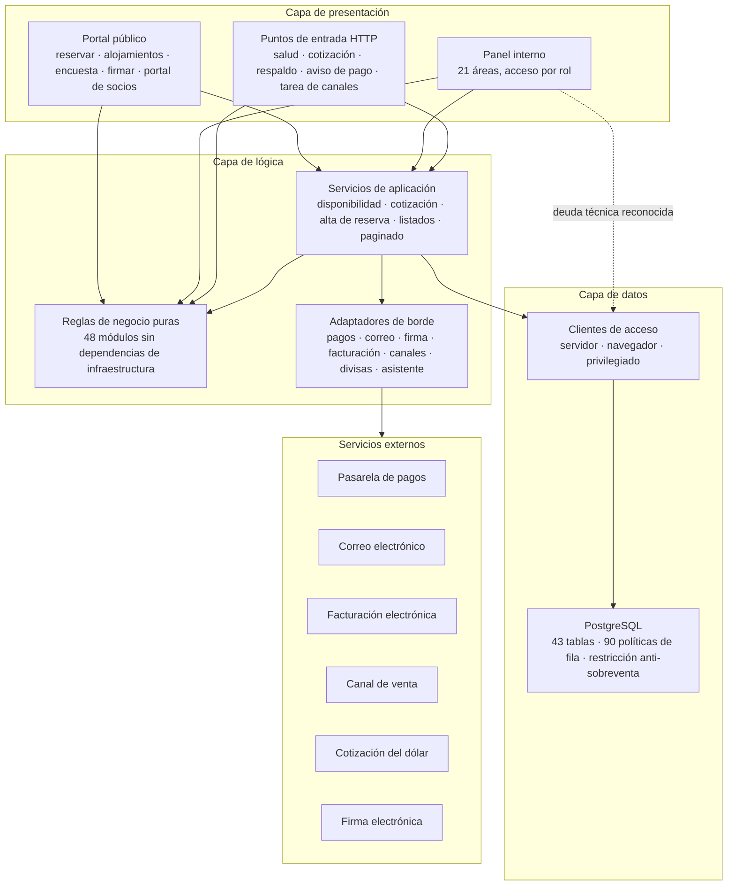
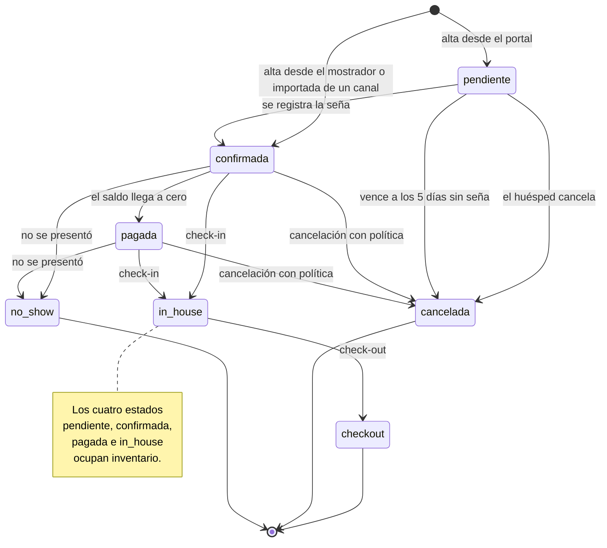
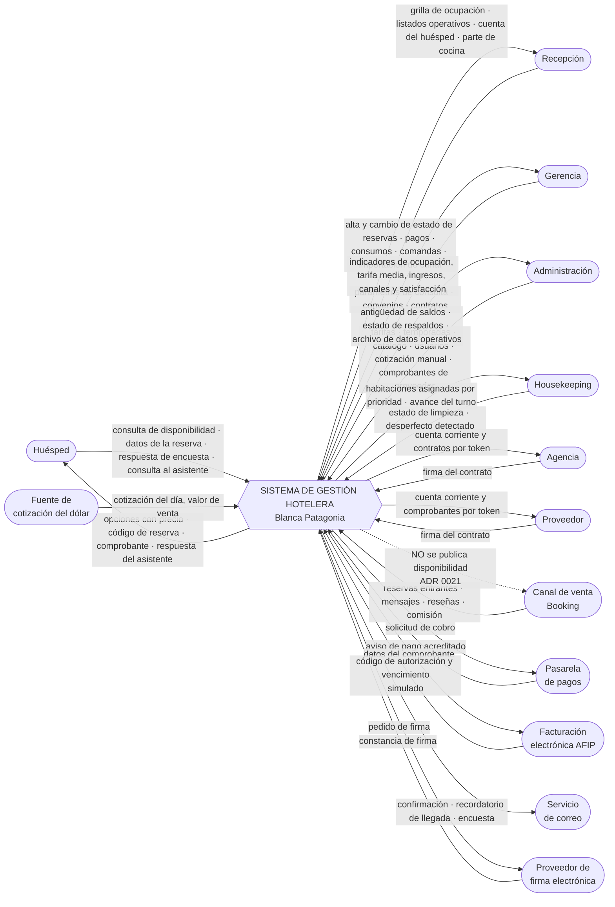
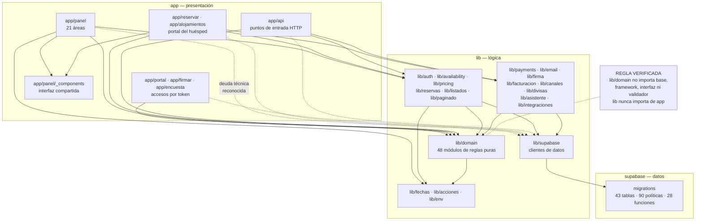
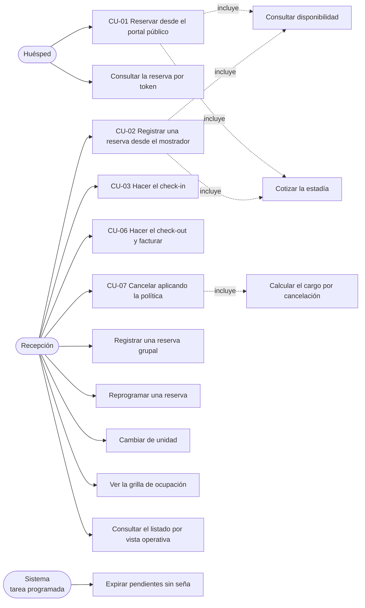
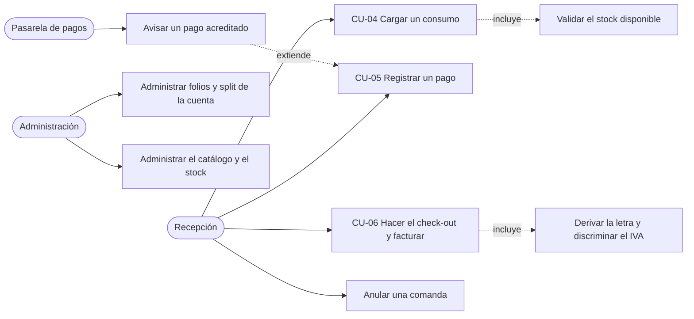
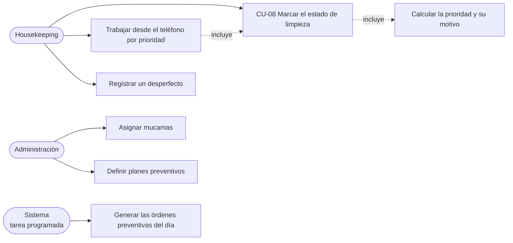
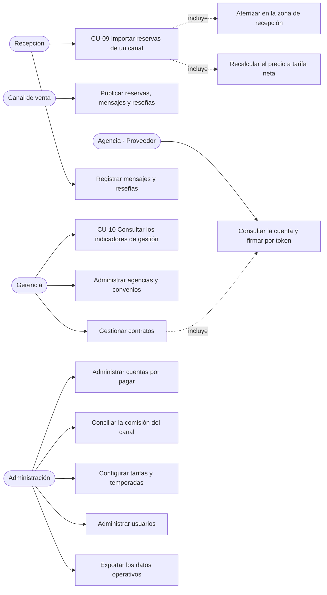

# Sistema de Gestión Hotelera — Hotel Blanca Patagonia

## PARTE 2: MODELADO Y DESARROLLO DEL SISTEMA (PP3)

**Carrera:** Analista de Sistemas — Colegio Universitario IES
**Autores:** Fakiani, Octavio · Morán, Santiago
**Comitente:** Blanca Patagonia S.A.S. — Charles Furh 149, El Calafate, Santa Cruz
**Fecha:** agosto de 2026

> Este documento describe el sistema **tal como está construido**. No propone
> funcionalidad nueva: releva lo implementado, lo que se decidió no implementar y
> el motivo de cada decisión. Cuando algo difiere de lo anticipado en la PP2, se
> señala explícitamente en el capítulo 7.

---

## Índice

1. [Objetivos, Límites y Alcance](#1-objetivos-límites-y-alcance)
   - [1.1 Objetivo general](#11-objetivo-general)
   - [1.2 Objetivos específicos](#12-objetivos-específicos)
   - [1.3 Límites del sistema](#13-límites-del-sistema)
   - [1.4 Alcance funcional](#14-alcance-funcional)
   - [1.5 Fuera de alcance](#15-fuera-de-alcance-declarado)
   - [1.6 Supuestos y restricciones](#16-supuestos-y-restricciones)
2. [Especificación de Requerimientos](#2-especificación-de-requerimientos)
   - [2.1 Actores del sistema](#21-actores-del-sistema)
   - [2.2 Requerimientos funcionales](#22-requerimientos-funcionales)
   - [2.3 Requerimientos no funcionales](#23-requerimientos-no-funcionales)
   - [2.4 Reglas de negocio](#24-reglas-de-negocio)
3. [Análisis y Diseño del producto](#3-análisis-y-diseño-del-producto)
   - [3.1 Arquitectura en capas](#31-arquitectura-en-capas)
   - [3.2 Justificación de las decisiones principales](#32-justificación-de-las-decisiones-principales)
   - [3.3 Modelo de datos](#33-modelo-de-datos)
   - [3.4 Ciclo de vida de la reserva](#34-ciclo-de-vida-de-la-reserva)
   - [3.5 Diseño de la interfaz](#35-diseño-de-la-interfaz)
   - [3.6 Estrategia de pruebas](#36-estrategia-de-pruebas)
4. [Modelado Ambiental](#4-modelado-ambiental)
   - [4.1 Declaración de propósitos](#41-declaración-de-propósitos)
   - [4.2 Diagrama de contexto](#42-diagrama-de-contexto)
   - [4.3 Lista de acontecimientos](#43-lista-de-acontecimientos)
5. [Modelado de Paquetes](#5-modelado-de-paquetes)
6. [Modelado de los Casos de Uso](#6-modelado-de-los-casos-de-uso)
   - [6.1 Diagramas por subsistema](#61-diagramas-por-subsistema)
   - [6.2 Especificación de los casos de uso centrales](#62-especificación-de-los-casos-de-uso-centrales)
7. [Correspondencia con la propuesta original](#7-correspondencia-con-la-propuesta-original)
8. [Trazabilidad](#8-trazabilidad)

---

# 1. Objetivos, Límites y Alcance

## 1.1 Objetivo general

Construir un sistema de gestión hotelera para el Hotel Blanca Patagonia que
reemplace el sistema heredado WinPAX y las planillas de cálculo que hoy sostienen
la operación, y que habilite un canal de venta propio para reducir la dependencia
de las agencias de viaje online.

El sistema tiene dos frentes de uso claramente separados: un **panel interno**
para el personal del hotel, con acceso diferenciado por puesto, y un **portal
público** donde el huésped consulta disponibilidad y reserva sin necesidad de
crear una cuenta.

## 1.2 Objetivos específicos

Cada objetivo se enuncia con el criterio que permite verificar si se cumplió.

| # | Objetivo | Criterio de verificación |
|---|---|---|
| OE-1 | Eliminar la posibilidad de sobreventa de una unidad física | Dos reservas activas que se solapen sobre la misma unidad son rechazadas por el motor de base de datos, no por la aplicación. Verificado con pruebas de integración concurrentes |
| OE-2 | Sustituir la verificación manual de disponibilidad | La disponibilidad se consulta en línea por tipo de alojamiento y período, tanto desde el mostrador como desde el portal |
| OE-3 | Registrar los consumos del huésped en el sistema y no en papel | Toda venta de frigobar, restaurante o excursión queda asociada a la estadía, con el precio congelado al momento de la carga |
| OE-4 | Cerrar la cuenta del huésped con un comprobante calculado por el sistema | La factura consolida alojamiento y consumos, discrimina el IVA y determina la letra del comprobante a partir de la condición fiscal de las partes |
| OE-5 | Diferenciar el acceso por puesto de trabajo | Cuatro roles con un mapa de permisos por área, verificado en cada pantalla y en cada operación de escritura, y respaldado por políticas de seguridad a nivel de fila en la base |
| OE-6 | Dar al hotel un canal de venta propio | Portal público operativo: búsqueda, cotización, checkout y confirmación por token, sin login |
| OE-7 | Entregar indicadores de gestión sin trabajo manual | Ocupación, tarifa media diaria, ingreso por habitación disponible, ranking y rentabilidad por canal, y satisfacción del huésped, calculados sobre los datos de la operación |
| OE-8 | Reflejar en el sistema las reservas que entran por Booking | Las reservas del canal aterrizan en una zona de recepción y se incorporan bajo control de un operador |
| OE-9 | Hacer el sistema usable desde el teléfono | Navegación móvil, área de toque mínima ampliada y tableros pensados para el celular en housekeeping |
| OE-10 | Dejar el trabajo verificable | Suite de pruebas automatizadas ejecutada en integración continua, con la base de datos real levantada en el pipeline |

## 1.3 Límites del sistema

El sistema termina donde empieza la responsabilidad de un tercero. Los cinco
límites concretos:

1. **No mueve dinero.** Registra pagos, calcula saldos y prepara el cobro, pero
   la ejecución del cobro con tarjeta es de la pasarela. La integración existe
   como contrato de software con un proveedor simulado; no hay credenciales
   reales cargadas.
2. **No emite comprobantes con validez fiscal.** El modelo fiscal argentino está
   implementado —letra del comprobante, discriminación del IVA, validación de
   CUIT, numeración correlativa—, pero el código de autorización que devuelve el
   sistema es simulado. Conectar el organismo exige un certificado digital
   asociado a un CUIT real.
3. **No envía correo real.** Las plantillas y el circuito de envío están
   completos detrás de un adaptador; el proveedor vigente registra el envío sin
   despacharlo.
4. **No publica disponibilidad hacia los canales de venta.** La integración con
   Booking es de una sola dirección: trae reservas, no informa cupo. Esto es una
   limitación del canal, no una omisión, y está declarada tanto en el código como
   en la pantalla.
5. **No respalda la base de datos.** Eso lo hace la plataforma que la aloja. Lo
   que el sistema ofrece es una exportación de los datos operativos, con su
   alcance explicitado dentro del propio archivo.

Fuera del sistema quedan también: la operación de la cocina y el restaurante como
tal —el sistema registra lo que se vendió y quiénes desayunan, no gestiona
recetas ni compras de insumos—, la liquidación de sueldos, y la contabilidad
general del establecimiento.

## 1.4 Alcance funcional

El panel interno se organiza en **21 áreas funcionales**. Dieciocho están activas;
tres quedaron apagadas por decisión del hotel, con su código, sus tablas y sus
pruebas intactos, de modo que volver a habilitarlas es quitar un nombre de una
lista.

| Área | Qué hace | Estado |
|---|---|---|
| Inicio | Tablero de entrada con los indicadores y accesos que corresponden al rol | Activa |
| Ocupación | Grilla de unidades por día, con resumen diario y filtros por bloque y piso | Activa |
| Reservas | Alta individual y grupal, ficha completa, ciclo de vida, cuenta, factura, reprogramación y cambio de unidad | Activa |
| Huéspedes | Padrón, historial de estadías, condición frente al IVA, marca de huésped preferencial | Activa |
| Punto de venta | Carga de consumos por comanda, con grilla por departamento y control de stock | Activa |
| Servicio de cocina | Lista de desayuno del día y resumen de lo vendido, pensados para imprimir | Activa |
| Housekeeping | Estado de limpieza de cada unidad, asignación de mucamas y tablero móvil por prioridad | Activa |
| Mantenimiento | Órdenes correctivas y planes preventivos con generación automática de órdenes | Activa |
| Canales de venta | Reservas entrantes de Booking, mensajes, reseñas y contabilidad de la comisión | Activa |
| Agencias | Cuenta corriente, convenio, descuento y etapa de negociación comercial | Activa |
| Proveedores | Cuentas por pagar, vencimientos y antigüedad de saldos | Activa |
| Contratos | Redacción, envío y firma electrónica por token | Activa |
| Avisos | Comunicaciones internas al personal, con fijado | Activa |
| Reportes | Ocupación, tarifa media, ingreso por habitación disponible, canales y satisfacción | Activa |
| Configuración | Tarifas, temporadas, catálogo de productos, stock, cotización de divisas y ubicación física de las unidades | Activa |
| Usuarios | Alta, rol y baja del personal con acceso al sistema | Activa |
| Respaldos | Exportación de datos operativos y registro de cuándo se hizo la última | Activa |
| Ayuda | Manual de uso filtrado por rol | Activa |
| Auditoría | Consulta del rastro de operaciones sensibles | **Apagada** |
| Conversaciones | Mensajería interna del personal por canal | **Apagada** |
| Objetos perdidos | Registro y devolución de objetos olvidados | **Apagada** |

El apagado de la pantalla de auditoría no detiene el registro: la tabla sigue
escribiendo el rastro de las operaciones sensibles. Se ocultó la vista, no la
traza, porque un registro que se deja de escribir pierde justamente el valor de
estar ahí cuando hace falta revisar algo que ya pasó.

El **portal público** comprende: búsqueda de disponibilidad con cotización,
checkout sin cuenta, confirmación por token, catálogo de alojamientos con precios
por temporada, asistente de consultas basado en reglas, encuesta de satisfacción
por token y portal de socios —agencias y proveedores— también por token.

## 1.5 Fuera de alcance (declarado)

Lo siguiente **no está implementado**, y en cada caso hay una razón registrada:

| Tema | Situación | Motivo |
|---|---|---|
| Despliegue en producción | Pendiente | Requiere las cuentas del hotel en la plataforma de alojamiento y en el servicio de base de datos |
| Cobro real con tarjeta | Adaptador con proveedor simulado | Exige credenciales del hotel y mueve dinero real |
| Envío real de correo | Adaptador con proveedor simulado | Ídem: credenciales de un servicio de terceros |
| Facturación electrónica autorizada | Modelo fiscal completo, autorización simulada | Certificado digital sobre un CUIT real, trámite presencial, y numeración que una vez emitida no se deshace |
| Firma electrónica con valor legal | Adaptador con proveedor local | El circuito y la constancia están; la validez jurídica la da un tercero |
| Publicación de cupo a Booking | No existe | Requiere ser socio de conectividad certificado o contratar un administrador de canales. Es una contratación del hotel |
| Cobro efectivo de la política de cancelación | El cargo se calcula y se muestra; no se cobra ni se asienta | Es una decisión de producto y de riesgo comercial que corresponde al hotel. Está documentada con cinco opciones evaluadas y sigue sin resolver |
| Repositorio documental con archivos adjuntos | No existe | Introduce un modelo de permisos paralelo al de la base; es una etapa propia |
| Seguridad por campo | No existe: la seguridad es por área | Exigiría un rol de base de datos por cada rol de negocio, es un rediseño del modelo de seguridad |
| Multi-propiedad | No existe | El negocio real es una sola propiedad; implementarlo sin un segundo hotel que lo valide es complejidad a ciegas |
| Migración de los datos históricos de WinPAX y Excel | Pendiente | Tarea de puesta en marcha, no de construcción |
| Exención de IVA al turista del exterior | No implementada | Anotada como consecuencia diferida al modelar la estructura tarifaria |
| Fotografías propias en el catálogo público | Pendiente | Falta el material del hotel |
| Política de seguridad de contenido en el navegador | No aplicada | Una política mal calibrada rompe la aplicación de forma difícil de diagnosticar; hacerla bien exige un valor único por petición y probar cada pantalla |
| Revisión individual de las 90 políticas de seguridad de fila | Pendiente | Que estén activas en las 43 tablas no dice qué permite cada una. Exige ejecutarlas contra una base con los cuatro roles |
| Atomicidad de los flujos de varios pasos de reservas | Parcial | Hoy un fallo a mitad de camino avisa, pero deja datos incompletos. Resolverlo pide una función transaccional en la base |

## 1.6 Supuestos y restricciones

**Supuestos del negocio**

- El hotel publica sus tarifas **en dólares** y cobra en pesos a la cotización de
  venta del día de pago. El dólar es la moneda base del sistema; el peso es una
  capa de presentación y de cobro.
- Existen **dos precios** por tipo de alojamiento y temporada: neto para agencias
  y rack para mostrador. El canal por el que entra la reserva determina cuál se
  aplica.
- Las tarifas publicadas están **sin IVA**. El impuesto se calcula sobre el neto y
  no se almacena sumado.
- Los rangos de temporada y de estadía son **cerrados a la izquierda y abiertos a
  la derecha**: del 10 al 13 son tres noches y el día 13 la unidad ya está libre.
- La política de cancelación es la del tarifario vigente y está cargada como datos
  editables, no como código.
- El inventario físico exacto de unidades y la tarifa rack de las cabañas quedan
  **pendientes de confirmación con el hotel**. El sistema opera con los datos del
  tarifario 2025/2026.

**Restricciones técnicas**

- La **integridad crítica vive en la base de datos**, no en la aplicación. La
  imposibilidad de sobrevender, la unicidad de la factura por reserva y la
  idempotencia de los avisos de pago son restricciones del motor, no
  validaciones de código.
- Las cuatro credenciales de rol de la aplicación se resuelven sobre un único rol
  de base de datos autenticado. Esto acota qué se puede expresar en las políticas
  de seguridad: filtran filas, no columnas.
- La interfaz de consulta a la base **corta en mil filas sin avisar**. Toda
  lectura sobre una tabla completa tiene que ir por el mecanismo de paginado
  interno.
- Los proveedores externos se resuelven por variable de entorno. En producción,
  la falta de esa definición **detiene el arranque a propósito**: es preferible
  no arrancar a arrancar con un simulador creyendo que se está operando.
- El entorno de desarrollo levanta la base de datos completa en contenedores. Sin
  ese entorno, 337 de las 1292 pruebas quedan salteadas, entre ellas las del
  motor anti-sobreventa.

**Fuente:** `CLAUDE.md`, `AGENTS.md`, `docs/roadmap.md`, `docs/arquitectura.md`,
`lib/domain/permisos.ts`, `docs/decisiones/0003`, `0004`, `0012`, `0013`, `0018`,
`0019`, `0021`, `docs/modernizacion-winpax.md`, `docs/PENDIENTES.md`,
`next.config.ts`.

---

# 2. Especificación de Requerimientos

## 2.1 Actores del sistema

| Actor | Descripción | Autenticación |
|---|---|---|
| **Administración** | Configura el sistema completo: tarifas, temporadas, catálogo, usuarios, respaldos. Único rol con acceso a las 21 áreas | Usuario y contraseña |
| **Gerencia** | Gestión y control: reportes, indicadores, agencias, proveedores, contratos. Ve el estado de los respaldos pero no exporta el archivo | Usuario y contraseña |
| **Recepción** | Operación diaria: reservas, huéspedes, punto de venta, cuenta, canales de venta | Usuario y contraseña |
| **Housekeeping** | Estado de limpieza y desperfectos de las unidades asignadas | Usuario y contraseña |
| **Huésped** | Consulta disponibilidad, reserva, consulta su reserva, responde la encuesta | Sin cuenta. Token en la dirección |
| **Agencia** | Consulta su cuenta corriente y firma sus contratos | Sin cuenta. Token en la dirección |
| **Proveedor** | Consulta su cuenta corriente y firma sus contratos | Sin cuenta. Token en la dirección |
| **Canal de venta** | Booking, como origen de reservas, mensajes y reseñas | Feed público o archivo del extranet |
| **Pasarela de pagos** | Notifica pagos acreditados | Firma del mensaje verificada |
| **Sistema** | Actor no humano: las tareas programadas que corren sin intervención | Secreto compartido o tarea interna de la base |

Un usuario recién creado nace **sin rol y desactivado**. El valor de rol vacío
está deliberadamente fuera de la lista de roles válidos de la aplicación, de modo
que la sesión se descarta: alguien tiene que asignarle un puesto antes de que
pueda entrar.

## 2.2 Requerimientos funcionales

### Reservas y estadías

| ID | Nombre | Descripción | Actor | Prioridad |
|---|---|---|---|---|
| RF-01 | Consultar disponibilidad | Buscar unidades libres por tipo de alojamiento y rango de fechas, tanto desde el mostrador como desde el portal | Recepción · Huésped | Alta |
| RF-02 | Cotizar una estadía | Calcular el precio noche por noche, admitiendo estadías que cruzan temporadas, aplicando promoción si corresponde y discriminando el IVA | Recepción · Huésped | Alta |
| RF-03 | Registrar reserva desde el mostrador | Alta con datos del huésped, ocupantes, condiciones comerciales y asignación de unidad | Recepción | Alta |
| RF-04 | Reservar desde el portal público | Alta sin cuenta: el visitante elige tipo y fechas, deja sus datos y obtiene un código de reserva | Huésped | Alta |
| RF-05 | Registrar reserva grupal | Alta de varias unidades en una sola operación, con titular único | Recepción | Media |
| RF-06 | Consultar el listado de reservas | Diez vistas operativas —en el hotel, llegadas de hoy, salidas de hoy, pendientes, confirmadas, check-out, no-show, canceladas, grupos, particulares—, con búsqueda, filtros, paginado, columna de saldo y exportación | Recepción · Gerencia | Alta |
| RF-07 | Consultar la ficha de una reserva | Vista completa: huésped, período, unidad, desglose de ocupantes, plan, garantía, segmento, voucher, desglose fiscal y estado de la cuenta | Recepción | Alta |
| RF-08 | Avanzar el estado de la reserva | Confirmar, hacer el check-in, el check-out, cancelar o registrar el no-show, respetando las transiciones válidas | Recepción | Alta |
| RF-09 | Cancelar aplicando la política | Calcular y mostrar el cargo que corresponde según los días de anticipación antes de confirmar la cancelación | Recepción | Alta |
| RF-10 | Reprogramar una reserva | Cambiar el período conservando la reserva, con la misma verificación de solapamiento | Recepción | Media |
| RF-11 | Cambiar de unidad | Mudar una estadía a otra unidad física, con aviso cuando la reserva está marcada como "no mover" | Recepción | Media |
| RF-12 | Consultar la reserva por token | El huésped accede a su confirmación con un identificador opaco, sin poder enumerar las reservas ajenas | Huésped | Alta |
| RF-13 | Enviar recordatorios de llegada | Despachar el aviso a quienes llegan, por el circuito de plantillas de correo | Recepción | Baja |

### Ocupación

| ID | Nombre | Descripción | Actor | Prioridad |
|---|---|---|---|---|
| RF-14 | Ver la grilla de ocupación | Unidades en filas y días en columnas, con el estado de cada celda identificado por letra y por color, y una fila de resumen diario con ocupadas, libres, llegadas, salidas, pasajeros y porcentaje | Recepción · Gerencia | Alta |
| RF-15 | Filtrar y ordenar la grilla | Por bloque, piso, categoría y estado de limpieza, con el orden del recorrido físico del edificio | Recepción · Housekeeping | Media |
| RF-16 | Crear una reserva desde la grilla | Abrir el alta ya posicionada en la unidad y el día elegidos | Recepción | Media |

### Huéspedes

| ID | Nombre | Descripción | Actor | Prioridad |
|---|---|---|---|---|
| RF-17 | Administrar el padrón de huéspedes | Alta y edición con documento, contacto, nacionalidad, condición frente al IVA y marca de huésped preferencial | Recepción | Alta |
| RF-18 | Buscar un huésped y ver su historial | Búsqueda por apellido, documento o correo, con las estadías anteriores de la persona | Recepción | Alta |
| RF-19 | Exportar listados | Bajar a planilla el resultado de cualquier listado, respetando los filtros aplicados | Recepción · Gerencia | Media |

### Consumos, punto de venta y cuenta

| ID | Nombre | Descripción | Actor | Prioridad |
|---|---|---|---|---|
| RF-20 | Administrar el catálogo de productos | Alta, precio, stock y departamento de cada producto o servicio vendible | Administración | Media |
| RF-21 | Cargar una comanda | Seleccionar varias líneas en una grilla por departamento, con buscador insensible a acentos, total en vivo y número de comanda | Recepción | Alta |
| RF-22 | Anular una comanda | Dar de baja las líneas de una comanda por su número | Recepción | Media |
| RF-23 | Cargar y quitar consumos desde la reserva | Imputar un consumo puntual a la estadía, con el precio congelado al momento de la carga | Recepción | Alta |
| RF-24 | Administrar la cuenta del huésped | Cuenta detallada por departamento, dos folios con reparto línea por línea, anticipos y cargo manual en otra moneda con la cotización registrada | Recepción · Administración | Alta |

### Pagos y facturación

| ID | Nombre | Descripción | Actor | Prioridad |
|---|---|---|---|---|
| RF-25 | Registrar un pago | Seña, saldo o reembolso, por medio de pago, con paso automático de la reserva a pagada cuando el saldo llega a cero | Recepción | Alta |
| RF-26 | Recibir el aviso de una pasarela | Aceptar la notificación de un pago acreditado verificando la firma del mensaje y descartando los repetidos | Pasarela | Alta |
| RF-27 | Emitir la factura | Consolidar alojamiento y consumos, determinar la letra del comprobante, discriminar el IVA y asignar la numeración correlativa | Recepción · Administración | Alta |
| RF-28 | Imprimir el comprobante | Vista imprimible de la factura emitida | Recepción | Media |
| RF-29 | Administrar la cotización de divisas | Consultar la cotización vigente y cargarla a mano cuando la fuente automática no responde | Administración | Media |

### Housekeeping y mantenimiento

| ID | Nombre | Descripción | Actor | Prioridad |
|---|---|---|---|---|
| RF-30 | Marcar el estado de limpieza | Pasar una unidad entre limpia, sucia, inspeccionada y bloqueada | Housekeeping · Administración | Alta |
| RF-31 | Asignar mucamas | Repartir las unidades entre el personal de limpieza | Administración · Gerencia | Media |
| RF-32 | Trabajar desde el teléfono | Vista de tarjetas con las habitaciones asignadas ordenadas por prioridad real, con el motivo escrito y un botón por tarjeta | Housekeeping | Alta |
| RF-33 | Registrar un desperfecto | Abrir una orden de mantenimiento, opcionalmente desde la celda de la grilla con la unidad ya seleccionada | Recepción · Housekeeping | Media |
| RF-34 | Administrar mantenimiento preventivo | Definir planes recurrentes y generar las órdenes que corresponden a la fecha | Administración | Baja |

### Canales de venta

| ID | Nombre | Descripción | Actor | Prioridad |
|---|---|---|---|---|
| RF-35 | Sondear el canal | Leer el calendario publicado por el canal y dejar las reservas encontradas en la zona de recepción | Sistema · Recepción | Alta |
| RF-36 | Importar el informe del canal | Subir el archivo de reservas del extranet, advirtiendo cuántas fechas resultaron ambiguas | Recepción | Alta |
| RF-37 | Revisar e incorporar una entrante | Convertir una reserva del canal en una reserva del hotel, o descartarla, viendo el motivo cuando el sistema no pudo | Recepción | Alta |
| RF-38 | Configurar el mapeo de columnas | Adaptar el lector del informe a los nombres de columna que exporta el canal | Administración | Baja |
| RF-39 | Registrar mensajes y reseñas del canal | Cargar y responder los mensajes del huésped y las reseñas publicadas, vinculándolas a la reserva | Recepción | Baja |
| RF-40 | Contabilizar la comisión del canal | Devengar la comisión por reserva y conciliarla contra la factura mensual del canal | Administración · Gerencia | Media |

### Agencias, proveedores y contratos

| ID | Nombre | Descripción | Actor | Prioridad |
|---|---|---|---|---|
| RF-41 | Administrar agencias | Convenio, descuento, condición fiscal, cuenta corriente y etapa de negociación comercial | Gerencia | Media |
| RF-42 | Administrar proveedores | Comprobantes por pagar, vencimientos, pagos y antigüedad de saldos | Administración | Media |
| RF-43 | Dar acceso a la contraparte | Portal por token donde la agencia o el proveedor ve su cuenta y firma sus contratos, sin usuario ni contraseña | Agencia · Proveedor | Media |
| RF-44 | Gestionar contratos | Redactar, enviar a firmar, verificar la integridad del texto firmado y controlar la vigencia | Gerencia | Media |

### Gestión y configuración

| ID | Nombre | Descripción | Actor | Prioridad |
|---|---|---|---|---|
| RF-45 | Consultar los indicadores de gestión | Ocupación, tarifa media diaria, ingreso por habitación disponible, ingresos cobrados, facturado, reservas por estado, ranking y rentabilidad por canal, y satisfacción del huésped | Gerencia | Alta |
| RF-46 | Exportar las series | Bajar los indicadores a planilla para su tratamiento externo | Gerencia | Media |
| RF-47 | Ver el tablero de inicio | Tablero de entrada con los indicadores y accesos que corresponden al rol de quien entra | Todos los roles internos | Media |
| RF-48 | Buscar en todo el sistema | Un único buscador que devuelve reservas, huéspedes, unidades y agencias, limitado a lo que el rol puede ver | Recepción · Gerencia | Media |
| RF-49 | Configurar tarifas y temporadas | Editar precios por tipo y temporada y los rangos de fecha de cada temporada | Administración | Alta |
| RF-50 | Configurar la ubicación física | Cargar bloque, piso y orden de recorrido de cada unidad | Administración | Baja |
| RF-51 | Administrar usuarios | Crear el usuario del personal, asignarle rol y darlo de baja revocando su acceso | Administración | Alta |
| RF-52 | Exportar los datos operativos | Generar el archivo de respaldo, ver qué incluye y cuándo fue la última exportación | Administración | Media |
| RF-53 | Publicar avisos internos | Comunicar al personal, con posibilidad de fijar el aviso | Gerencia · Recepción | Baja |
| RF-54 | Imprimir los partes de cocina | Lista de desayuno del día y resumen de lo vendido en un período | Recepción | Media |
| RF-55 | Consultar la ayuda | Manual de uso paso a paso, filtrado según lo que el rol puede hacer | Todos los roles internos | Media |

### Portal público

| ID | Nombre | Descripción | Actor | Prioridad |
|---|---|---|---|---|
| RF-56 | Ver el catálogo de alojamientos | Listado y detalle de cada tipo, con capacidad, servicios y precio por temporada con el IVA incluido | Huésped | Media |
| RF-57 | Consultar al asistente | Respuestas a las preguntas frecuentes construidas con los datos reales del sistema; lo que no reconoce queda registrado para que alguien lo atienda | Huésped | Baja |
| RF-58 | Responder la encuesta | Encuesta de satisfacción accesible por token, generada al cerrar la estadía | Huésped | Baja |

## 2.3 Requerimientos no funcionales

| ID | Categoría | Requerimiento | Cómo está resuelto |
|---|---|---|---|
| RNF-01 | Seguridad | Ningún dato personal accesible sin autorización | Seguridad a nivel de fila activada en las 43 tablas, con 90 políticas. La lectura pública se limita al catálogo: tipos, tarifas de mostrador, temporadas y promociones activas |
| RNF-02 | Seguridad | El precio neto de agencia no debe ser visible desde internet | Dos funciones de cotización, una sola de las cuales conoce el neto, con el permiso de ejecución revocado al rol público, y privilegio revocado sobre esa columna |
| RNF-03 | Seguridad | La autorización se verifica en el servidor, no en la interfaz | Una guarda de acceso por área en cada pantalla y en cada operación de escritura del panel; la interfaz sólo decide qué mostrar |
| RNF-04 | Seguridad | La credencial privilegiada nunca llega al navegador | El cliente que la usa está marcado como exclusivo de servidor |
| RNF-05 | Seguridad | Las entradas públicas deben resistir el abuso automatizado | Límite por dirección de origen: cinco reservas por hora, diez intentos de acceso cada quince minutos, tres respuestas de encuesta por hora. Cada número tiene su justificación escrita |
| RNF-06 | Seguridad | Un usuario nuevo no debe recibir privilegios | Nace sin rol y desactivado, y el valor sin rol queda fuera de la lista de roles válidos de la aplicación |
| RNF-07 | Seguridad | Encabezados de protección en toda respuesta | Cinco encabezados declarados en la configuración: tipo de contenido, marco, referencia de origen, permisos de dispositivo y transporte seguro. La política de contenido queda pendiente, documentada |
| RNF-08 | Seguridad | Los avisos de pago no pueden aceptarse a ciegas | Firma verificada y descarte del evento repetido por restricción de unicidad en la base |
| RNF-09 | Seguridad | Las operaciones sensibles dejan rastro | Registro de sólo agregado sobre pagos, tarifas y cambios de estado de reserva, mediante disparadores en la base |
| RNF-10 | Rendimiento | Ninguna lectura debe truncarse en silencio | La interfaz de consulta corta en mil filas sin error; toda lectura sobre una tabla completa usa el mecanismo de paginado interno |
| RNF-11 | Rendimiento | Las consultas por fecha no deben recorrer toda la tabla | Índice de exclusión sobre el rango de ocupación, columnas de fecha generadas y consultables, e índices sobre las claves foráneas |
| RNF-12 | Usabilidad | Nada oculto y nada manejado por dirección | Prohibido esconder acciones o formularios detrás de un desplegable; el alta y la edición van en pantalla propia con un botón visible |
| RNF-13 | Usabilidad | Todo campo con etiqueta visible | Ninguna entrada se identifica sólo por su texto de ejemplo |
| RNF-14 | Usabilidad | Ninguna escritura puede fallar en silencio | Toda operación revisa el error de la base: la que devuelve estado informa el mensaje, la que redirige corta con un motivo, y la accesoria queda registrada sin interrumpir |
| RNF-15 | Usabilidad | Doble envío imposible | El botón de envío se bloquea al primer clic y las acciones sin vuelta atrás piden confirmación |
| RNF-16 | Accesibilidad | Uso desde el teléfono | Área mínima de toque ampliada y tamaño de letra fijo en los campos bajo entrada táctil; columnas secundarias plegadas en lugar de eliminadas; nunca desplazamiento horizontal sobre una tabla |
| RNF-17 | Accesibilidad | La información no puede depender del color | Cada estado de la grilla lleva letra además de color, y una descripción no visual por celda |
| RNF-18 | Accesibilidad | Respetar la preferencia de movimiento reducido | Las transiciones se anulan cuando el sistema operativo lo indica |
| RNF-19 | Mantenibilidad | Las reglas de negocio deben poder probarse sin base de datos | 48 módulos de reglas puras que no dependen de la base, del framework ni de la interfaz |
| RNF-20 | Mantenibilidad | Los bordes con terceros deben ser reemplazables | Siete adaptadores con la misma forma: interfaz estable más implementación seleccionada por variable de entorno |
| RNF-21 | Mantenibilidad | El esquema evoluciona de forma reproducible | 57 migraciones numeradas, en español, que no se editan una vez aplicadas |
| RNF-22 | Mantenibilidad | Cada cambio queda verificado antes de darse por terminado | Verificación única que corre revisión de estilo, comprobación de tipos, pruebas y compilación |
| RNF-23 | Disponibilidad | Debe poder saberse si el sistema está en pie | Punto de consulta de salud que responde según si la base contesta |
| RNF-24 | Disponibilidad | Una cotización vencida no puede bloquear el cobro | Cadena de respaldo de cuatro niveles; el valor viejo se usa avisando. La única excepción deliberada es el cargo en moneda extranjera, que sin cotización no tiene número en dólares |
| RNF-25 | Disponibilidad | Un proveedor mal configurado no puede degradar en silencio | Fuera de producción se cae al simulador sin ruido; en producción, la variable ausente o desconocida detiene el arranque con un mensaje que dice qué definir |
| RNF-26 | Trazabilidad | Todo importe convertido guarda con qué cotización se convirtió | El cargo en otra moneda registra el importe original, la moneda y el valor usado |

## 2.4 Reglas de negocio

| ID | Regla | Dónde se garantiza |
|---|---|---|
| RN-01 | Dos reservas activas no pueden solaparse sobre la misma unidad física | Restricción de exclusión en la base sobre unidad y período, para los estados que ocupan inventario. Es la garantía central del sistema |
| RN-02 | Cuatro estados ocupan inventario: pendiente, confirmada, pagada y en casa. Cancelada, no-show y check-out lo liberan | Máquina de estados en el dominio y condición de la restricción de exclusión |
| RN-03 | La reserva pendiente sin seña expira a los cinco días y libera la unidad | Función programada que corre a diario en la base |
| RN-04 | Cancelación: más de catorce días sin cargo, entre catorce y siete la primera noche, menos de siete el total, no-show el total | Umbrales cargados como datos editables, resueltos por el dominio |
| RN-05 | El cargo por cancelación se calcula y se informa, pero **no se cobra ni se asienta** | Situación conocida y documentada; la decisión de cómo cobrarlo está pendiente del hotel |
| RN-06 | Existen dos precios por tipo y temporada: neto de agencia y rack de mostrador | Dos columnas en la tabla de tarifas |
| RN-07 | El canal de la reserva determina qué precio se aplica. El portal público vende a rack; agencias y canales van a neto | Campo de tipo de tarifa en la reserva |
| RN-08 | Las tarifas se guardan sin IVA. El impuesto se calcula sobre el neto y no se almacena sumado | Motor de precios en el dominio |
| RN-09 | Toda pantalla que le muestre un precio a un huésped tiene que sumarle el IVA | Función específica del catálogo público, obligatoria en el portal |
| RN-10 | Una estadía que cruza temporadas se tarifa noche por noche | Motor de precios sobre noches tarifadas individuales |
| RN-11 | El dólar es la moneda base. El peso se calcula a la cotización de **venta** del día de pago | Decisión de moneda y proveedor de cotización |
| RN-12 | Una cotización manual reciente le gana a una automática más vieja: gana la más fresca, sin privilegiar la fuente | Resolución de la cotización vigente en el dominio |
| RN-13 | La cantidad de ocupantes de una estadía se deriva del desglose: adultos más menores. Los bebés no ocupan plaza | Función de alta de reserva, único lugar donde nacen las estadías |
| RN-14 | Las camas extra amplían la capacidad de la unidad | Validación de capacidad en el dominio |
| RN-15 | La noche del check-out no cuenta como ocupada | Períodos abiertos a la derecha; verificado con pruebas |
| RN-16 | El desayuno se sirve la mañana siguiente a cada noche dormida: quien sale hoy desayuna, quien entra hoy no | Regla del módulo de servicio de cocina |
| RN-17 | El precio del consumo se congela al cargarlo: un cambio de catálogo no altera cuentas ya cargadas | Copia del precio unitario en la línea de consumo |
| RN-18 | El departamento se copia en la línea de consumo y no se deriva del producto al consultar | Columna propia en la línea |
| RN-19 | La cuenta se cierra con la **factura**, no con el check-out. Es facturable una reserva pagada, en casa o con check-out hecho | Reglas de facturabilidad en el dominio |
| RN-20 | Una reserva no puede tener dos facturas | Restricción de unicidad en la base, no una verificación previa en la aplicación |
| RN-21 | La letra del comprobante y la discriminación del IVA se **derivan** de la condición frente al IVA de emisor y receptor, guardada en la contraparte y no elegida factura por factura | Dominio fiscal, con la condición almacenada en agencias y huéspedes |
| RN-22 | El IVA se obtiene por diferencia sobre el total, para que neto más impuesto cierren exactamente | Desglose fiscal en el dominio |
| RN-23 | La numeración fiscal es correlativa y **no admite huecos**; la numeración de comandas es una secuencia y **sí los admite** | Contador transaccional para facturas, secuencia para comandas. Son mecanismos deliberadamente distintos |
| RN-24 | La suma de los folios es igual al total de la cuenta: el reparto no crea ni destruye cargos | El total se calcula sobre todas las líneas, no sumando los folios, y la pantalla avisa si no cierran |
| RN-25 | El saldo de un folio nunca es negativo, y un anticipo no se mueve de folio | Reglas de folios en el dominio |
| RN-26 | Una reserva importada de un canal entra **confirmada**, no pendiente | Si entrara pendiente, la expiración automática liberaría a los cinco días una unidad ya vendida |
| RN-27 | El precio lo pone el hotel. El importe informado por el canal es referencia para conciliar; si difiere se avisa, nunca se ajusta | Servicio de importación de canales |
| RN-28 | Lo que llega de un canal **no ocupa inventario** hasta que un operador lo incorpora | Zona de recepción intermedia. Hace visible el choque con la restricción anti-sobreventa en lugar de perderlo en un registro técnico |
| RN-29 | Un estado desconocido informado por el canal se interpreta como reserva nueva, nunca como cancelada | Interpretarlo mal liberaría una unidad vendida |
| RN-30 | La comisión del canal se registra dos veces a propósito: lo que informó el archivo de reservas y lo que cobró la factura mensual. El origen forma parte de la clave, así que no se pisan | Libro auxiliar por reserva más libro mayor de proveedor |
| RN-31 | Prioridad de limpieza: sucia con llegada hoy es urgente; sucia con salida hoy es alta; bloqueada o en reparación no genera tarea aunque llegue alguien | Reglas de housekeeping en el dominio, con el motivo escrito al lado |
| RN-32 | La mucama no inspecciona: desde el teléfono sólo pasa de sucia a limpia. El control de calidad no lo firma quien hizo el trabajo | El destino lo decide el dominio, no el formulario |
| RN-33 | Una mucama sólo cierra las habitaciones que tiene asignadas; administración y gerencia pueden cerrar cualquiera | Validación de la acción y política de la base |
| RN-34 | El sistema **no guarda datos de tarjeta**: ni número, ni vencimiento, ni autorización, ni clave. Sólo el medio de pago y el identificador que devuelve la pasarela | Ausencia deliberada en el esquema, fijada por una prueba |
| RN-35 | El aislamiento de la contraparte en el portal por token se verifica en el dominio, además del filtro de la consulta, y oculta los contratos en borrador | Función de filtrado testeada, para que no dependa de recordar el filtro en la próxima consulta |
| RN-36 | La jerarquía de departamentos se detiene en dos niveles | Disparador en la base que rechaza el tercero |

**Fuente:** `app/panel/**`, `app/reservar/**`, `app/alojamientos/**`,
`app/portal/[token]`, `app/encuesta/[token]`, `app/firmar/[token]`,
`app/api/**`, `lib/domain/*` (48 módulos), `lib/limites.ts`,
`supabase/migrations/0001`–`0057`, `next.config.ts`, `app/globals.css`,
`docs/decisiones/0002`, `0003`, `0004`, `0006`, `0012`, `0016`, `0017`, `0018`,
`0019`, `0020`, `0021`, `0023`.

---

# 3. Análisis y Diseño del producto

## 3.1 Arquitectura en capas

El sistema es una única aplicación web con renderizado en el servidor, sobre una
base de datos relacional gestionada. No hay un servidor de aplicación separado:
las páginas y las operaciones de escritura se ejecutan en el servidor del propio
framework, y la base impone su propia seguridad por fila.

**Presentación.** Dos frentes separados por decisión de producto: el panel del
personal, con sesión y control de acceso por área, y el portal del huésped, sin
cuenta. A eso se suman cinco puntos de entrada HTTP: consulta de salud,
cotización interna, generación del respaldo, recepción de avisos de pago y la
tarea programada de canales.

**Lógica.** Las reglas de negocio están en 48 módulos que no importan la base de
datos, el framework ni la biblioteca de interfaz. Esto no es un detalle de estilo:
es lo que permite probar la política de cancelación, el cálculo de precios, la
prioridad de limpieza o el desglose del IVA sin levantar nada. Las páginas y las
operaciones orquestan; no calculan reglas.

Los siete adaptadores comparten la misma forma —una interfaz estable más una
implementación elegida por variable de entorno—, de modo que enchufar un
proveedor real no toca el dominio ni las pantallas. Cinco de ellos tienen
simulador: pagos, correo, firma, facturación y asistente. Los otros dos son
distintos y conviene decirlo: la cotización de divisas usa fuentes públicas y su
respaldo es la carga manual, que no inventa nada; el canal de venta sí tiene un
modo simulado que no habla con nadie.

**Datos.** PostgreSQL con seguridad a nivel de fila en todas las tablas. La
credencial privilegiada, que saltea esa seguridad, vive exclusivamente en el
servidor y se usa en los tres lugares donde un actor sin cuenta necesita escribir
o leer algo propio: la reserva del portal, la firma por token y el portal de
socios.

**La deuda técnica reconocida** es la flecha punteada: buena parte de las
pantallas del panel accede a los clientes de datos directamente, sin pasar por una
capa de servicios intermedia. Está documentada como tal. No se refactorizó porque
el costo de introducir esa capa a esta altura es alto y el beneficio, sobre todo
ordenamiento.

## 3.2 Justificación de las decisiones principales

Las decisiones de arquitectura están registradas como documentos numerados. Son
**22** en total: del 0001 al 0021 más el 0023. El número 0022 no existe; es un
salto en la numeración, no un documento faltante.

| Decisión | Qué se resolvió | Por qué |
|---|---|---|
| 0001 · Stack | Aplicación web unificada con renderizado en servidor sobre base de datos gestionada | Mantiene el lenguaje y la base relacional que anticipaba la PP2, pero evita construir y mantener a mano la autenticación, la interfaz de datos y el servidor de API. Ver capítulo 7 |
| 0002 · Motor de disponibilidad | La no-superposición la garantiza una restricción de exclusión en la base | Es imposible sobrevender aunque dos pedidos lleguen a la vez. La garantía no depende de que la aplicación se acuerde de verificar |
| 0003 · Moneda | Dólar como moneda base, peso a cotización configurable | El tarifario oficial está en dólares. Aísla la volatilidad en un único punto sin duplicar precios ni recalcular históricos |
| 0004 · Tarifas | Doble precio neto y rack, con IVA discriminado calculado en el dominio | Refleja la realidad comercial. Mantener el impuesto discriminado deja la tarifa reutilizable para distintos escenarios fiscales |
| 0005 · Autenticación y roles | Autorización en dos capas: mapa de permisos en la aplicación y seguridad de fila en la base | Defensa en profundidad. La interfaz oculta y la guarda redirige, pero la barrera real es la base |
| 0006 · Pagos | Registro manual operativo hoy, más abstracción de pasarela e idempotencia por unicidad en la base | El sistema es usable sin credenciales de nadie y queda listo para enchufar la pasarela |
| 0007 · Portal público | Reserva sin cuenta, escritura por un único punto controlado del servidor, confirmación por token | El visitante es anónimo y la seguridad de fila no le permite escribir; concentrar esa escritura en un lugar deja el resto del modelo intacto |
| 0008 · Consumos y factura | Consumo con precio congelado, cuenta consolidada y comprobante imprimible con las columnas fiscales previstas | Operable desde el primer día, y la integración fiscal se agrega sobre columnas que ya existen |
| 0009 · Sistema de diseño | Identidad visual propia, componentes compartidos sin estado, filtros y paginado por dirección web | Los componentes sin estado no arrastran código al navegador; los filtros en la dirección funcionan sin JavaScript y la pantalla siempre es reproducible |
| 0010 · Contratos y firma | Ciclo de vida explícito, reglas en el dominio, firma por token, referencia validada por disparador | La contraparte no es usuaria del sistema. La integridad de una referencia que apunta a tres tablas distintas se vigila en la base |
| 0011 · Asistente | Reglas deterministas sobre datos reales, en lugar de un modelo de lenguaje | La política de cancelación se redacta a partir de las reglas cargadas: si el hotel las cambia, la respuesta cambia sin tocar código. Y no puede inventar un precio |
| 0012 · Facturación electrónica | Modelo fiscal completo, autorización simulada | La parte propia del negocio queda resuelta y probada; la conexión al organismo exige un certificado sobre un CUIT real |
| 0013 · Alcance ERP | Tres áreas explícitamente diferidas, con el camino de cada una | Decidir qué queda afuera es parte del trabajo de arquitectura |
| 0014 · Portal de socios | Acceso por token en lugar de cuentas para agencias y proveedores | Evita administrar credenciales de terceros para un uso ocasional de sólo lectura más una firma |
| 0015 · Endurecimiento | Pruebas de integración con base real en el pipeline, y sobre las operaciones de escritura | Una suite que saltea lo importante deja el semáforo en verde sin haber verificado nada |
| 0016 · Precio neto | El precio de agencia queda fuera del alcance del rol público, por dos caminos independientes | Era una filtración real de información comercial. Se cerró la función y también la columna |
| 0017 · Alta de usuario | El usuario nace sin rol y desactivado; el auto-registro está apagado | Un valor por omisión que concede algo es una vía de escalada de privilegios |
| 0018 · Selección de proveedor | En producción, la falta de definición detiene el arranque | Es preferible no arrancar a arrancar con un simulador creyendo que se opera de verdad |
| 0019 · Cobro de cancelaciones | **Sin decidir.** Cinco opciones evaluadas con su riesgo | Es una decisión de producto y de riesgo comercial del hotel. Dejarla en blanco es más honesto que resolverla por defecto |
| 0020 · Cotización de divisas | Fuente pública de terceros, valor de venta, cadena de respaldo de cuatro niveles | Es lo que dice el tarifario, y el hotel compra al precio de venta los dólares que va a rendir |
| 0021 · Canales de venta | Integración de una sola dirección, con la limitación declarada en el código y en la pantalla | Callarlo habría generado confianza falsa sobre lo más caro que le puede pasar al hotel |
| 0023 · Comisión de canal | Dos capas: devengo por reserva y factura mensual del canal como proveedor | Permite responder cuánto deja el canal neto de comisión, y conciliar lo informado contra lo cobrado |

## 3.3 Modelo de datos

El esquema tiene 43 tablas, construidas por 57 migraciones numeradas. El diagrama
siguiente muestra las entidades que cuentan el flujo central del negocio —reserva,
estadía, consumo, pago, factura— más las que definen el precio y el canal. Se
omiten las tablas de soporte: auditoría, avisos, conversaciones, encuestas,
mantenimiento, fidelidad, respaldos y límites de intento.

```mermaid
erDiagram
    tipos_unidad ||--o{ unidades : clasifica
    tipos_unidad ||--o{ tarifas : "tiene precio"
    temporadas ||--o{ temporada_rangos : abarca
    temporadas ||--o{ tarifas : "tiene precio"
    huespedes ||--o{ reservas : titular
    huespedes ||--o{ reserva_huespedes : acompaña
    reservas ||--o{ reserva_huespedes : incluye
    reservas ||--o{ estadias : compone
    reservas ||--o{ pagos : recibe
    reservas ||--o{ consumos : acumula
    reservas ||--o| facturas : cierra
    unidades ||--o{ estadias : "se ocupa en"
    productos_servicios ||--o{ consumos : "se vende como"
    departamentos ||--o{ productos_servicios : agrupa
    departamentos ||--o{ consumos : "se imputa a"
    departamentos ||--o{ departamentos : "subdivide en"
    promociones ||--o{ reservas : descuenta
    politicas_cancelacion ||--o{ reservas : rige
    agencias ||--o{ reservas : intermedia
    agencias ||--o{ movimientos_cuenta : "debe y paga"
    canal_reservas ||--o| reservas : "se importa como"
    canal_reservas ||--o{ canal_cargos : devenga
    cotizaciones ||--o{ consumos : "convierte"

    tipos_unidad {
        uuid id PK
        text codigo UK
        text categoria "hosteria | cabana"
        int capacidad_max
    }
    unidades {
        uuid id PK
        uuid tipo_unidad_id FK
        text nombre
        text estado_hk "limpia | sucia | inspeccionada | bloqueada"
        text bloque
        text piso
        int orden
    }
    temporada_rangos {
        uuid id PK
        uuid temporada_id FK
        daterange rango "sin solape entre temporadas"
    }
    tarifas {
        uuid id PK
        uuid tipo_unidad_id FK
        uuid temporada_id FK
        numeric precio_neto "vedado al rol publico"
        numeric precio_rack
        numeric iva_pct
    }
    reservas {
        uuid id PK
        text codigo UK
        uuid huesped_id FK
        text estado "7 valores"
        text canal
        text tarifa_tipo "neto | rack"
        numeric subtotal
        numeric descuento
        numeric iva
        numeric total "con IVA"
        text garantia
        text plan
        text segmento
        boolean no_mover
    }
    estadias {
        uuid id PK
        uuid reserva_id FK
        uuid unidad_id FK
        daterange periodo "EXCLUDE gist sin solape"
        date check_in "generada"
        date check_out "generada"
        int huespedes "adultos + menores"
        int adultos
        int menores
        int bebes
        int camas_extra
    }
    pagos {
        uuid id PK
        uuid reserva_id FK
        text medio
        text tipo "senia | saldo | reembolso"
        numeric monto
        text external_id UK "idempotencia"
    }
    consumos {
        uuid id PK
        uuid reserva_id FK
        uuid producto_id FK
        uuid departamento_id FK
        numeric precio_unitario "congelado, en USD"
        int comanda
        text folio "A | B"
        text moneda_origen
        numeric cotizacion_usada
    }
    facturas {
        uuid id PK
        uuid reserva_id FK "unica por reserva"
        text tipo_comprobante "A | B | C"
        int punto_venta
        int numero_fiscal "correlativo sin huecos"
        numeric neto
        numeric iva
        numeric total
        text cae "simulado"
    }
    canal_reservas {
        uuid id PK
        text canal
        text external_id UK
        text estado "nueva | importada | error | ignorada"
        numeric importe_canal "referencia"
        numeric comision
    }
```

### La decisión central de integridad

La tabla de estadías lleva una **restricción de exclusión** de PostgreSQL: para
una misma unidad, dos períodos no pueden intersecarse mientras la reserva esté en
un estado que ocupa inventario. No es una validación que la aplicación ejecuta
antes de insertar; es una condición que el motor comprueba en el momento de
escribir, dentro de la transacción.

La diferencia importa. Una verificación en la aplicación tiene la forma
"consulto si está libre, y después inserto": entre esas dos operaciones hay una
ventana en la que otro pedido puede insertar lo mismo. Es exactamente el problema
que el relevamiento describió como dos recepcionistas consultando la planilla al
mismo tiempo, sólo que a velocidad de máquina. La restricción no tiene esa
ventana, y por eso el diagnóstico se resuelve en la base y no en el código.

La consecuencia es que la aplicación tiene que **traducir el error**: cuando la
base rechaza la escritura, hay que convertir ese rechazo en un mensaje que se
entienda —"la unidad ya no está disponible"— y abortar toda la operación sin
dejar una reserva huérfana. Está verificado con pruebas de integración, incluida
una que corre dos altas en paralelo.

Tres consecuencias más del modelo, que conviene señalar porque no son obvias:

- Las fechas de entrada y salida de la estadía son **columnas generadas** a partir
  del rango. Existen porque la interfaz de consulta no expone las funciones de
  extremo de un rango, y escribir "las que llegan hoy" con operadores de rango
  negados es ilegible y fácil de equivocar. Al ser generadas no se pueden
  escribir, y esa es la garantía de que nunca se desincronizan del rango.
- La cantidad de ocupantes **no tiene una restricción que la ate al desglose**, y
  eso fue deliberado: habría roto las operaciones de mudanza y reprogramación,
  que tocan la unidad y el período sin mirar el número de pasajeros. En su lugar,
  la coherencia se garantiza en la función de alta, que es el único lugar del
  sistema donde nacen estadías.
- La jerarquía de departamentos se limita a **dos niveles** con un disparador que
  rechaza el tercero. Un árbol de profundidad arbitraria exigiría consultas
  recursivas en la cuenta del huésped, y el hotel no tiene ninguna estructura que
  lo necesite.

## 3.4 Ciclo de vida de la reserva

Un detalle que separa a este sistema de la planilla que reemplaza: **estar
alojado y tener que estar alojado son cosas distintas**. La vista "en el hotel"
del listado consulta el estado, no las fechas. Que el período incluya el día de
hoy significa que la persona *tendría* que estar; que esté lo marca el check-in.
Distinguir "está alojado" de "no apareció" es justamente lo que recepción
necesita a las nueve de la noche.

## 3.5 Diseño de la interfaz

El principio se fijó a partir de quién usa el sistema: personal de recepción y de
limpieza de una empresa de la Patagonia, con distinto grado de familiaridad con
una computadora, en dos turnos, y a veces desde un teléfono. De ahí se
desprenden reglas concretas, no preferencias estéticas:

1. **Nada oculto.** No se esconde una acción ni un formulario detrás de un
   desplegable. Se eliminaron los once que había. El alta y la edición van en
   pantalla propia, con un botón visible en el encabezado del listado.
2. **Nada manejado por la dirección web para funcionar**, pero **todo el estado
   de la pantalla reflejado en ella**. Los filtros, la búsqueda y la página son
   parámetros de la dirección con formularios de consulta: funcionan sin
   JavaScript, la pantalla se puede compartir y siempre es reproducible.
3. **Toda entrada con etiqueta visible.** Nunca sólo con un texto de ejemplo, que
   desaparece al escribir.
4. **Al guardar no se redirige en silencio**: se muestra qué pasó y qué se puede
   hacer a continuación.
5. **El botón de envío se bloquea al primer clic**, y las acciones sin vuelta
   atrás piden confirmación.
6. **Ninguna escritura falla en silencio.** Había 38 operaciones que descartaban
   el error de la base; hoy no hay ninguna. Si la base rechaza y nadie avisa, la
   pantalla recarga sin cambios y quien la usa no puede distinguir "no se pudo"
   de "no pasó nada".
7. **En el teléfono, tarjetas y no tablas.** Una tabla en un teléfono obliga a
   desplazarse de costado. Las columnas secundarias se pliegan bajo la principal;
   no se eliminan, porque el dato importa.
8. **El color nunca es el único portador de información.** Cada estado de la
   grilla lleva una letra además de su color, y una descripción para lectores de
   pantalla.

La identidad visual se tomó del entorno del hotel: el turquesa del Lago
Argentino como color principal, el violeta de la baya de calafate para los datos
financieros, el naranja del bosque en otoño para lo pendiente y los grises
cálidos de la estepa para el texto. Un tipo de letra con serifa para títulos y
marca, que da el carácter de hostería boutique sin resignar legibilidad en tablas
densas.

## 3.6 Estrategia de pruebas

La suite tiene **1292 casos en 79 archivos**. La estrategia se organiza en tres
niveles, y cada uno responde una pregunta distinta.

| Nivel | Qué verifica | Cantidad | Necesita base |
|---|---|---|---|
| Reglas puras | El cálculo de precios, la política de cancelación, el desglose fiscal, la prioridad de limpieza, los folios, las métricas, la validación de CUIT, el lector del informe del canal, el calendario del canal | 955 casos ejecutables sin nada levantado | No |
| Operaciones de escritura | Que cada operación del panel verifique el rol antes de escribir y revise el error de la base | Incluidos arriba y en el nivel siguiente | Parcial |
| Integración | La restricción anti-sobreventa bajo concurrencia, la cotización, el alta atómica, la expiración de pendientes, las políticas de escritura por rol, y el borde público —qué puede leer efectivamente el rol anónimo— | 337 casos | Sí |

Tres decisiones sobre las pruebas que vale la pena explicitar:

- **Los casos que necesitan la base se saltean si no la hay**, para que la suite
  siga siendo útil en una máquina sin contenedores. Pero saltear en silencio
  significa que el semáforo del pipeline queda verde sin haber probado el
  anti-sobreventa, que es la garantía central. Por eso existe una variable que,
  en integración continua, convierte la ausencia de base en un **error** en lugar
  de un salto.
- Esa protección tiene un hueco conocido y documentado: mira si hay base, no si
  hay clave pública. Sin exportar la clave publicable, los cuatro casos que
  verifican el borde público quedan salteados aun con la protección activa. En el
  pipeline se exporta; en local hay que hacerlo a mano.
- **Todo arreglo de un defecto entra con una prueba que fallaba antes del
  arreglo.** No es una formalidad: varios de los defectos encontrados usando el
  sistema a mano eran resultados plausibles y equivocados, del tipo que una
  prueba detecta y una revisión visual no.

La verificación completa —revisión de estilo, comprobación de tipos, pruebas y
compilación— corre en un solo comando, y el pipeline la ejecuta con la base de
datos levantada en contenedores. Está verificado en verde.

**Fuente:** `docs/arquitectura.md`, `docs/modelo-datos.md`,
`docs/decisiones/0001`–`0023`, `supabase/migrations/0002`, `0005`, `0037`,
`0039`, `0041`, `0045`, `lib/domain/reservas.ts`, `lib/domain/vistas-reservas.ts`,
`app/panel/_components/ui.tsx`, `app/globals.css`, `tests/db.ts`,
`.github/workflows/ci.yml`, `package.json`.

---

# 4. Modelado Ambiental

## 4.1 Declaración de propósitos

El sistema administra el ciclo completo de alojamiento del Hotel Blanca
Patagonia: registra la reserva —tomada por el mostrador, por el portal propio o
importada de un canal de venta—, garantiza que dos reservas no se solapen sobre
la misma unidad, controla el ingreso y el egreso del huésped, acumula sus
consumos y sus pagos, cierra la cuenta con un comprobante que discrimina el
impuesto, y produce con esos mismos datos los indicadores con los que la gerencia
decide. En paralelo sostiene la operación que rodea al alojamiento: el estado de
limpieza de cada unidad, los desperfectos, las cuentas corrientes de agencias y
proveedores, y los contratos.

## 4.2 Diagrama de contexto

Dos flujos merecen una aclaración, porque el diagrama sería engañoso sin ella:

- **La flecha hacia el canal de venta es punteada y dice lo que dice.** El sistema
  recibe reservas de Booking pero **no le informa qué queda libre**. La
  restricción anti-sobreventa protege la base propia, no el inventario publicado
  del otro lado: Booking puede vender una unidad que el mostrador ya vendió. El
  hotel tiene que seguir cerrando fechas a mano en el extranet.
- **Las flechas hacia la pasarela, la facturación, el correo y la firma existen
  como contratos de software, no como conexiones activas.** El proveedor vigente
  de cada una es un simulador; el código de autorización que devuelve la
  facturación no tiene validez fiscal.

## 4.3 Lista de acontecimientos

| # | Acontecimiento | Tipo | Respuesta del sistema |
|---|---|---|---|
| A-01 | Un visitante consulta disponibilidad para un rango de fechas | Flujo de datos | Devuelve los tipos con lugar libre y su precio a tarifa de mostrador con el IVA incluido, distinguiendo "sin lugar" de "sin precio cargado" |
| A-02 | Un visitante completa el checkout del portal | Flujo de datos | Verifica el límite por origen, valida los datos, asigna una unidad libre, cotiza, crea la reserva pendiente —que ya bloquea la unidad— y entrega el código |
| A-03 | Recepción registra una reserva desde el mostrador | Flujo de datos | Crea huésped si no existe, cotiza, crea la reserva y la estadía en una sola operación de base y traduce el rechazo por solapamiento |
| A-04 | Recepción registra una reserva de varias unidades | Flujo de datos | Crea la reserva grupal con titular único y una estadía por unidad |
| A-05 | Llega el pago de la seña | Flujo de datos | Registra el pago, recalcula el saldo y confirma la reserva |
| A-06 | La pasarela avisa que se acreditó un pago | Flujo de datos | Verifica la firma, descarta el evento si ya fue procesado y registra el pago |
| A-07 | El huésped se presenta a hacer el check-in | Flujo de datos | Valida la transición, marca la estadía en casa y deja la unidad ocupada |
| A-08 | Se carga un consumo o una comanda | Flujo de datos | Valida el stock, toma el precio del catálogo —nunca del formulario—, imputa las líneas a la estadía con el departamento y el número de comanda, y descuenta el stock sin interrumpir si eso falla |
| A-09 | El huésped hace el check-out | Flujo de datos | Valida la transición, libera la unidad y deja la cuenta lista para facturar. La cuenta **no** se cierra acá |
| A-10 | Se emite la factura | Flujo de datos | Consolida alojamiento y consumos, deriva la letra del comprobante, discrimina el IVA, asigna la numeración correlativa y rechaza el intento si la reserva ya tiene factura |
| A-11 | Se cancela una reserva | Flujo de datos | Calcula el cargo según los días de anticipación, lo informa, y transiciona la reserva liberando la unidad. **El cargo no se cobra** |
| A-12 | El huésped no se presenta | Flujo de datos | Marca el no-show y libera la unidad. La política prevé cargo total; el sistema no lo genera |
| A-13 | Se importa el informe de reservas del canal | Flujo de datos | Lee el archivo, advierte cuántas fechas eran ambiguas y deja cada reserva en la zona de recepción sin ocupar inventario |
| A-14 | Recepción incorpora una reserva entrante del canal | Flujo de datos | Busca el huésped por correo, recalcula el precio a tarifa neta, crea la reserva confirmada y devenga la comisión. Si choca con el anti-sobreventa, la entrante queda con el motivo escrito |
| A-15 | Housekeeping marca una habitación como limpia desde el teléfono | Flujo de datos | Valida que la unidad esté asignada a esa persona, cambia el estado a limpia —nunca a inspeccionada— y recalcula el avance del turno |
| A-16 | Se detecta un desperfecto | Flujo de datos | Abre la orden de mantenimiento y, si corresponde, la unidad deja de generar tarea de limpieza |
| A-17 | Llega la factura mensual del canal | Flujo de datos | Entra como comprobante del canal en su carácter de proveedor y se concilia contra las comisiones devengadas reserva por reserva |
| A-18 | Un usuario del personal intenta entrar | Control | Verifica credenciales contra el límite de intentos, resuelve el rol y descarta la sesión si el rol no es válido |
| A-19 | Alguien intenta abrir un área que su rol no tiene | Control | La guarda de acceso lo redirige. Entrar a la dirección a mano no sirve |
| A-20 | El rol anónimo intenta cotizar a precio neto | Control | Se le devuelve el precio de mostrador, en silencio y sin error. Un error sólo confirmaría que encontró algo |
| A-21 | Se supera el volumen permitido desde un mismo origen | Control | Rechaza la operación con el mensaje del límite |
| A-22 | Vencen cinco días de una reserva pendiente sin seña | Temporal | Tarea diaria de la base: la cancela y libera la unidad |
| A-23 | Amanece un día con órdenes de mantenimiento preventivo programadas | Temporal | Tarea diaria: genera las órdenes que corresponden a la fecha |
| A-24 | Vence el plazo de un comprobante de proveedor | Temporal | Tarea diaria: marca el comprobante como vencido y alimenta la antigüedad de saldos |
| A-25 | Termina la vigencia de un contrato enviado y no firmado | Temporal | Tarea diaria: lo marca vencido |
| A-26 | Es la hora de sondear el canal de venta | Temporal | Tarea programada: lee el calendario del canal y deja lo encontrado en la zona de recepción. **No crea reservas** |
| A-27 | Se cierra una estadía | Control | Se genera la encuesta de satisfacción del huésped |
| A-28 | Una consulta al asistente no coincide con ninguna regla | Control | Responde con honestidad y registra la consulta para que alguien la atienda; esa bandeja indica qué reglas conviene agregar |

**Fuente:** `app/reservar/actions.ts`, `app/panel/reservas/actions.ts`,
`app/panel/canales/actions.ts`, `app/panel/punto-venta/actions.ts`,
`app/panel/housekeeping/actions.ts`, `app/api/webhooks/pagos/[proveedor]`,
`app/api/cron/canales`, `supabase/migrations/0011`, `0027`, `0052`,
`docs/sincronizacion-automatica.md`, `docs/decisiones/0019`, `0021`.

---

# 5. Modelado de Paquetes

La arista tachada no es decorativa: es una **regla de dependencia verificable**.
Al medirla hoy sobre el código, `lib/domain` tiene **cero** importaciones de la
biblioteca de base de datos, del framework, de la biblioteca de interfaz o del
validador. Y `lib` tiene **cero** importaciones desde `app`. Las dos condiciones
se pueden comprobar con una búsqueda de texto, que es lo que las hace útiles: una
regla de arquitectura que no se puede verificar se degrada sola.

| Paquete | Responsabilidad | Depende de |
|---|---|---|
| `app/panel` | Pantallas y operaciones de escritura del personal, con guarda de acceso por área. 105 archivos usan la interfaz compartida | interfaz compartida · dominio · servicios · clientes de datos |
| `app/reservar`, `app/alojamientos` | Portal del huésped: búsqueda, cotización, checkout, catálogo | dominio · disponibilidad · cotización · asistente · clientes de datos |
| `app/portal`, `app/firmar`, `app/encuesta` | Accesos por token para agencias, proveedores y huéspedes, sin cuenta | dominio · cliente privilegiado |
| `app/api` | Puntos de entrada HTTP: salud, cotización, respaldo, aviso de pago, tarea de canales | dominio · adaptadores · cliente privilegiado |
| `app/panel/_components` | Componentes de interfaz sin estado ni eventos e iconografía propia | nada del dominio: sólo tipos |
| `lib/domain` | **Las reglas del negocio.** Precios, cancelación, estados, permisos, folios, métricas, fiscalidad, housekeeping, canales, divisas, ayuda. 48 módulos | únicamente utilidades de fecha |
| `lib/auth` | Resolución de la sesión y guarda de acceso por área | dominio de permisos y roles · clientes de datos |
| `lib/availability`, `lib/pricing`, `lib/reservas` | Servicios de aplicación: consulta de disponibilidad, cotización de estadía, alta atómica de reserva | dominio · clientes de datos |
| `lib/listados`, `lib/paginado` | Búsqueda, filtros y paginado seguros; lectura completa sin truncamiento | nada |
| `lib/payments`, `lib/email`, `lib/firma`, `lib/facturacion`, `lib/canales`, `lib/divisas`, `lib/asistente` | Los siete adaptadores de borde: interfaz estable más implementación por variable de entorno | dominio · selección de proveedor |
| `lib/integraciones` | Selección de proveedor sin degradación silenciosa | variables de entorno |
| `lib/supabase` | Tres clientes de acceso: servidor, navegador y privilegiado | biblioteca de base de datos |
| `lib/acciones` | Manejo uniforme del error de escritura: cortar con motivo o registrar sin interrumpir | nada |
| `supabase/migrations` | El esquema y sus garantías: tablas, políticas, funciones, disparadores, tareas programadas | nada |

**La deuda técnica reconocida** son las flechas punteadas de `app` hacia los
clientes de datos: 74 archivos de presentación construyen su consulta
directamente en lugar de pasar por una capa de servicios. La documentación del
proyecto la registra como tal. El efecto práctico es que la lógica de consulta
—qué se selecciona, con qué filtros, con qué embebidos— queda repartida en las
pantallas, lo que ya produjo al menos un defecto sutil: un filtro sobre una tabla
embebida sólo acota la fila madre si el embebido es interno, y con un embebido
normal el filtro no filtra y tampoco falla. Ese caso está hoy cubierto por una
prueba.

**Fuente:** `AGENTS.md`, medición sobre `app/` y `lib/` con búsqueda de
importaciones, `lib/domain/`, `lib/integraciones/seleccion.ts`,
`lib/acciones.ts`, `app/panel/reservas/consulta.ts`.

---

# 6. Modelado de los Casos de Uso

## 6.1 Diagramas por subsistema

### Subsistema de reservas y estadías

### Subsistema de cuenta del huésped

### Subsistema de housekeeping y mantenimiento

### Subsistema comercial y de administración

## 6.2 Especificación de los casos de uso centrales

### CU-01 · Reservar desde el portal público

| Campo | Contenido |
|---|---|
| **Identificador** | CU-01 |
| **Nombre** | Reservar desde el portal público |
| **Actor principal** | Huésped, sin cuenta |
| **Actores secundarios** | Servicio de correo |

**Precondiciones**

1. Hay tarifas cargadas para el período consultado y temporadas que lo cubran.
2. Hay al menos una unidad activa del tipo elegido libre en ese período.

**Flujo principal**

1. El huésped ingresa fechas de entrada y salida y cantidad de personas.
2. El sistema consulta la disponibilidad por tipo de alojamiento y cotiza cada
   opción a tarifa de mostrador, noche por noche, y le suma el IVA.
3. El sistema muestra las opciones con lugar y precio, la capacidad de cada tipo
   y una señal de escasez cuando quedan pocas unidades.
4. El huésped elige un tipo y avanza al checkout.
5. El huésped ingresa apellido, nombre, correo y teléfono.
6. El sistema verifica que no se haya superado el límite de reservas por hora
   desde ese origen.
7. El sistema valida los datos, crea el huésped si no existe, elige una unidad
   libre del tipo pedido, recotiza y crea la reserva en estado **pendiente**, con
   su estadía. La unidad queda bloqueada en ese mismo instante.
8. El sistema despacha el correo de confirmación por el circuito de plantillas.
9. El sistema redirige a la página de confirmación, identificada por un token
   opaco, con el código de reserva, el detalle, el importe de la seña y el plazo
   para pagarla.

**Flujos alternativos**

- **3a. Ningún tipo tiene lugar en el período.** El sistema informa que no hay
  disponibilidad y ofrece cambiar las fechas.
- **3b. Hay lugar pero falta la tarifa de alguna de esas noches.** El sistema
  distingue este caso del anterior y **no** dice "sin disponibilidad": informar
  que el hotel está lleno cuando en realidad falta cargar un precio hace perder
  la reserva sin que nadie se entere.
- **5a. El huésped ya existe en el padrón, identificado por su correo.** Se reusa
  la ficha en lugar de duplicarla. La búsqueda es sólo por correo: por apellido
  se fusionarían dos personas distintas, que es peor que tener dos fichas de la
  misma.

**Excepciones**

- **E1. La unidad se vendió entre el paso 3 y el paso 7.** La restricción de
  exclusión de la base rechaza la escritura. El sistema aborta toda la operación
  —sin dejar reserva ni huésped a medias— e informa que la unidad ya no está
  disponible.
- **E2. Se superó el límite de cinco reservas por hora desde ese origen.** Se
  rechaza con el mensaje del límite. Cada reserva pendiente bloquea una unidad
  cinco días: sin este límite, unas decenas de envíos dejan al hotel sin nada
  vendible por casi una semana.
- **E3. Datos inválidos** —correo mal formado, salida anterior o igual a la
  entrada, más de treinta noches, capacidad insuficiente para las personas
  declaradas—. Se rechaza con el mensaje correspondiente y el formulario conserva
  lo cargado.
- **E4. Falla el despacho del correo.** Se registra el fallo y **no** se cae la
  reserva: la reserva ya existe y es el dato que importa.

**Postcondiciones**

- Existe una reserva en estado pendiente, canal web, tarifa de mostrador, con su
  estadía ocupando la unidad.
- El huésped tiene un código y una dirección con token para consultarla.
- Si en cinco días no se registra la seña, la reserva se cancela sola y libera la
  unidad.

**Reglas asociadas:** RN-01, RN-02, RN-03, RN-07, RN-08, RN-09, RN-10, RN-13,
RN-14.

---

### CU-02 · Registrar una reserva desde el mostrador

| Campo | Contenido |
|---|---|
| **Identificador** | CU-02 |
| **Nombre** | Registrar una reserva desde el mostrador |
| **Actor principal** | Recepción |

**Precondiciones**

1. El usuario tiene sesión activa y su rol accede al área de reservas.
2. Hay tarifas y temporadas cargadas para el período.

**Flujo principal**

1. Recepción abre el alta de reserva, en pantalla propia.
2. Ingresa o busca al huésped titular.
3. Ingresa el período y elige tipo de alojamiento y unidad, o deja que el sistema
   asigne una libre.
4. Completa el desglose de ocupantes: adultos, menores, bebés, camas extra y
   cunas.
5. Completa las condiciones comerciales: canal, agencia si corresponde, tipo de
   tarifa, plan de comidas, garantía, segmento, voucher, promoción y política de
   cancelación.
6. El sistema valida que la capacidad de la unidad alcance para los ocupantes que
   ocupan plaza.
7. El sistema cotiza la estadía noche por noche según el tipo de tarifa y guarda
   el desglose: subtotal, descuento, impuesto y total.
8. El sistema crea la reserva y la estadía en una sola operación de base, y
   deriva la cantidad de ocupantes del desglose.
9. El sistema muestra la ficha de la reserva creada y qué se puede hacer a
   continuación.

**Flujos alternativos**

- **3a. El alta se inició desde una celda libre de la grilla de ocupación.** La
  unidad y el día vienen preseleccionados.
- **5a. La reserva es de agencia.** El tipo de tarifa se resuelve como neto y se
  aplica el descuento del convenio.
- **8a. Es una reserva grupal.** Se crea una reserva con titular único y una
  estadía por unidad.

**Excepciones**

- **E1. La unidad ya está ocupada en ese período.** La restricción de exclusión
  rechaza la escritura; el sistema aborta la operación completa y lo informa.
- **E2. La capacidad no alcanza.** Se rechaza indicando la capacidad de la unidad
  y las plazas requeridas. Los bebés no cuentan como plaza y las camas extra
  amplían la capacidad.
- **E3. No hay tarifa cargada para alguna de las noches.** No se cotiza en cero:
  se informa que falta la tarifa. Éste fue un defecto real del sistema —una
  reserva quedaba en cero dólares por falta de temporadas cargadas— y por eso hoy
  el caso está separado.
- **E4. El rol no tiene acceso al área.** La guarda redirige antes de mostrar
  nada.

**Postcondiciones**

- Existe una reserva en estado confirmada con su estadía ocupando la unidad y su
  desglose fiscal guardado.

**Reglas asociadas:** RN-01, RN-02, RN-06, RN-07, RN-08, RN-10, RN-13, RN-14.

---

### CU-03 · Hacer el check-in

| Campo | Contenido |
|---|---|
| **Identificador** | CU-03 |
| **Nombre** | Hacer el check-in |
| **Actor principal** | Recepción |

**Precondiciones**

1. Existe una reserva en estado confirmada o pagada.
2. La unidad asignada está disponible físicamente.

**Flujo principal**

1. Recepción abre la vista de llegadas del día, que incluye a quienes ya se
   registraron —es la planilla del día— y excluye canceladas y no-show.
2. Selecciona la reserva y abre su ficha.
3. Verifica los datos del huésped y completa lo que falte: documento, contacto,
   condición frente al IVA.
4. Confirma el check-in.
5. El sistema valida que la transición sea permitida desde el estado actual.
6. El sistema pasa la reserva y la estadía al estado en casa.
7. El huésped queda habilitado para cargar consumos y aparece en la vista "en el
   hotel", en la lista de desayuno del día siguiente y en el punto de venta.

**Flujos alternativos**

- **2a. La reserva no aparece en llegadas del día.** Se la busca por código,
  apellido o documento en el buscador global.
- **3a. La habitación asignada no está en condiciones.** Se cambia de unidad
  antes del check-in, con la misma verificación de solapamiento. Si la reserva
  está marcada como "no mover", la pantalla lo advierte.

**Excepciones**

- **E1. La reserva está pendiente.** No se puede pasar a en casa desde pendiente:
  primero hay que confirmarla registrando la seña.
- **E2. La reserva está cancelada, en no-show o ya tiene check-out.** Son estados
  terminales; el sistema no ofrece la transición.
- **E3. La unidad está bloqueada o en reparación.** El sistema lo muestra en la
  grilla y en el tablero de limpieza. Mandar a limpiar una habitación con una
  cañería rota le hace perder el viaje al huésped: el problema pasa a recepción.

**Postcondiciones**

- La reserva y la estadía están en casa, la unidad figura ocupada, y la estadía
  entra en el circuito de consumos y de desayuno.

**Reglas asociadas:** RN-02, RN-16, RN-31.

---

### CU-04 · Cargar un consumo

| Campo | Contenido |
|---|---|
| **Identificador** | CU-04 |
| **Nombre** | Cargar un consumo |
| **Actor principal** | Recepción |

**Precondiciones**

1. Hay al menos una estadía en casa.
2. El catálogo tiene productos activos con su departamento y su precio.

**Flujo principal**

1. Recepción abre el punto de venta.
2. Elige la estadía a la que se le va a cargar. Sólo aparecen las personas
   alojadas hoy.
3. Busca los productos en la grilla por departamento. El buscador ignora acentos.
4. Agrega las líneas con su cantidad. El total se actualiza en pantalla.
5. Cierra la comanda.
6. El sistema valida el stock de cada línea y **toma los precios del catálogo**,
   no del formulario.
7. El sistema pide el número de comanda, después de validar.
8. El sistema inserta todas las líneas en una sola operación, con el precio
   congelado, el departamento copiado en cada línea y el folio que corresponde.
9. El sistema descuenta el stock.
10. La comanda queda en las recientes y los cargos aparecen en la cuenta del
    huésped.

**Flujos alternativos**

- **1a. Es un consumo puntual.** Se carga directamente desde la ficha de la
  reserva, con producto y cantidad.
- **4a. Hay que cargar algo que no está en el catálogo.** Se usa el cargo manual
  desde la cuenta detallada, que apunta a un producto reservado para ese fin.
- **4b. El cargo es en otra moneda.** Se registra el importe original, la moneda y
  la cotización usada, y se guarda el equivalente en dólares.

**Excepciones**

- **E1. No hay stock suficiente.** El sistema avisa **antes** de cobrar y no
  inserta nada.
- **E2. Falla el descuento de stock después de insertar las líneas.** Se registra
  el fallo y **no** se interrumpe: el consumo ya está en la cuenta, y cortar
  dejaría a quien cargó creyendo que la comanda no entró cuando sí entró. El
  inventario queda desactualizado, que es corregible.
- **E3. Hay que corregir una comanda.** Se anula por su número. **La anulación no
  repone stock**: la botella igual salió del frigobar; lo que se corrige es a
  quién se le cobra.
- **E4. Falla una línea de la comanda.** No entra ninguna. Media comanda en la
  cuenta es peor que una comanda rechazada, porque hay que descubrirla para
  corregirla.
- **E5. Un cargo en moneda extranjera sin cotización disponible.** Se rechaza. Es
  la única operación del sistema donde una cotización ausente bloquea algo, y es
  correcto: el número en dólares no existe sin ella.

**Postcondiciones**

- Las líneas están imputadas a la estadía con su precio congelado, su
  departamento y su folio, y el stock refleja la venta.

**Reglas asociadas:** RN-17, RN-18, RN-24, RN-26 (numeración de comandas con
huecos, RN-23).

---

### CU-05 · Registrar un pago

| Campo | Contenido |
|---|---|
| **Identificador** | CU-05 |
| **Nombre** | Registrar un pago |
| **Actor principal** | Recepción |
| **Actor secundario** | Pasarela de pagos |

**Precondiciones**

1. Existe una reserva con saldo pendiente.

**Flujo principal**

1. Recepción abre la ficha de la reserva y ve el total, lo pagado y el saldo.
2. Elige el tipo de pago: seña, saldo o reembolso.
3. Elige el medio: efectivo, transferencia o tarjeta.
4. Ingresa el importe.
5. El sistema registra el pago y recalcula el saldo.
6. Si el saldo llega a cero, el sistema pasa la reserva a **pagada** de forma
   automática.
7. La ficha muestra el nuevo saldo y el pago en el detalle.

**Flujos alternativos**

- **1a. El pago llega por la pasarela.** El aviso entra por el punto de entrada
  correspondiente, se verifica la firma del mensaje y el pago se registra con el
  identificador externo que trae.
- **2a. Es la seña de una reserva pendiente.** Al registrarla, la reserva pasa a
  confirmada.
- **4a. El huésped paga en pesos.** El sistema convierte con la cotización de
  venta vigente y guarda el equivalente en dólares con la cotización usada.

**Excepciones**

- **E1. El aviso de la pasarela ya fue procesado.** El identificador externo
  choca con la restricción de unicidad de la base y el evento se descarta como
  duplicado. La idempotencia es de la base, no de la aplicación, y por eso resiste
  los reintentos.
- **E2. La firma del mensaje no valida.** Se rechaza. El punto de entrada **falla
  cerrado**: antes tenía el defecto contrario, aceptar cuando no podía verificar.
- **E3. La cotización disponible está vencida.** Se usa igual, avisando. La
  alternativa a cobrar con el valor de la mañana es no poder cobrar.

**Postcondiciones**

- El pago está registrado, el saldo actualizado y el estado de la reserva
  ajustado si correspondía.
- Si el pago vino de la pasarela, el evento no se puede volver a aplicar.

**Reglas asociadas:** RN-11, RN-12, RN-34, RNF-08.

---

### CU-06 · Hacer el check-out y facturar

| Campo | Contenido |
|---|---|
| **Identificador** | CU-06 |
| **Nombre** | Hacer el check-out y facturar |
| **Actor principal** | Recepción |
| **Actor secundario** | Servicio de facturación electrónica |

**Precondiciones**

1. La reserva está en casa.
2. Los consumos del huésped están cargados.

**Flujo principal**

1. Recepción abre la vista de salidas del día y selecciona la reserva.
2. Revisa la cuenta consolidada: alojamiento más consumos, agrupados por
   departamento, con los anticipos aplicados.
3. Registra el pago del saldo si queda algo por cobrar.
4. Confirma el check-out. El sistema valida la transición y libera la unidad.
5. Recepción emite la factura.
6. El sistema determina la letra del comprobante a partir de la condición frente
   al IVA del emisor y del receptor, discrimina el impuesto y calcula el neto por
   diferencia para que neto más impuesto cierren exactamente con el total.
7. El sistema asigna la numeración correlativa del punto de venta y solicita la
   autorización al proveedor de facturación.
8. El sistema registra la factura con su total, su desglose y el código de
   autorización con su vencimiento.
9. Recepción imprime el comprobante.

**Flujos alternativos**

- **2a. La cuenta está repartida en dos folios** —por ejemplo, la empresa paga la
  habitación y el huésped sus consumos—. Se revisa cada folio por separado desde
  la cuenta detallada y se factura según corresponda.
- **5a. Se factura antes del check-out.** Es válido: son facturables las reservas
  pagadas, en casa o con check-out hecho. **La cuenta se cierra con la factura, no
  con el check-out.**
- **6a. El receptor es una agencia responsable inscripta.** Corresponde
  comprobante A, que exige el CUIT del receptor y muestra el impuesto en renglón
  aparte.
- **6b. El receptor es consumidor final.** Corresponde comprobante B, que no
  discrimina el impuesto ni exige CUIT.

**Excepciones**

- **E1. La reserva ya tiene factura.** El intento se rechaza por una restricción
  de unicidad en la base, no por una verificación previa en la aplicación. La
  diferencia importa: entre consultar si existe e insertar hay una ventana en la
  que dos operadores simultáneos emitirían dos comprobantes con numeración
  distinta para la misma reserva.
- **E2. Corresponde comprobante A y el CUIT del receptor falta o es inválido.** Se
  rechaza. El dígito verificador se valida en el sistema, antes de que el
  organismo lo rechace.
- **E3. Los folios no cierran contra el total de la cuenta.** La pantalla lo avisa
  arriba con la indicación de no facturar hasta revisarlo. El total se calcula
  sobre todas las líneas, no sumando los folios, precisamente para que una línea
  con folio inválido produzca una diferencia visible en lugar de desaparecer.
- **E4. La reserva no está en un estado facturable.** El sistema informa el motivo:
  sin consumir, anulada o ya facturada.

**Postcondiciones**

- La reserva tiene check-out, la unidad quedó libre y existe una única factura con
  su numeración, su desglose fiscal y su código de autorización.
- Se genera la encuesta de satisfacción del huésped.
- El código de autorización es **simulado**: el comprobante no tiene validez
  fiscal.

**Reglas asociadas:** RN-19, RN-20, RN-21, RN-22, RN-23, RN-24.

---

### CU-07 · Cancelar una reserva aplicando la política

| Campo | Contenido |
|---|---|
| **Identificador** | CU-07 |
| **Nombre** | Cancelar una reserva aplicando la política |
| **Actor principal** | Recepción |

**Precondiciones**

1. La reserva está en un estado que admite cancelación: pendiente, confirmada o
   pagada.
2. La reserva tiene una política de cancelación asociada.

**Flujo principal**

1. Recepción abre la ficha de la reserva.
2. El sistema calcula los días entre hoy y la fecha de entrada.
3. El sistema resuelve el tramo de la política que corresponde a esa anticipación
   y calcula el importe: sin cargo, la primera noche, o el total de la estadía.
4. El sistema muestra el importe junto al botón de cancelar.
5. Recepción confirma la cancelación.
6. El sistema valida la transición, pasa la reserva a cancelada y **libera la
   unidad**.

**Flujos alternativos**

- **3a. La estadía cruza un cambio de temporada.** La primera noche real no es el
  promedio del total. El sistema reparte el total guardado para obtener el precio
  de la primera noche en lugar de dividir por la cantidad de noches, que en los
  dos sentidos daba plata mal cobrada.
- **5a. El huésped no se presentó.** Se registra el no-show en lugar de la
  cancelación. La política prevé cargo total.
- **5b. Hubo seña.** El reembolso de la diferencia se registra como pago de tipo
  reembolso, a mano.

**Excepciones**

- **E1. La reserva ya está en un estado terminal.** No se ofrece la transición.
- **E2. El cargo calculado no se cobra.** Ésta es la excepción más importante de
  este caso de uso y es una **limitación conocida del sistema**: el importe se
  informa en pantalla, la reserva se cancela, y no se registra un pago, ni un
  cargo en la cuenta, ni una retención. La rama de no-show, además, no tiene
  ningún llamador que le pase el indicador correspondiente. Está documentado con
  cinco opciones evaluadas y la decisión pendiente del hotel. El riesgo declarado
  es doble: el hotel pierde el ingreso que la política prevé, y se le comunica al
  huésped un cargo que no se produce.

**Postcondiciones**

- La reserva está cancelada o en no-show y la unidad quedó libre.
- **No existe ningún asiento del cargo.**

**Reglas asociadas:** RN-02, RN-04, RN-05.

---

### CU-08 · Marcar el estado de limpieza de una unidad

| Campo | Contenido |
|---|---|
| **Identificador** | CU-08 |
| **Nombre** | Marcar el estado de limpieza de una unidad |
| **Actor principal** | Housekeeping |

**Precondiciones**

1. El usuario tiene sesión activa con rol de housekeeping.
2. Tiene unidades asignadas.

**Flujo principal**

1. La mucama abre "Mi trabajo" desde el teléfono.
2. El sistema muestra una tarjeta por habitación asignada, **ordenadas por
   prioridad real** y con el motivo escrito al lado: sucia con llegada hoy es
   urgente; sucia con salida hoy es alta.
3. Dentro de cada nivel de prioridad, el orden es el del recorrido del pasillo y
   no el alfabético.
4. La mucama termina una habitación y toca el botón de su tarjeta.
5. El sistema valida que esa unidad esté asignada a esa persona.
6. El sistema pasa la unidad a **limpia**.
7. El sistema recalcula el avance del turno y la cantidad de habitaciones que
   faltan.

**Flujos alternativos**

- **1a. La operación la hace administración o gerencia** desde el tablero de
  housekeeping, que permite cualquier transición de estado, incluida
  inspeccionada y bloqueada, sobre cualquier unidad.
- **2a. La habitación está bloqueada o en reparación.** No genera tarea, y no
  cuenta en el denominador del avance del turno. Si además hay una llegada
  prevista, el problema es de recepción.

**Excepciones**

- **E1. La mucama intenta marcar una habitación de otra persona.** Se rechaza. La
  gobernanta —administración o gerencia— sí puede cerrar cualquiera.
- **E2. La mucama intenta marcar la habitación como inspeccionada.** No existe esa
  opción desde el teléfono: **el destino lo decide el sistema, no el
  formulario**. Si pudiera, el control de calidad lo firmaría quien hizo el
  trabajo.
- **E3. El rol de housekeeping intenta modificar otros datos de la unidad.** La
  política de la base se lo impide: puede tocar el estado de limpieza y la
  asignación, no el inventario.

**Postcondiciones**

- La unidad quedó en el estado que corresponde, y el avance del turno y los
  contadores por persona reflejan el cambio.

**Reglas asociadas:** RN-31, RN-32, RN-33.

---

### CU-09 · Importar reservas de un canal de venta

| Campo | Contenido |
|---|---|
| **Identificador** | CU-09 |
| **Nombre** | Importar reservas de un canal de venta |
| **Actor principal** | Recepción |
| **Actores secundarios** | Canal de venta · Sistema, como tarea programada |

**Precondiciones**

1. El canal está configurado: la dirección de su calendario, o el archivo del
   informe descargado del extranet.

**Flujo principal**

1. La tarea programada sondea el calendario del canal, o recepción sube el
   archivo del informe.
2. El sistema lee lo recibido y **aterriza** cada reserva en la zona de recepción,
   sin ocupar inventario.
3. El sistema detecta al aterrizar si alguna entrante choca con una reserva ya
   existente, y lo señala como posible sobreventa.
4. Recepción abre la pantalla de canales y revisa las entrantes.
5. Selecciona una y pide incorporarla.
6. El sistema busca al huésped por su correo, y lo crea si no existe.
7. El sistema **recalcula el precio** a tarifa neta con sus propias tarifas. El
   importe informado por el canal queda como referencia para conciliar; si
   difiere, se avisa.
8. El sistema crea la reserva en estado **confirmada**, con su estadía.
9. El sistema devenga la comisión de esa reserva en el libro auxiliar del canal.
10. La entrante queda marcada como importada, con el vínculo a la reserva creada.

**Flujos alternativos**

- **2a. El archivo del informe trae fechas ambiguas.** Una fecha como 10/09/2026
  puede ser el 10 de septiembre o el 9 de octubre, y **no se puede resolver
  mirando el archivo**. Se asume día/mes y la pantalla **advierte cuántas fechas
  eran ambiguas**.
- **2b. El estado que informa el canal no se reconoce.** Se interpreta como
  reserva nueva, nunca como cancelada: interpretarlo mal liberaría una unidad
  vendida.
- **4a. Recepción decide no incorporarla.** La ignora, y la entrante queda con ese
  registro.
- **9a. Llega la factura mensual del canal.** Entra como comprobante del canal en
  su carácter de proveedor y se concilia contra las comisiones devengadas. Las dos
  filas de comisión conviven a propósito: la que informó el archivo y la que
  cobró la factura. Si compartieran clave, la segunda borraría a la primera y la
  conciliación sería imposible.

**Excepciones**

- **E1. La unidad ya está vendida.** La restricción anti-sobreventa rechaza la
  escritura y la entrante queda **con el motivo escrito**, no perdida en un
  registro técnico. Éste es el objetivo de que exista la zona de recepción: hacer
  visible el choque en lugar de esconderlo.
- **E2. El separador del archivo no es el esperado.** El informe usa punto y coma
  cuando la planilla exporta en español. Asumir la coma no falla: devuelve
  columnas vacías, que es peor. El lector lo detecta.
- **E3. El sistema no puede publicar disponibilidad hacia el canal.** No es un
  fallo: es una capacidad que el canal no ofrece por esta vía. El sistema lo
  **declara** en el descriptor de capacidades y distingue "no puedo" de "fallé".
  La pantalla lo advierte con texto e icono: **esta integración no evita la
  sobreventa**, y el hotel tiene que seguir cerrando fechas a mano en el
  extranet.

**Postcondiciones**

- Existe una reserva confirmada del canal, con su comisión devengada y su vínculo
  a la entrante.
- El inventario publicado en el canal **sigue sin actualizarse**.

**Reglas asociadas:** RN-01, RN-26, RN-27, RN-28, RN-29, RN-30.

---

### CU-10 · Consultar los indicadores de gestión

| Campo | Contenido |
|---|---|
| **Identificador** | CU-10 |
| **Nombre** | Consultar los indicadores de gestión |
| **Actor principal** | Gerencia |

**Precondiciones**

1. El usuario tiene sesión activa y su rol accede al área de reportes.
2. Hay estadías, pagos y facturas registrados en el período consultado.

**Flujo principal**

1. Gerencia abre los reportes y elige el mes.
2. El sistema calcula, con las definiciones estándar de la industria:
   - **ocupación** como noches vendidas sobre noches disponibles;
   - **tarifa media diaria** como ingreso de alojamiento sobre noches vendidas;
   - **ingreso por habitación disponible** como ingreso de alojamiento sobre
     noches disponibles.
3. El sistema muestra además los ingresos cobrados, lo facturado, las reservas
   por estado, el ranking de canales, la rentabilidad por canal neta de comisión
   y la satisfacción del huésped.
4. El sistema muestra la variación respecto del mes anterior.
5. Gerencia exporta la serie a planilla si necesita trabajarla afuera.

**Flujos alternativos**

- **2a. Una estadía queda a caballo entre dos meses.** Se prorratea: aporta a cada
  mes sólo las noches que le corresponden.
- **4a. El mes anterior fue cero.** No se muestra la variación. Un "más cien por
  ciento" sobre cero sería engañoso en un informe de gestión.
- **3a. No hay reservas por canal en el período.** Se muestra el estado vacío con
  el hecho, no una tabla en blanco.

**Excepciones**

- **E1. Recepción o housekeeping intentan entrar a reportes.** La guarda de acceso
  redirige: el área es de administración y gerencia.
- **E2. Los totales de un listado paginado no coinciden con el universo
  completo.** Los totales al pie son **de la página, y la pantalla lo dice**.
  Sumar el resultado completo exigiría traer todas las filas, que es justamente lo
  que la paginación evita, y la interfaz de consulta cortaría en mil sin avisar.

**Postcondiciones**

- Ninguna. Es un caso de uso de consulta: no modifica datos.

**Reglas asociadas:** RN-15 (la noche de salida no cuenta como ocupada), RN-30,
RNF-10.

**Fuente:** `app/reservar/actions.ts`, `app/panel/reservas/actions.ts`,
`app/panel/reservas/[id]/`, `app/panel/punto-venta/`, `app/panel/canales/`,
`app/panel/housekeeping/`, `app/panel/reportes/`, `lib/domain/reservas.ts`,
`lib/domain/cancelacion.ts`, `lib/domain/facturacion.ts`,
`lib/domain/housekeeping.ts`, `lib/domain/metricas.ts`, `lib/domain/folios.ts`,
`lib/canales/`, `docs/modernizacion-winpax.md`, `docs/decisiones/0019`, `0021`,
`0023`.

---

# 7. Correspondencia con la propuesta original

La PP2 anticipó una solución y el sistema construido se aparta de ella en varios
puntos. Se dejan asentados, porque la defensa del trabajo exige explicar el
desvío y no disimularlo.

| Punto de la PP2 | Lo construido | Motivo |
|---|---|---|
| Tecnología propuesta: biblioteca de interfaz más servidor de API propio y base relacional | Aplicación web unificada con renderizado en servidor sobre base de datos gestionada, más estilos utilitarios | Sigue siendo el mismo lenguaje y la misma base relacional que anticipaba la propuesta, pero evita construir a mano la autenticación, la capa de API y la de datos. La base relacional era condición para resolver la sobreventa con una restricción de exclusión, que es la decisión central del sistema |
| Alojamiento y despliegue en la nube | Pendiente | Requiere las cuentas del hotel |
| Pasarela de pago para cobros con tarjeta | Adaptador con proveedor simulado | Credenciales del hotel y dinero real |
| Servicio de correo para confirmaciones automáticas | Adaptador con proveedor simulado | Credenciales de un tercero |
| Facturación al check-out: definir impresora fiscal homologada o servicio web del organismo | Se implementó el modelo fiscal completo con autorización simulada. La definición sigue pendiente del hotel | La pregunta de la PP2 no se resolvió; lo que se hizo fue implementar la parte que no depende de la respuesta |
| Reglas de cancelación configurables con procesamiento automático de reembolsos | Las reglas son configurables y el cargo se calcula. El **cobro y el reembolso automático no existen** | Es una decisión de riesgo comercial del hotel, con cinco opciones evaluadas |
| Portal propio para reducir la dependencia de Booking | Implementado y operativo | — |
| Módulos pedidos por el comitente: reservas y estadías, check-in y check-out con facturación, consumos y servicios, huéspedes, y reportes de ocupación y facturación | Los cinco están implementados | El sistema entregado los excede: agrega housekeeping, mantenimiento, canales, agencias, proveedores, contratos, punto de venta, servicio de cocina, respaldos y ayuda |

Además, tres precisiones sobre la documentación interna del proyecto, para que
quien la lea no dé por buenos números desactualizados:

- El proyecto tiene **22 documentos de decisión de arquitectura**, no 26. La
  numeración va del 0001 al 0021 más el 0023; el 0022 no existe.
- El esquema tiene **57 migraciones** y **43 tablas** con **90 políticas** de
  seguridad de fila.
- La suite tiene **1292 casos en 79 archivos**. Sin la base de datos levantada,
  955 se ejecutan y 337 quedan salteados.
- El documento de arquitectura describe la presentación con nombres de carpeta
  que ya no existen: hoy el panel y el portal son rutas distintas de las que ese
  documento nombra. Es documentación desactualizada, no una diferencia de diseño.
- La documentación del proyecto declara que la validación de entrada se hace con
  una biblioteca de esquemas. En el código, esa biblioteca se usa **solamente**
  para validar las variables de entorno: la validación de los formularios está
  escrita a mano en cada operación de escritura.
- No hay en el repositorio ningún registro de un relevamiento con el cliente
  posterior a la PP2. Los cinco pedidos del comitente que están documentados son
  los de la sección "Pedido del Usuario" de la PP2, firmada por la dirección del
  hotel.

**Fuente:** PP2 (secciones 1.2, 2.4.2, 3.2), `docs/decisiones/`,
`docs/arquitectura.md`, `docs/roadmap.md`, `package.json`, `lib/env.ts`,
`supabase/migrations/`, ejecución de la suite de pruebas.

---

# 8. Trazabilidad

Cada requerimiento funcional, el caso de uso que lo realiza y el módulo del
sistema que lo implementa. Los casos de uso identificados como C-xx aparecen en
los diagramas del capítulo 6 sin especificación narrativa completa; los CU-xx
están especificados en 6.2.

| RF | Requerimiento | Caso de uso | Módulo |
|---|---|---|---|
| RF-01 | Consultar disponibilidad | CU-01, CU-02 (C-01) | Portal de reservas · Reservas |
| RF-02 | Cotizar una estadía | CU-01, CU-02 (C-02) | Portal de reservas · Reservas |
| RF-03 | Registrar reserva desde el mostrador | CU-02 | Reservas |
| RF-04 | Reservar desde el portal público | CU-01 | Portal de reservas |
| RF-05 | Registrar reserva grupal | C-05 | Reservas |
| RF-06 | Consultar el listado de reservas | C-06 | Reservas |
| RF-07 | Consultar la ficha de una reserva | CU-03, CU-05, CU-07 | Reservas |
| RF-08 | Avanzar el estado de la reserva | CU-03, CU-06, CU-07 | Reservas |
| RF-09 | Cancelar aplicando la política | CU-07 | Reservas |
| RF-10 | Reprogramar una reserva | C-10 | Reservas |
| RF-11 | Cambiar de unidad | C-11 | Reservas |
| RF-12 | Consultar la reserva por token | C-12 | Portal de reservas |
| RF-13 | Enviar recordatorios de llegada | C-13 | Reservas · Correo |
| RF-14 | Ver la grilla de ocupación | C-14 | Ocupación |
| RF-15 | Filtrar y ordenar la grilla | C-14 | Ocupación · Configuración |
| RF-16 | Crear una reserva desde la grilla | CU-02 (alt. 3a) | Ocupación · Reservas |
| RF-17 | Administrar el padrón de huéspedes | CU-03 (paso 3) | Huéspedes |
| RF-18 | Buscar un huésped y ver su historial | C-18 | Huéspedes |
| RF-19 | Exportar listados | C-19 | Todos los listados |
| RF-20 | Administrar el catálogo de productos | C-20 | Configuración |
| RF-21 | Cargar una comanda | CU-04 | Punto de venta |
| RF-22 | Anular una comanda | CU-04 (E3) | Punto de venta |
| RF-23 | Cargar y quitar consumos desde la reserva | CU-04 (alt. 1a) | Reservas |
| RF-24 | Administrar la cuenta del huésped | C-24, CU-06 | Cuenta de la reserva |
| RF-25 | Registrar un pago | CU-05 | Reservas |
| RF-26 | Recibir el aviso de una pasarela | CU-05 (alt. 1a), C-26 | Punto de entrada de pagos |
| RF-27 | Emitir la factura | CU-06 | Reservas · Facturación |
| RF-28 | Imprimir el comprobante | CU-06 (paso 9) | Factura de la reserva |
| RF-29 | Administrar la cotización de divisas | C-29 | Configuración · Divisas |
| RF-30 | Marcar el estado de limpieza | CU-08 | Housekeeping |
| RF-31 | Asignar mucamas | C-31 | Housekeeping |
| RF-32 | Trabajar desde el teléfono | CU-08 | Housekeeping móvil |
| RF-33 | Registrar un desperfecto | C-33 | Mantenimiento · Ocupación |
| RF-34 | Administrar mantenimiento preventivo | C-34, C-35 | Mantenimiento |
| RF-35 | Sondear el canal | CU-09 (paso 1) | Canales · Tarea programada |
| RF-36 | Importar el informe del canal | CU-09 | Canales |
| RF-37 | Revisar e incorporar una entrante | CU-09 | Canales |
| RF-38 | Configurar el mapeo de columnas | C-38 | Canales |
| RF-39 | Registrar mensajes y reseñas del canal | C-39 | Canales |
| RF-40 | Contabilizar la comisión del canal | CU-09 (alt. 9a), C-40 | Canales · Proveedores |
| RF-41 | Administrar agencias | C-41 | Agencias |
| RF-42 | Administrar proveedores | C-42 | Proveedores |
| RF-43 | Dar acceso a la contraparte | C-43 | Portal de socios |
| RF-44 | Gestionar contratos | C-44 | Contratos |
| RF-45 | Consultar los indicadores de gestión | CU-10 | Reportes |
| RF-46 | Exportar las series | CU-10 (paso 5) | Reportes |
| RF-47 | Ver el tablero de inicio | C-47 | Inicio |
| RF-48 | Buscar en todo el sistema | C-48, CU-03 (alt. 2a) | Buscador global |
| RF-49 | Configurar tarifas y temporadas | C-49 | Configuración |
| RF-50 | Configurar la ubicación física | C-50 | Configuración |
| RF-51 | Administrar usuarios | C-51 | Usuarios |
| RF-52 | Exportar los datos operativos | C-52 | Respaldos |
| RF-53 | Publicar avisos internos | C-53 | Avisos |
| RF-54 | Imprimir los partes de cocina | C-54 | Servicio de cocina |
| RF-55 | Consultar la ayuda | C-55 | Ayuda |
| RF-56 | Ver el catálogo de alojamientos | C-56 | Catálogo público |
| RF-57 | Consultar al asistente | C-57 | Asistente del portal |
| RF-58 | Responder la encuesta | C-58, CU-06 (postcondición) | Encuesta pública |

### Requerimientos sin caso de uso asociado

No todo requerimiento se realiza en un caso de uso: los no funcionales son
propiedades del sistema y se verifican de otra manera. Se deja constancia de
dónde:

| RNF | Se verifica en |
|---|---|
| RNF-01, RNF-02, RNF-03, RNF-06 | Pruebas de escritura por rol y del borde público, contra la base real |
| RNF-05, RNF-08 | Pruebas de límite por origen e idempotencia del aviso de pago |
| RNF-10, RNF-11 | Pruebas de integración de listados y de lectura completa |
| RNF-14, RNF-15 | Pruebas sobre las operaciones de escritura y revisión de código |
| RNF-16, RNF-17, RNF-18 | Hojas de estilo globales y pruebas de la grilla |
| RNF-19 a RNF-22 | La propia estructura del proyecto, verificable por búsqueda de importaciones, y el pipeline de integración continua |
| RNF-23 a RNF-26 | Pruebas de la cadena de respaldo de cotización y de selección de proveedor |
