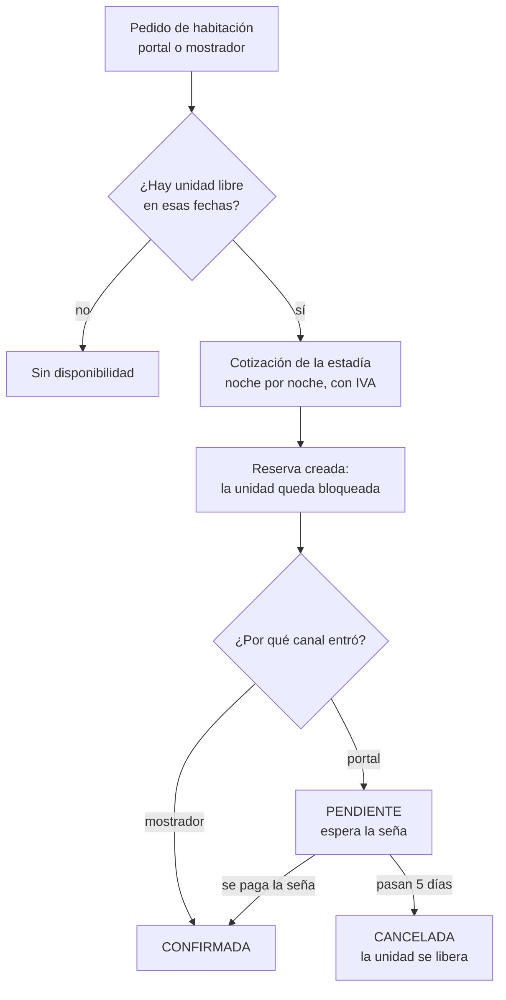
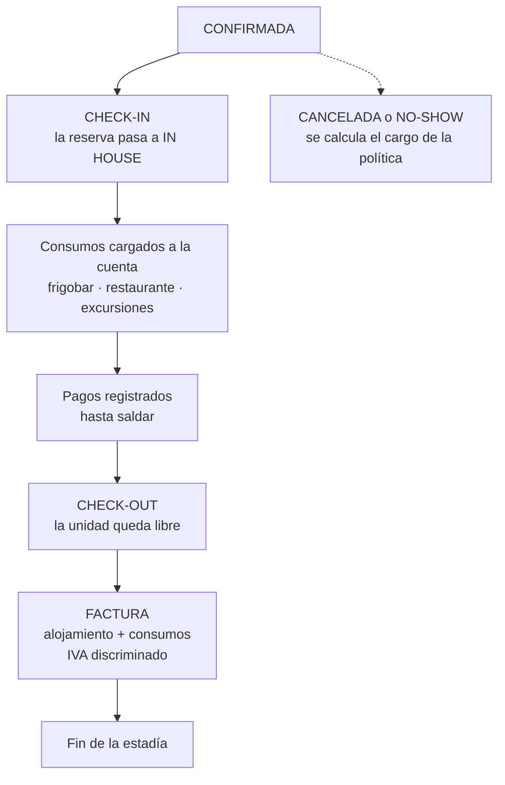
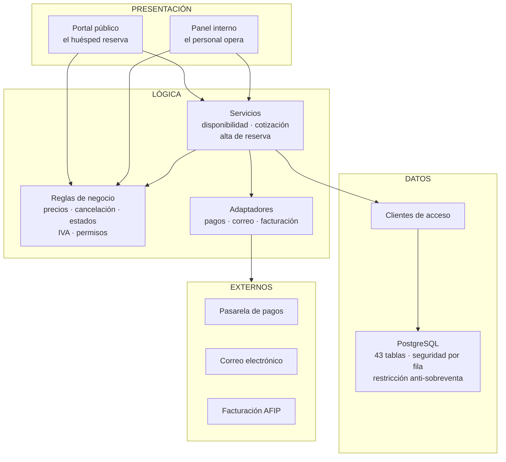
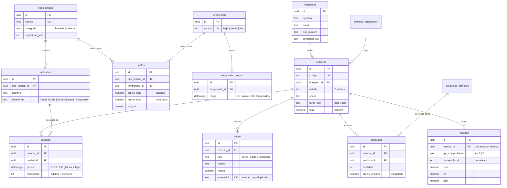
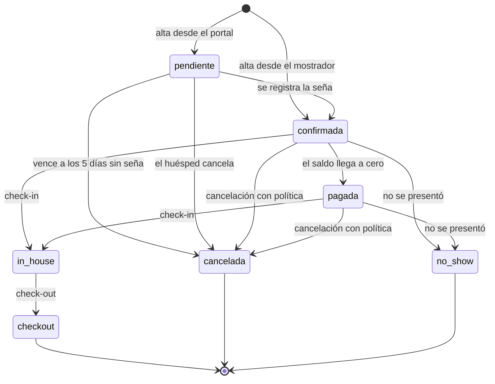
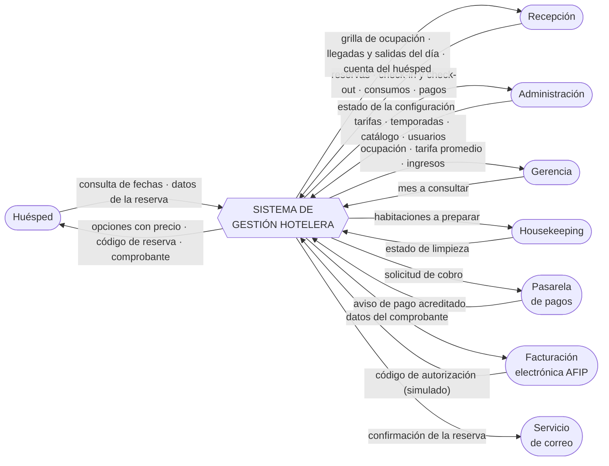
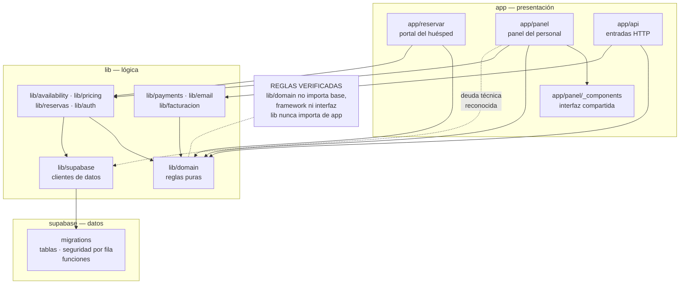
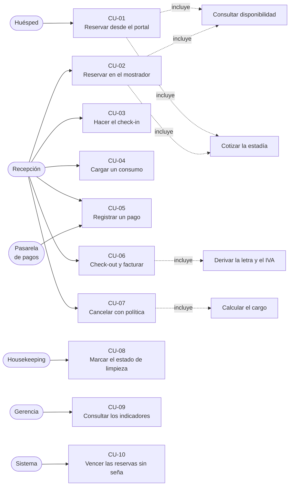

# PARTE 2: MODELADO Y DESARROLLO DEL SISTEMA (PP3)

## Índice

1. [Objetivos, Límites y Alcance](#1-objetivos-límites-y-alcance)
   - [1.1 Objetivo general](#11-objetivo-general)
   - [1.2 Objetivos específicos](#12-objetivos-específicos)
   - [1.3 El flujo principal del sistema](#13-el-flujo-principal-del-sistema)
   - [1.4 Alcance](#14-alcance)
   - [1.5 Límites](#15-límites)
   - [1.6 Supuestos y restricciones](#16-supuestos-y-restricciones)
2. [Especificación de Requerimientos](#2-especificación-de-requerimientos)
   - [2.1 Actores](#21-actores)
   - [2.2 Requerimientos funcionales](#22-requerimientos-funcionales)
   - [2.3 Requerimientos no funcionales](#23-requerimientos-no-funcionales)
   - [2.4 Reglas de negocio](#24-reglas-de-negocio)
3. [Análisis y Diseño del producto](#3-análisis-y-diseño-del-producto)
   - [3.1 Arquitectura en capas](#31-arquitectura-en-capas)
   - [3.2 Decisiones de diseño](#32-decisiones-de-diseño)
   - [3.3 Modelo de datos](#33-modelo-de-datos)
   - [3.4 Ciclo de vida de la reserva](#34-ciclo-de-vida-de-la-reserva)
   - [3.5 Diseño de la interfaz](#35-diseño-de-la-interfaz)
   - [3.6 Estrategia de pruebas](#36-estrategia-de-pruebas)
4. [Modelado Ambiental](#4-modelado-ambiental)
   - [4.1 Declaración de propósitos](#41-declaración-de-propósitos)
   - [4.2 Diagrama de contexto](#42-diagrama-de-contexto)
   - [4.3 Lista de acontecimientos](#43-lista-de-acontecimientos)
5. [Modelado de Paquetes](#5-modelado-de-paquetes)
6. [Modelado de los Casos de Uso](#6-modelado-de-los-casos-de-uso)
   - [6.1 Diagrama de casos de uso](#61-diagrama-de-casos-de-uso)
   - [6.2 Especificación de los casos de uso](#62-especificación-de-los-casos-de-uso)
7. [Trazabilidad](#7-trazabilidad)

---

# 1. Objetivos, Límites y Alcance

## 1.1 Objetivo general

Desarrollar un sistema de gestión hotelera para el Hotel Blanca Patagonia que
reemplace el sistema heredado Winpax y las planillas de cálculo con las que hoy se
controla la disponibilidad, y que le dé al hotel un canal de venta propio para
reducir la dependencia de las agencias de viaje online.

El sistema tiene dos vistas separadas: un **panel interno** para el personal del
hotel, con acceso según el puesto, y un **portal público** donde el huésped
consulta disponibilidad y reserva sin crear una cuenta.

## 1.2 Objetivos específicos

| # | Objetivo | Cómo se verifica |
|---|---|---|
| OE-1 | Eliminar la posibilidad de vender dos veces la misma habitación | Dos reservas que se superponen sobre la misma unidad son rechazadas por la base de datos. Probado con dos altas simultáneas |
| OE-2 | Reemplazar la consulta manual de disponibilidad | La disponibilidad se consulta en línea por tipo de habitación y rango de fechas |
| OE-3 | Registrar los consumos del huésped en el sistema y no en papel | Cada consumo queda asociado a la estadía con el precio del momento en que se cargó |
| OE-4 | Cerrar la cuenta con un comprobante calculado por el sistema | La factura suma alojamiento y consumos, discrimina el IVA y define la letra del comprobante |
| OE-5 | Separar el acceso según el puesto de trabajo | Cuatro roles con permisos por área, verificados en cada pantalla y respaldados por reglas de seguridad en la base de datos |
| OE-6 | Dar al hotel un canal de venta propio | Portal público con búsqueda, cotización, reserva y confirmación por código |
| OE-7 | Entregar los indicadores de gestión sin armarlos a mano | Ocupación, tarifa promedio e ingreso por habitación disponible, calculados sobre los datos de la operación |

## 1.3 El flujo principal del sistema

Este es el circuito que recorre una estadía desde que alguien pide una habitación
hasta que se cierra la cuenta. Es el eje del sistema y el que se presenta en este
documento.

**Etapa 1 — del pedido a la reserva firme**

**Etapa 2 — de la llegada al cierre de la cuenta**

Dos aclaraciones que los diagramas no pueden mostrar y son importantes:

- **La reserva bloquea la unidad desde el primer instante**, incluso estando
  pendiente de pago. Por eso existe el vencimiento a los cinco días: una reserva
  sin seña no puede retener una habitación indefinidamente.
- **La cuenta se cierra con la factura, no con el check-out.** Son dos pasos
  distintos: el check-out libera la habitación, la factura cierra la cuenta.

## 1.4 Alcance

Los módulos que componen el flujo principal, que son los que este documento
especifica:

| Módulo | Qué hace |
|---|---|
| **Disponibilidad y tarifas** | Consulta de unidades libres por tipo y fechas; precio por temporada con IVA discriminado |
| **Reservas** | Alta desde el mostrador y desde el portal, ficha de la reserva, ciclo de vida completo, cancelación con política |
| **Huéspedes** | Padrón con documento, contacto y condición frente al IVA; historial de estadías |
| **Ocupación** | Grilla de unidades por día, con el estado de cada una |
| **Consumos** | Catálogo de productos y servicios; carga de consumos a la estadía |
| **Pagos** | Seña, saldo y reembolso, por medio de pago; cálculo del saldo |
| **Facturación** | Cuenta consolidada, letra del comprobante, IVA discriminado, numeración correlativa |
| **Housekeeping** | Estado de limpieza de cada unidad |
| **Reportes** | Ocupación, tarifa promedio diaria e ingreso por habitación disponible |

El sistema construido tiene además módulos que **no se presentan acá**, para no
extender el documento más allá del circuito central: canales de venta y reservas
de Booking, cuentas corrientes de agencias, cuentas por pagar a proveedores,
contratos con firma electrónica, punto de venta con comandas y reparto de la
cuenta en dos folios, mantenimiento preventivo, avisos internos, encuestas de
satisfacción, respaldos y ayuda en pantalla. Existen, funcionan y están
documentados aparte.

## 1.5 Límites

El sistema termina donde empieza la responsabilidad de un tercero. Los cuatro
límites del flujo principal:

1. **No cobra con tarjeta.** Registra los pagos y calcula el saldo, pero la
   ejecución del cobro es de la pasarela. La integración está escrita como
   contrato de software con un proveedor simulado; no hay credenciales reales.
2. **No emite comprobantes con validez fiscal.** El modelo fiscal está
   implementado —letra del comprobante, IVA discriminado, validación de CUIT,
   numeración correlativa—, pero el código de autorización que devuelve es
   simulado. Conectar el organismo exige un certificado digital sobre un CUIT
   real.
3. **No envía correo real.** Las plantillas y el circuito están completos detrás
   de un adaptador; el proveedor vigente registra el envío sin despacharlo.
4. **No cobra el cargo por cancelación.** Lo calcula y lo muestra, pero no lo
   asienta. Es una decisión de riesgo comercial que corresponde al hotel y está
   pendiente.

Queda fuera del sistema la operación del restaurante como tal, la liquidación de
sueldos y la contabilidad general del establecimiento. El despliegue en producción
también está pendiente: requiere las cuentas del hotel en los servicios de
alojamiento y base de datos.

## 1.6 Supuestos y restricciones

**Del negocio**

- El hotel publica sus tarifas **en dólares** y cobra en pesos a la cotización de
  venta del día de pago. El dólar es la moneda base; el peso es una capa de
  presentación.
- Hay **dos precios** por tipo de habitación y temporada: neto para agencias y
  rack para mostrador. El canal por el que entra la reserva define cuál se aplica.
- Las tarifas del tarifario están **sin IVA**. El impuesto se calcula sobre el
  neto y no se guarda sumado.
- Los períodos son **cerrados a la izquierda y abiertos a la derecha**: del 10 al
  13 son tres noches, y el día 13 la habitación ya está libre.
- La política de cancelación es la del tarifario y está cargada como datos
  editables, no escrita en el código.

**Técnicas**

- **La integridad crítica vive en la base de datos, no en la aplicación.** La
  imposibilidad de sobrevender y la unicidad de la factura por reserva son
  restricciones del motor de datos, no validaciones del programa.
- Las tarifas rack de las cabañas y el inventario físico exacto de unidades
  quedan **pendientes de confirmación con el hotel**. El sistema opera con los
  datos del tarifario 2025/2026.
- Los servicios externos se eligen por configuración. En producción, si falta esa
  definición el sistema **no arranca**, a propósito: es preferible eso a operar
  con un simulador creyendo que se está cobrando de verdad.

**Fuente:** `CLAUDE.md`, `docs/roadmap.md`, `docs/decisiones/0003`, `0004`,
`0018`, `0019`, `lib/domain/permisos.ts`, `lib/domain/reservas.ts`.

---

# 2. Especificación de Requerimientos

## 2.1 Actores

| Actor | Qué hace en el flujo principal | Acceso |
|---|---|---|
| **Huésped** | Consulta disponibilidad, reserva por el portal, consulta su reserva | Sin cuenta. Un código en la dirección web |
| **Recepción** | Toma reservas, hace el check-in y el check-out, carga consumos, registra pagos, emite la factura | Usuario y contraseña |
| **Administración** | Configura tarifas, temporadas, catálogo de productos y usuarios | Usuario y contraseña |
| **Gerencia** | Consulta los indicadores de gestión | Usuario y contraseña |
| **Housekeeping** | Marca el estado de limpieza de las habitaciones | Usuario y contraseña |
| **Pasarela de pagos** | Avisa que se acreditó un pago | Firma del mensaje verificada |
| **Sistema** | Tareas que corren solas: vencer las reservas sin seña | Tarea programada en la base |

Un usuario nuevo nace **sin rol y desactivado**: alguien tiene que asignarle un
puesto antes de que pueda entrar.

## 2.2 Requerimientos funcionales

| ID | Nombre | Descripción | Actor | Prioridad |
|---|---|---|---|---|
| RF-01 | Consultar disponibilidad | Buscar habitaciones libres por tipo y rango de fechas | Recepción · Huésped | Alta |
| RF-02 | Cotizar la estadía | Calcular el precio noche por noche, admitiendo estadías que cruzan temporadas, aplicando promoción si hay, y discriminando el IVA | Recepción · Huésped | Alta |
| RF-03 | Reservar desde el portal | Alta sin cuenta: el visitante elige tipo y fechas, deja sus datos y recibe un código de reserva | Huésped | Alta |
| RF-04 | Reservar desde el mostrador | Alta con datos del huésped, cantidad de ocupantes, condiciones comerciales y asignación de habitación | Recepción | Alta |
| RF-05 | Consultar el listado de reservas | Vistas de trabajo —en el hotel, llegadas de hoy, salidas de hoy, pendientes, canceladas—, con búsqueda, paginado y saldo | Recepción | Alta |
| RF-06 | Consultar la ficha de una reserva | Huésped, fechas, habitación, ocupantes, cuenta, pagos y saldo | Recepción | Alta |
| RF-07 | Consultar la reserva por código | El huésped ve su confirmación con un código que no permite adivinar las reservas ajenas | Huésped | Alta |
| RF-08 | Hacer el check-in | Registrar el ingreso del huésped y marcar la habitación como ocupada | Recepción | Alta |
| RF-09 | Hacer el check-out | Registrar la salida y liberar la habitación | Recepción | Alta |
| RF-10 | Cancelar una reserva | Calcular el cargo según los días de anticipación, informarlo y liberar la habitación | Recepción | Alta |
| RF-11 | Registrar el no-show | Marcar que el huésped no se presentó y liberar la habitación | Recepción | Media |
| RF-12 | Administrar el padrón de huéspedes | Alta y edición con documento, contacto, nacionalidad y condición frente al IVA | Recepción | Alta |
| RF-13 | Buscar un huésped y ver su historial | Búsqueda por apellido, documento o correo, con sus estadías anteriores | Recepción | Media |
| RF-14 | Ver la grilla de ocupación | Habitaciones en filas y días en columnas, con el estado de cada celda y un resumen por día | Recepción · Gerencia | Alta |
| RF-15 | Administrar el catálogo de productos | Alta, precio y stock de cada producto o servicio vendible | Administración | Media |
| RF-16 | Cargar un consumo | Imputar un consumo a la estadía, con el precio congelado al momento de la carga | Recepción | Alta |
| RF-17 | Quitar un consumo | Dar de baja una línea cargada por error | Recepción | Media |
| RF-18 | Registrar un pago | Seña, saldo o reembolso, por medio de pago, con paso automático a pagada cuando el saldo llega a cero | Recepción | Alta |
| RF-19 | Recibir el aviso de una pasarela | Aceptar la notificación de un pago verificando la firma y descartando los repetidos | Pasarela | Media |
| RF-20 | Emitir la factura | Consolidar alojamiento y consumos, definir la letra del comprobante, discriminar el IVA y asignar la numeración | Recepción | Alta |
| RF-21 | Imprimir el comprobante | Vista imprimible de la factura emitida | Recepción | Media |
| RF-22 | Marcar el estado de limpieza | Pasar una habitación entre limpia, sucia, inspeccionada y bloqueada | Housekeeping | Alta |
| RF-23 | Configurar tarifas y temporadas | Editar precios por tipo y temporada, y los rangos de fecha de cada temporada | Administración | Alta |
| RF-24 | Consultar los indicadores de gestión | Ocupación, tarifa promedio diaria, ingreso por habitación disponible, ingresos cobrados y reservas por estado | Gerencia | Alta |
| RF-25 | Administrar usuarios | Crear el usuario del personal, asignarle rol y darlo de baja | Administración | Alta |

## 2.3 Requerimientos no funcionales

| ID | Categoría | Requerimiento | Cómo está resuelto |
|---|---|---|---|
| RNF-01 | Seguridad | Ningún dato personal accesible sin autorización | Reglas de seguridad por fila activadas en las 43 tablas de la base. Sin sesión sólo se ve el catálogo: tipos, tarifas de mostrador, temporadas y promociones |
| RNF-02 | Seguridad | El precio neto de agencia no puede verse desde internet | La función de cotización que conoce el precio neto tiene el permiso de ejecución revocado para el acceso público, y el privilegio sobre esa columna también |
| RNF-03 | Seguridad | La autorización se verifica en el servidor, no en la pantalla | Una guarda de acceso por área en cada página y en cada operación de escritura. Entrar a la dirección a mano no sirve |
| RNF-04 | Seguridad | Las entradas públicas tienen que resistir el abuso automatizado | Límite por dirección de origen: cinco reservas por hora y diez intentos de acceso cada quince minutos |
| RNF-05 | Seguridad | Un pago avisado por la pasarela no puede aplicarse dos veces | El identificador del evento es único en la base: el repetido choca y se descarta |
| RNF-06 | Rendimiento | Ninguna consulta puede truncarse en silencio | La interfaz de datos corta en mil filas sin avisar; toda lectura completa pasa por el mecanismo de paginado interno |
| RNF-07 | Usabilidad | Nada oculto, pensado para quien no usa mucho la computadora | Prohibido esconder acciones o formularios detrás de un desplegable; el alta y la edición van en pantalla propia; todo campo con etiqueta visible |
| RNF-08 | Usabilidad | Ninguna operación de guardado puede fallar en silencio | Toda escritura revisa el error de la base y avisa. De 38 casos que lo descartaban hoy no queda ninguno |
| RNF-09 | Accesibilidad | Uso desde el teléfono | Área mínima de toque ampliada, tamaño de letra fijo en los campos, columnas secundarias plegadas y nunca desplazamiento horizontal sobre una tabla |
| RNF-10 | Accesibilidad | La información no puede depender del color | Cada estado de la grilla lleva una letra además de su color, y una descripción para lectores de pantalla |
| RNF-11 | Mantenibilidad | Las reglas de negocio deben poder probarse sin base de datos | 48 módulos de reglas puras que no dependen de la base, del framework ni de la interfaz |
| RNF-12 | Mantenibilidad | Los servicios externos deben ser reemplazables | Siete adaptadores con la misma forma: una interfaz estable y la implementación elegida por configuración |
| RNF-13 | Mantenibilidad | Cada cambio queda verificado antes de darse por terminado | Un solo comando corre revisión de estilo, comprobación de tipos, pruebas y compilación. Se ejecuta también en integración continua |
| RNF-14 | Disponibilidad | Tiene que poder saberse si el sistema está en pie | Una dirección de consulta que responde según si la base contesta |

## 2.4 Reglas de negocio

| ID | Regla | Dónde se garantiza |
|---|---|---|
| RN-01 | Dos reservas activas no pueden superponerse sobre la misma habitación | Restricción de exclusión en la base de datos. Es la garantía central del sistema |
| RN-02 | Cuatro estados ocupan la habitación: pendiente, confirmada, pagada y en casa. Cancelada, no-show y check-out la liberan | Máquina de estados en el dominio, y condición de la restricción de exclusión |
| RN-03 | Una reserva pendiente sin seña vence a los cinco días y libera la habitación | Tarea programada que corre a diario en la base |
| RN-04 | Cancelación: más de 14 días sin cargo, entre 14 y 7 días la primera noche, menos de 7 días el total, y no-show el total | Umbrales cargados como datos editables, resueltos por el dominio |
| RN-05 | El cargo por cancelación se calcula y se informa, pero **no se cobra ni se asienta** | Limitación conocida, documentada, pendiente de una decisión del hotel |
| RN-06 | El canal de la reserva define el precio: el portal público vende a tarifa rack, las agencias a tarifa neta | Campo de tipo de tarifa en la reserva |
| RN-07 | Las tarifas se guardan sin IVA; el impuesto se calcula sobre el neto y no se guarda sumado | Motor de precios en el dominio |
| RN-08 | Toda pantalla que le muestre un precio a un huésped tiene que sumarle el IVA | Función obligatoria del catálogo público |
| RN-09 | Una estadía que cruza temporadas se tarifa noche por noche | Motor de precios sobre noches individuales |
| RN-10 | El dólar es la moneda base; el peso se calcula a la cotización de venta del día de pago | Decisión de moneda y proveedor de cotización |
| RN-11 | La cantidad de ocupantes se deriva del desglose: adultos más menores. **Los bebés no ocupan plaza** y las camas extra amplían la capacidad | Función de alta de reserva, único lugar del sistema donde nacen las estadías |
| RN-12 | La noche del check-out no cuenta como ocupada | Períodos abiertos a la derecha, verificado con pruebas |
| RN-13 | El precio del consumo se congela al cargarlo: un cambio de catálogo no altera cuentas ya cargadas | Copia del precio en la línea de consumo |
| RN-14 | La cuenta se cierra con la factura, no con el check-out. Es facturable una reserva pagada, en casa o con check-out hecho | Reglas de facturabilidad en el dominio |
| RN-15 | Una reserva no puede tener dos facturas | Restricción de unicidad en la base, no una verificación previa del programa |
| RN-16 | La letra del comprobante se **deriva** de la condición frente al IVA de las dos partes, que está guardada en el huésped o en la agencia. No se elige factura por factura | Dominio fiscal |
| RN-17 | El IVA se obtiene por diferencia sobre el total, para que neto más impuesto cierren exactamente | Desglose fiscal en el dominio |
| RN-18 | La numeración de facturas es correlativa y no admite huecos | Contador transaccional en la base, por exigencia fiscal |
| RN-19 | El sistema **no guarda datos de tarjeta**: ni número, ni vencimiento, ni clave. Sólo el medio de pago y el identificador de la pasarela | Ausencia deliberada en el modelo, fijada por una prueba |
| RN-20 | La mucama no inspecciona: sólo pasa la habitación de sucia a limpia. El control de calidad no lo firma quien hizo el trabajo | El destino lo decide el dominio, no el formulario |

**Fuente:** `app/panel/reservas/`, `app/reservar/`, `app/panel/huespedes/`,
`app/panel/ocupacion/`, `app/panel/housekeeping/`, `app/panel/reportes/`,
`lib/domain/precios.ts`, `cancelacion.ts`, `reservas.ts`, `facturacion.ts`,
`consumos.ts`, `pagos.ts`, `ocupantes.ts`, `supabase/migrations/0005`, `0011`,
`0045`, `next.config.ts`, `app/globals.css`.

---

# 3. Análisis y Diseño del producto

## 3.1 Arquitectura en capas

El sistema es una sola aplicación web que se ejecuta en el servidor, sobre una
base de datos relacional. No hay un servidor de API separado: las pantallas y las
operaciones de guardado corren en el servidor del propio framework, y la base
impone sus propias reglas de seguridad.

- **Presentación.** Dos vistas separadas por decisión de producto: el panel del
  personal, con sesión y permisos por área, y el portal del huésped, sin cuenta.
- **Lógica.** Las reglas de negocio están en 48 módulos que **no importan la base
  de datos, el framework ni la biblioteca de interfaz**. Eso permite probar la
  política de cancelación, el cálculo de precios o el desglose del IVA sin
  levantar nada. Las pantallas orquestan; no calculan reglas.
- **Datos.** PostgreSQL con seguridad por fila en todas las tablas. La credencial
  privilegiada, que saltea esa seguridad, vive solamente en el servidor y se usa
  en el único lugar donde un visitante sin cuenta necesita escribir: la reserva
  del portal.

## 3.2 Decisiones de diseño

Las decisiones de arquitectura están registradas como documentos numerados. Las
seis que definen el flujo principal:

| Decisión | Qué se resolvió | Por qué |
|---|---|---|
| **0002 · Disponibilidad** | La imposibilidad de superponer reservas la garantiza una restricción de la base, no el programa | Es imposible sobrevender aunque dos pedidos lleguen a la vez. No depende de que la aplicación se acuerde de verificar |
| **0003 · Moneda** | Dólar como moneda base, peso a cotización configurable | El tarifario del hotel está en dólares. Aísla la volatilidad del peso en un solo punto |
| **0004 · Tarifas** | Doble precio neto y rack, con IVA calculado sobre el neto | Refleja la realidad comercial: agencias y mostrador pagan distinto. Dejar el IVA discriminado permite facturar correctamente |
| **0005 · Roles** | Autorización en dos capas: permisos en la aplicación y seguridad por fila en la base | La pantalla oculta y la guarda redirige, pero la barrera real es la base |
| **0006 · Pagos** | Registro manual operativo hoy, más abstracción de pasarela | El sistema es usable sin credenciales de nadie, y queda listo para enchufar el cobro real |
| **0012 · Facturación** | Modelo fiscal completo, autorización simulada | La parte propia del negocio —qué comprobante corresponde, cómo se discrimina el IVA— está resuelta y probada. La conexión con el organismo exige un certificado sobre un CUIT real |

## 3.3 Modelo de datos

El esquema completo tiene 43 tablas. El diagrama muestra las once que sostienen el
flujo principal.

### La decisión central: cómo se evita el overbooking

La tabla de estadías lleva una **restricción de exclusión** de PostgreSQL: para
una misma habitación, dos períodos no pueden cruzarse mientras la reserva esté en
un estado que ocupa inventario.

No es una validación que el programa ejecuta antes de guardar: es una condición
que el motor de datos comprueba en el momento de escribir, dentro de la
transacción. La diferencia es todo. Una validación en el programa tiene la forma
"consulto si está libre, y después inserto", y entre esas dos operaciones hay una
ventana donde otro pedido puede insertar lo mismo. Es el problema que el
relevamiento describió como dos recepcionistas mirando la planilla al mismo
tiempo, sólo que a velocidad de máquina. La restricción no tiene esa ventana.

La consecuencia práctica es que el programa tiene que **traducir el error**:
cuando la base rechaza, hay que convertir ese rechazo en un mensaje que se
entienda —"la habitación ya no está disponible"— y abortar toda la operación sin
dejar una reserva a medias. Está verificado con pruebas, incluida una que corre
dos altas en paralelo sobre la misma habitación.

## 3.4 Ciclo de vida de la reserva

Los cuatro estados de la izquierda —pendiente, confirmada, pagada y en casa—
**ocupan la habitación**. Los tres finales la liberan.

Un detalle que separa a este sistema de la planilla que reemplaza: **estar
alojado y tener que estar alojado son cosas distintas**. La vista "en el hotel"
consulta el estado, no las fechas. Que el período incluya el día de hoy significa
que la persona *tendría* que estar; que esté lo marca el check-in. Distinguir
"está alojado" de "no apareció" es justamente lo que recepción necesita.

## 3.5 Diseño de la interfaz

El criterio se fijó a partir de quién usa el sistema: personal de recepción y de
limpieza, con distinto grado de familiaridad con una computadora, en dos turnos y
a veces desde un teléfono. De ahí salen reglas concretas:

1. **Nada oculto.** Ninguna acción ni formulario se esconde detrás de un
   desplegable. El alta y la edición van en pantalla propia, con un botón visible.
2. **Todo campo con etiqueta visible**, nunca sólo con un texto de ejemplo que
   desaparece al escribir.
3. **Al guardar no se redirige en silencio**: se muestra qué pasó y qué se puede
   hacer después.
4. **El botón de guardar se bloquea al primer clic**, y lo que no tiene vuelta
   atrás pide confirmación.
5. **Ninguna operación de guardado falla en silencio.** Si la base rechaza y nadie
   avisa, la pantalla recarga sin cambios y quien la usa no puede distinguir "no
   se pudo" de "no pasó nada".
6. **En el teléfono, tarjetas y no tablas.** Una tabla en un teléfono obliga a
   desplazarse de costado. Las columnas secundarias se pliegan bajo la principal;
   no se eliminan, porque el dato importa.
7. **El color nunca es el único portador de información.** Cada estado de la
   grilla lleva una letra además de su color.

## 3.6 Estrategia de pruebas

La suite tiene **1292 casos automatizados en 79 archivos**, en tres niveles:

| Nivel | Qué verifica | Necesita base |
|---|---|---|
| Reglas puras | Cálculo de precios, política de cancelación, desglose del IVA, validación de CUIT, transiciones de estado, capacidad y ocupantes | No |
| Operaciones de guardado | Que cada operación verifique el rol antes de escribir y revise el error de la base | Parcial |
| Integración | La restricción anti-sobreventa bajo concurrencia, la cotización, el alta atómica, el vencimiento de pendientes y qué puede leer efectivamente un visitante sin sesión | Sí |

Sin la base de datos levantada, 955 casos se ejecutan y 337 quedan salteados
—entre ellos el anti-sobreventa—. Por eso en integración continua una variable
convierte la falta de base en un **error** en lugar de un salto: una suite que
saltea lo importante deja el semáforo en verde sin haber probado nada.

Todo arreglo de un defecto entra con una prueba que fallaba antes del arreglo. No
es una formalidad: varios de los defectos encontrados usando el sistema a mano
daban resultados plausibles y equivocados, del tipo que una prueba detecta y una
revisión visual no.

**Fuente:** `docs/arquitectura.md`, `docs/modelo-datos.md`,
`docs/decisiones/0002`–`0012`, `supabase/migrations/0005`, `0045`,
`lib/domain/`, `tests/db.ts`, `.github/workflows/ci.yml`.

---

# 4. Modelado Ambiental

## 4.1 Declaración de propósitos

El sistema administra el ciclo de alojamiento del Hotel Blanca Patagonia: registra
la reserva tomada por el mostrador o por el portal propio, garantiza que dos
reservas no se superpongan sobre la misma habitación, controla el ingreso y la
salida del huésped, acumula sus consumos y sus pagos, cierra la cuenta con un
comprobante que discrimina el impuesto, y produce con esos mismos datos los
indicadores con los que la gerencia decide.

## 4.2 Diagrama de contexto

Las flechas hacia la pasarela, la facturación y el correo **existen como
contratos de software, no como conexiones activas**: el proveedor vigente de cada
una es un simulador, y el código de autorización que devuelve la facturación no
tiene validez fiscal.

## 4.3 Lista de acontecimientos

| # | Acontecimiento | Tipo | Respuesta del sistema |
|---|---|---|---|
| A-01 | Un visitante consulta disponibilidad para un rango de fechas | Flujo de datos | Devuelve los tipos con lugar libre y su precio a tarifa de mostrador con el IVA incluido, distinguiendo "sin lugar" de "sin precio cargado" |
| A-02 | Un visitante completa la reserva en el portal | Flujo de datos | Verifica el límite por origen, valida los datos, asigna una habitación libre, cotiza y crea la reserva pendiente, que ya bloquea la habitación |
| A-03 | Recepción toma una reserva en el mostrador | Flujo de datos | Crea el huésped si no existe, cotiza, y crea la reserva y la estadía en una sola operación, traduciendo el rechazo por superposición |
| A-04 | Llega el pago de la seña | Flujo de datos | Registra el pago, recalcula el saldo y confirma la reserva |
| A-05 | La pasarela avisa que se acreditó un pago | Flujo de datos | Verifica la firma, descarta el evento si ya fue procesado y registra el pago |
| A-06 | El huésped se presenta a hacer el check-in | Flujo de datos | Valida la transición, marca la estadía en casa y deja la habitación ocupada |
| A-07 | Se carga un consumo | Flujo de datos | Valida el stock, toma el precio del catálogo —nunca del formulario— e imputa la línea a la estadía con el precio congelado |
| A-08 | El huésped hace el check-out | Flujo de datos | Valida la transición y libera la habitación. La cuenta **no** se cierra acá |
| A-09 | Se emite la factura | Flujo de datos | Consolida alojamiento y consumos, deriva la letra del comprobante, discrimina el IVA, asigna la numeración y rechaza el intento si la reserva ya tiene factura |
| A-10 | Se cancela una reserva | Flujo de datos | Calcula el cargo según los días de anticipación, lo informa y libera la habitación. **El cargo no se cobra** |
| A-11 | El huésped no se presenta | Flujo de datos | Marca el no-show y libera la habitación |
| A-12 | Housekeeping marca una habitación como limpia | Flujo de datos | Valida que la habitación esté asignada a esa persona y cambia el estado, nunca a inspeccionada |
| A-13 | Un usuario del personal intenta entrar | Control | Verifica las credenciales contra el límite de intentos, resuelve el rol y descarta la sesión si el rol no es válido |
| A-14 | Alguien intenta abrir un área que su rol no tiene | Control | La guarda de acceso lo redirige. Entrar a la dirección a mano no sirve |
| A-15 | Un visitante sin sesión intenta cotizar a precio de agencia | Control | Se le devuelve el precio de mostrador, en silencio y sin error: un error sólo le confirmaría que encontró algo |
| A-16 | Se supera el volumen permitido desde un mismo origen | Control | Rechaza la operación con el mensaje del límite |
| A-17 | Pasan cinco días de una reserva pendiente sin seña | Temporal | Tarea diaria en la base: la cancela y libera la habitación |
| A-18 | Termina el mes | Temporal | Los indicadores del mes quedan disponibles con la variación respecto del anterior |

**Fuente:** `app/reservar/actions.ts`, `app/panel/reservas/actions.ts`,
`app/panel/housekeeping/actions.ts`, `app/api/webhooks/pagos/`,
`supabase/migrations/0011`, `0027`, `docs/decisiones/0016`, `0019`.

---

# 5. Modelado de Paquetes

| Paquete | Responsabilidad | Depende de |
|---|---|---|
| `app/reservar` | Portal del huésped: búsqueda, cotización, reserva y confirmación | dominio · servicios · clientes de datos |
| `app/panel` | Pantallas y operaciones del personal, con guarda de acceso por área | interfaz compartida · dominio · servicios · clientes de datos |
| `app/api` | Entradas HTTP: aviso de pago, consulta de salud | dominio · adaptadores |
| `app/panel/_components` | Componentes de interfaz sin estado ni eventos | nada, sólo tipos |
| `lib/domain` | **Las reglas del negocio**: precios, cancelación, estados, IVA, permisos, ocupantes | sólo utilidades de fecha |
| `lib/availability`, `lib/pricing`, `lib/reservas`, `lib/auth` | Servicios: disponibilidad, cotización, alta atómica de reserva, sesión y permisos | dominio · clientes de datos |
| `lib/payments`, `lib/email`, `lib/facturacion` | Adaptadores de los servicios externos | dominio |
| `lib/supabase` | Clientes de acceso a la base: servidor, navegador y privilegiado | biblioteca de base de datos |
| `supabase/migrations` | El esquema y sus garantías: tablas, seguridad por fila, funciones y tareas programadas | nada |

Las dos reglas del recuadro **se pueden comprobar con una búsqueda de texto**, y
eso es lo que las hace útiles: una regla de arquitectura que no se puede verificar
se degrada sola. Medidas hoy sobre el código, las dos dan cero violaciones.

**La deuda técnica reconocida** es la flecha punteada: buena parte de las
pantallas del panel arma su consulta directamente en lugar de pasar por una capa
de servicios. Está documentada como tal. El efecto práctico es que la lógica de
consulta queda repartida en las pantallas, lo que ya produjo al menos un defecto
sutil, hoy cubierto por una prueba.

**Fuente:** `AGENTS.md`, medición de importaciones sobre `app/` y `lib/`.

---

# 6. Modelado de los Casos de Uso

## 6.1 Diagrama de casos de uso

## 6.2 Especificación de los casos de uso

### CU-01 · Reservar desde el portal público

**Actor principal:** Huésped, sin cuenta · **Actor secundario:** servicio de correo

**Precondiciones**

1. Hay tarifas cargadas y temporadas que cubran el período consultado.
2. Hay al menos una habitación activa del tipo elegido libre en ese período.

**Flujo principal**

1. El huésped ingresa fechas de entrada y salida y cantidad de personas.
2. El sistema consulta la disponibilidad por tipo y cotiza cada opción a tarifa de
   mostrador, noche por noche, con el IVA incluido.
3. El sistema muestra las opciones con lugar, su capacidad y su precio.
4. El huésped elige un tipo y avanza.
5. El huésped ingresa apellido, nombre, correo y teléfono.
6. El sistema verifica que no se haya superado el límite de reservas por hora
   desde ese origen.
7. El sistema valida los datos, crea el huésped si no existe, elige una habitación
   libre, vuelve a cotizar y crea la reserva **pendiente** con su estadía. La
   habitación queda bloqueada en ese mismo instante.
8. El sistema despacha el correo de confirmación.
9. El sistema muestra la página de confirmación con el código de reserva, el
   detalle, el importe de la seña y el plazo para pagarla.

**Flujos alternativos**

- **3a.** Ningún tipo tiene lugar: se informa que no hay disponibilidad y se
  ofrece cambiar las fechas.
- **3b.** Hay lugar pero falta la tarifa de alguna de esas noches: el sistema
  distingue este caso y **no** dice "sin disponibilidad". Avisar que el hotel está
  lleno cuando en realidad falta cargar un precio hace perder la reserva sin que
  nadie se entere.
- **5a.** El huésped ya está en el padrón, identificado por su correo: se reusa su
  ficha. La búsqueda es sólo por correo, porque por apellido se fusionarían dos
  personas distintas.

**Excepciones**

- **E1.** La habitación se vendió entre el paso 3 y el paso 7: la base rechaza la
  escritura, el sistema aborta toda la operación sin dejar datos a medias e
  informa que ya no está disponible.
- **E2.** Se superó el límite de cinco reservas por hora desde ese origen: se
  rechaza. Cada reserva pendiente bloquea una habitación cinco días; sin el
  límite, unas decenas de envíos dejan al hotel sin nada vendible por casi una
  semana.
- **E3.** Datos inválidos —correo mal formado, salida anterior o igual a la
  entrada, capacidad insuficiente—: se rechaza con el mensaje correspondiente.
- **E4.** Falla el envío del correo: se registra el fallo y **no** se cae la
  reserva, que ya existe y es el dato que importa.

**Postcondiciones**

- Existe una reserva pendiente, canal web, a tarifa de mostrador, con su estadía
  ocupando la habitación.
- Si en cinco días no se registra la seña, se cancela sola y libera la habitación.

**Reglas asociadas:** RN-01, RN-02, RN-03, RN-06, RN-07, RN-08, RN-09, RN-11.

---

### CU-02 · Reservar en el mostrador

**Actor principal:** Recepción

**Precondiciones**

1. El usuario tiene sesión activa y su rol accede al área de reservas.
2. Hay tarifas y temporadas cargadas para el período.

**Flujo principal**

1. Recepción abre el alta de reserva, en pantalla propia.
2. Ingresa o busca al huésped titular.
3. Ingresa el período y elige tipo y habitación, o deja que el sistema asigne una
   libre.
4. Completa el desglose de ocupantes: adultos, menores, bebés y camas extra.
5. Completa las condiciones: canal, agencia si corresponde, tipo de tarifa,
   promoción y política de cancelación.
6. El sistema valida que la capacidad alcance para los ocupantes que ocupan plaza.
7. El sistema cotiza noche por noche y guarda el desglose: subtotal, descuento,
   IVA y total.
8. El sistema crea la reserva y la estadía en una sola operación, derivando la
   cantidad de ocupantes del desglose.
9. El sistema muestra la ficha de la reserva creada.

**Flujos alternativos**

- **3a.** El alta se inició desde una celda libre de la grilla de ocupación: la
  habitación y el día vienen preseleccionados.
- **5a.** La reserva es de agencia: el tipo de tarifa se resuelve como neto y se
  aplica el descuento del convenio.

**Excepciones**

- **E1.** La habitación ya está ocupada en ese período: la base rechaza y el
  sistema aborta la operación completa.
- **E2.** La capacidad no alcanza: se rechaza indicando la capacidad y las plazas
  necesarias. Los bebés no cuentan como plaza y las camas extra amplían la
  capacidad.
- **E3.** No hay tarifa cargada para alguna noche: **no se cotiza en cero**, se
  informa que falta la tarifa. Fue un defecto real —una reserva quedaba en cero
  dólares por faltar las temporadas— y por eso hoy el caso está separado.
- **E4.** El rol no tiene acceso al área: la guarda redirige antes de mostrar nada.

**Postcondiciones**

- Existe una reserva confirmada con su estadía ocupando la habitación y su
  desglose de precios guardado.

**Reglas asociadas:** RN-01, RN-02, RN-06, RN-07, RN-09, RN-11.

---

### CU-03 · Hacer el check-in

**Actor principal:** Recepción

**Precondiciones**

1. Existe una reserva confirmada o pagada.
2. La habitación asignada está disponible físicamente.

**Flujo principal**

1. Recepción abre la vista de llegadas del día, que incluye a quienes ya se
   registraron y excluye canceladas y no-show.
2. Selecciona la reserva y abre su ficha.
3. Verifica los datos del huésped y completa lo que falte: documento, contacto,
   condición frente al IVA.
4. Confirma el check-in.
5. El sistema valida que la transición sea permitida desde el estado actual.
6. El sistema pasa la reserva y la estadía a **en casa**.
7. El huésped queda habilitado para cargar consumos y aparece en la vista "en el
   hotel".

**Flujos alternativos**

- **2a.** La reserva no aparece en llegadas del día: se la busca por código,
  apellido o documento.
- **3a.** La habitación asignada no está en condiciones: se cambia de habitación
  antes del check-in, con la misma verificación de superposición.

**Excepciones**

- **E1.** La reserva está pendiente: no se puede pasar a en casa desde pendiente,
  primero hay que confirmarla registrando la seña.
- **E2.** La reserva está cancelada, en no-show o ya tiene check-out: son estados
  finales y el sistema no ofrece la transición.
- **E3.** La habitación está bloqueada o en reparación: el sistema lo muestra, y
  el problema pasa a recepción.

**Postcondiciones**

- La reserva y la estadía están en casa y la habitación figura ocupada.

**Reglas asociadas:** RN-02.

---

### CU-04 · Cargar un consumo

**Actor principal:** Recepción

**Precondiciones**

1. Hay una estadía en casa.
2. El catálogo tiene productos activos con su precio.

**Flujo principal**

1. Recepción abre la ficha de la reserva.
2. Elige el producto o servicio y la cantidad.
3. El sistema valida el stock disponible.
4. El sistema **toma el precio del catálogo, no del formulario**, e imputa la
   línea a la estadía con ese precio congelado.
5. El sistema descuenta el stock.
6. El consumo aparece en la cuenta del huésped y el total se actualiza.

**Flujos alternativos**

- **2a.** Hay que cargar varias líneas juntas: se usa el punto de venta, que
  agrupa las líneas bajo un número de comanda y las inserta en una sola operación.
- **6a.** La línea se cargó por error: se quita desde la misma ficha.

**Excepciones**

- **E1.** No hay stock suficiente: el sistema avisa **antes** de cobrar y no
  inserta nada.
- **E2.** Falla el descuento de stock después de insertar la línea: se registra el
  fallo y **no** se interrumpe. El consumo ya está en la cuenta, y cortar dejaría
  a quien cargó creyendo que no entró cuando sí entró. El inventario queda
  desactualizado, que es corregible.
- **E3.** El precio del producto cambia después: no afecta las líneas ya cargadas.

**Postcondiciones**

- El consumo está imputado a la estadía con su precio congelado, y el stock
  refleja la venta.

**Reglas asociadas:** RN-13.

---

### CU-05 · Registrar un pago

**Actor principal:** Recepción · **Actor secundario:** pasarela de pagos

**Precondiciones**

1. Existe una reserva con saldo pendiente.

**Flujo principal**

1. Recepción abre la ficha de la reserva y ve el total, lo pagado y el saldo.
2. Elige el tipo de pago: seña, saldo o reembolso.
3. Elige el medio: efectivo, transferencia o tarjeta.
4. Ingresa el importe.
5. El sistema registra el pago y recalcula el saldo.
6. Si el saldo llega a cero, el sistema pasa la reserva a **pagada** de forma
   automática.

**Flujos alternativos**

- **1a.** El pago llega por la pasarela: el aviso entra por su dirección
  correspondiente, se verifica la firma y el pago se registra con el
  identificador que trae.
- **2a.** Es la seña de una reserva pendiente: al registrarla, la reserva pasa a
  confirmada.
- **4a.** El huésped paga en pesos: el sistema convierte con la cotización de
  venta vigente y guarda el equivalente en dólares junto con la cotización usada.

**Excepciones**

- **E1.** El aviso de la pasarela ya fue procesado: el identificador choca con la
  restricción de unicidad de la base y el evento se descarta. La protección es de
  la base, no del programa, y por eso resiste los reintentos.
- **E2.** La firma del mensaje no valida: se rechaza. La entrada **falla
  cerrada**; antes tenía el defecto contrario, aceptar cuando no podía verificar.
- **E3.** La cotización disponible está vencida: se usa igual, avisando. La
  alternativa a cobrar con el valor de la mañana es no poder cobrar.

**Postcondiciones**

- El pago está registrado, el saldo actualizado y el estado de la reserva ajustado
  si correspondía.

**Reglas asociadas:** RN-10, RN-19.

---

### CU-06 · Hacer el check-out y facturar

**Actor principal:** Recepción · **Actor secundario:** servicio de facturación

**Precondiciones**

1. La reserva está en casa.
2. Los consumos del huésped están cargados.

**Flujo principal**

1. Recepción abre la vista de salidas del día y selecciona la reserva.
2. Revisa la cuenta consolidada: alojamiento más consumos, con los pagos ya
   aplicados.
3. Registra el pago del saldo si queda algo por cobrar.
4. Confirma el check-out. El sistema valida la transición y **libera la
   habitación**.
5. Recepción emite la factura.
6. El sistema define la letra del comprobante a partir de la condición frente al
   IVA del emisor y del receptor, discrimina el impuesto y calcula el neto por
   diferencia, para que neto más IVA cierren exactamente con el total.
7. El sistema asigna la numeración correlativa y pide la autorización al servicio
   de facturación.
8. El sistema registra la factura con su total, su desglose y el código de
   autorización.
9. Recepción imprime el comprobante.

**Flujos alternativos**

- **5a.** Se factura antes del check-out: es válido. Son facturables las reservas
  pagadas, en casa o con check-out hecho. **La cuenta se cierra con la factura, no
  con el check-out.**
- **6a.** El receptor es una agencia responsable inscripta: corresponde
  comprobante A, que exige el CUIT del receptor y muestra el IVA en renglón
  aparte.
- **6b.** El receptor es consumidor final: corresponde comprobante B, que no
  discrimina el IVA ni exige CUIT.

**Excepciones**

- **E1.** La reserva ya tiene factura: el intento se rechaza por una restricción
  de unicidad en la base, **no** por una verificación previa del programa. La
  diferencia importa: entre consultar si existe e insertar hay una ventana en la
  que dos operadores simultáneos emitirían dos comprobantes con numeración
  distinta para la misma reserva.
- **E2.** Corresponde comprobante A y el CUIT falta o es inválido: se rechaza. El
  dígito verificador se valida en el sistema, antes de que el organismo lo
  rechace.
- **E3.** La reserva no está en un estado facturable: el sistema informa el motivo
  —sin consumir, anulada o ya facturada—.

**Postcondiciones**

- La reserva tiene check-out, la habitación quedó libre y existe una única factura
  con su numeración y su desglose fiscal.
- El código de autorización es **simulado**: el comprobante no tiene validez
  fiscal.

**Reglas asociadas:** RN-14, RN-15, RN-16, RN-17, RN-18.

---

### CU-07 · Cancelar una reserva aplicando la política

**Actor principal:** Recepción

**Precondiciones**

1. La reserva está pendiente, confirmada o pagada.
2. La reserva tiene una política de cancelación asociada.

**Flujo principal**

1. Recepción abre la ficha de la reserva.
2. El sistema calcula los días entre hoy y la fecha de entrada.
3. El sistema resuelve el tramo de la política que corresponde y calcula el
   importe: sin cargo, la primera noche, o el total de la estadía.
4. El sistema muestra el importe junto al botón de cancelar.
5. Recepción confirma la cancelación.
6. El sistema valida la transición, pasa la reserva a cancelada y **libera la
   habitación**.

**Flujos alternativos**

- **3a.** La estadía cruza un cambio de temporada: la primera noche real no es el
  promedio del total, así que el sistema reparte el total guardado en lugar de
  dividir por la cantidad de noches, que en los dos sentidos daba plata mal
  cobrada.
- **5a.** El huésped no se presentó: se registra el no-show en lugar de la
  cancelación. La política prevé cargo total.
- **5b.** Hubo seña: el reembolso de la diferencia se registra como pago de tipo
  reembolso, a mano.

**Excepciones**

- **E1.** La reserva ya está en un estado final: no se ofrece la transición.
- **E2. El cargo calculado no se cobra.** Es la limitación más importante de este
  caso de uso: el importe se informa en pantalla, la reserva se cancela, y no se
  registra un pago, ni un cargo en la cuenta, ni una retención. Está documentado
  con cinco opciones evaluadas y la decisión pendiente del hotel. El riesgo
  declarado es doble: el hotel pierde el ingreso que la política prevé, y se le
  comunica al huésped un cargo que no se produce.

**Postcondiciones**

- La reserva está cancelada o en no-show y la habitación quedó libre.
- **No existe ningún asiento del cargo.**

**Reglas asociadas:** RN-02, RN-04, RN-05.

---

### CU-08 · Marcar el estado de limpieza de una habitación

**Actor principal:** Housekeeping

**Precondiciones**

1. El usuario tiene sesión activa con rol de housekeeping.
2. Tiene habitaciones asignadas.

**Flujo principal**

1. La mucama abre su vista de trabajo desde el teléfono.
2. El sistema muestra una tarjeta por habitación asignada, ordenadas por
   prioridad y con el motivo escrito al lado: sucia con llegada hoy es urgente,
   sucia con salida hoy es alta.
3. La mucama termina una habitación y toca el botón de su tarjeta.
4. El sistema valida que esa habitación esté asignada a esa persona.
5. El sistema la pasa a **limpia**.
6. El sistema recalcula el avance del turno.

**Flujos alternativos**

- **1a.** La operación la hace administración desde el tablero, que permite
  cualquier estado sobre cualquier habitación, incluidas inspeccionada y
  bloqueada.
- **2a.** La habitación está bloqueada o en reparación: no genera tarea, y no
  cuenta en el avance del turno. Mandar a limpiar una habitación con una cañería
  rota le hace perder el viaje al huésped.

**Excepciones**

- **E1.** La mucama intenta marcar una habitación de otra persona: se rechaza.
  Administración y gerencia sí pueden cerrar cualquiera.
- **E2.** La mucama intenta marcarla como inspeccionada: no existe esa opción
  desde el teléfono. **El destino lo decide el sistema, no el formulario**: si
  pudiera, el control de calidad lo firmaría quien hizo el trabajo.

**Postcondiciones**

- La habitación quedó en el estado correspondiente y el avance del turno lo
  refleja.

**Reglas asociadas:** RN-20.

---

### CU-09 · Consultar los indicadores de gestión

**Actor principal:** Gerencia

**Precondiciones**

1. El usuario tiene sesión activa y su rol accede al área de reportes.
2. Hay estadías, pagos y facturas registrados en el período.

**Flujo principal**

1. Gerencia abre los reportes y elige el mes.
2. El sistema calcula, con las definiciones estándar de la industria:
   **ocupación** como noches vendidas sobre noches disponibles, **tarifa promedio
   diaria** como ingreso de alojamiento sobre noches vendidas, e **ingreso por
   habitación disponible** como ingreso de alojamiento sobre noches disponibles.
3. El sistema muestra además los ingresos cobrados, lo facturado y las reservas
   por estado.
4. El sistema muestra la variación respecto del mes anterior.
5. Gerencia exporta la serie a planilla si necesita trabajarla afuera.

**Flujos alternativos**

- **2a.** Una estadía queda a caballo entre dos meses: se prorratea, aporta a cada
  mes sólo las noches que le corresponden.
- **4a.** El mes anterior fue cero: no se muestra la variación. Un "más cien por
  ciento" sobre cero sería engañoso en un informe de gestión.

**Excepciones**

- **E1.** Recepción o housekeeping intentan entrar a reportes: la guarda de acceso
  redirige.
- **E2.** Los totales al pie de un listado paginado son **de la página, y la
  pantalla lo dice**. Sumar el resultado completo exigiría traer todas las filas,
  que es justamente lo que la paginación evita.

**Postcondiciones**

- Ninguna: es un caso de uso de consulta y no modifica datos.

**Reglas asociadas:** RN-12.

---

### CU-10 · Vencer las reservas sin seña

**Actor principal:** Sistema (tarea programada)

**Precondiciones**

1. Hay reservas en estado pendiente.

**Flujo principal**

1. La tarea corre todos los días a las 3:10 en la base de datos.
2. Busca las reservas pendientes creadas hace más de cinco días.
3. Descarta las que tengan una seña aprobada registrada.
4. Pasa las restantes a canceladas.
5. Al cambiar de estado, la estadía deja de ocupar inventario y la habitación
   vuelve a estar disponible.
6. La tarea devuelve cuántas reservas venció.

**Flujos alternativos**

- **1a.** La extensión de tareas programadas no está disponible en el entorno: la
  función se puede ejecutar a mano, que es como funcionaba antes.

**Excepciones**

- **E1.** Una reserva tiene seña aprobada: no se vence, aunque hayan pasado más de
  cinco días.

**Postcondiciones**

- Las reservas pendientes sin seña de más de cinco días están canceladas y sus
  habitaciones libres.

**Reglas asociadas:** RN-02, RN-03.

**Fuente:** `app/reservar/actions.ts`, `app/panel/reservas/actions.ts`,
`app/panel/housekeeping/actions.ts`, `app/panel/reportes/page.tsx`,
`lib/domain/cancelacion.ts`, `facturacion.ts`, `metricas.ts`, `housekeeping.ts`,
`supabase/migrations/0011`, `0027`, `0045`.

---

# 7. Trazabilidad

Cada requerimiento funcional, el caso de uso que lo realiza y el módulo que lo
implementa. Es lo que demuestra que el documento describe el sistema construido y
no un sistema imaginado.

| RF | Requerimiento | Caso de uso | Módulo |
|---|---|---|---|
| RF-01 | Consultar disponibilidad | CU-01, CU-02 | Portal · Reservas |
| RF-02 | Cotizar la estadía | CU-01, CU-02 | Portal · Reservas |
| RF-03 | Reservar desde el portal | CU-01 | Portal |
| RF-04 | Reservar desde el mostrador | CU-02 | Reservas |
| RF-05 | Consultar el listado de reservas | CU-03, CU-06 | Reservas |
| RF-06 | Consultar la ficha de una reserva | CU-04, CU-05, CU-07 | Reservas |
| RF-07 | Consultar la reserva por código | CU-01 | Portal |
| RF-08 | Hacer el check-in | CU-03 | Reservas |
| RF-09 | Hacer el check-out | CU-06 | Reservas |
| RF-10 | Cancelar una reserva | CU-07 | Reservas |
| RF-11 | Registrar el no-show | CU-07 | Reservas |
| RF-12 | Administrar el padrón de huéspedes | CU-03 | Huéspedes |
| RF-13 | Buscar un huésped y ver su historial | CU-03 | Huéspedes |
| RF-14 | Ver la grilla de ocupación | CU-02 | Ocupación |
| RF-15 | Administrar el catálogo de productos | CU-04 | Configuración |
| RF-16 | Cargar un consumo | CU-04 | Reservas · Punto de venta |
| RF-17 | Quitar un consumo | CU-04 | Reservas |
| RF-18 | Registrar un pago | CU-05 | Reservas |
| RF-19 | Recibir el aviso de una pasarela | CU-05 | Entrada de pagos |
| RF-20 | Emitir la factura | CU-06 | Reservas · Facturación |
| RF-21 | Imprimir el comprobante | CU-06 | Factura de la reserva |
| RF-22 | Marcar el estado de limpieza | CU-08 | Housekeeping |
| RF-23 | Configurar tarifas y temporadas | — | Configuración |
| RF-24 | Consultar los indicadores de gestión | CU-09 | Reportes |
| RF-25 | Administrar usuarios | — | Usuarios |

Dos requerimientos —RF-23 y RF-25— no tienen un caso de uso especificado en este
documento: son operaciones de configuración previas al flujo, no parte del
circuito de la estadía.

Los requerimientos no funcionales no se realizan en un caso de uso: son
propiedades del sistema. Se verifican con las pruebas de escritura por rol y del
acceso público contra la base real, las pruebas de límite por origen y de pago
duplicado, las hojas de estilo globales, y la estructura del proyecto, que es
comprobable con una búsqueda de importaciones.
