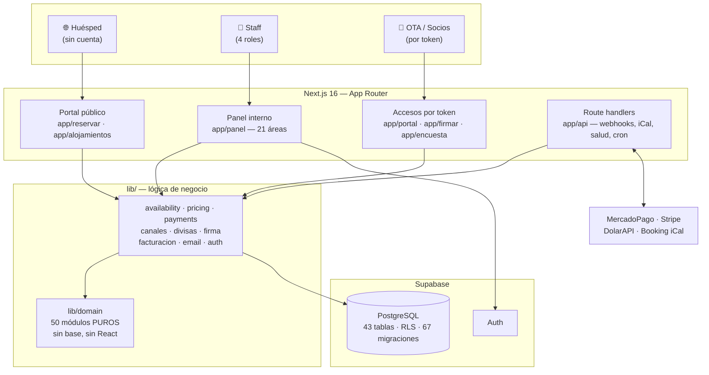

# Arquitectura

Aplicación web única en **Next.js 16 (App Router)** con **Supabase**
(PostgreSQL + Auth + RLS + Storage) como backend. Despliegue previsto en Vercel.

El principio que ordena todo lo demás: **la integridad crítica vive en la base de
datos, no en la aplicación.** La app puede tener un bug; la base tiene que
rechazar igual lo que no puede pasar.

---

## Vista general



---

## Las capas, y las reglas que las sostienen

```
app/rutas ──124──> app/panel/_components   (interfaz compartida)
          ──100──> lib/domain              (reglas puras)
          ───89──> lib/{auth,pricing,payments,email,firma,
                        facturacion,availability,canales,divisas}
          ───60──> lib/supabase            ← puentea la capa de datos (deuda conocida)

lib/servicios ──> lib/domain ──> lib/fechas
lib/supabase  ──> PostgreSQL + RLS
```

Tres reglas de dependencia, todas **verificables con `rg`** y no sólo declaradas:

1. **`lib/domain/` es puro.** No importa `@supabase/*`, ni `next/*`, ni `react`,
   ni `zod`. Son 50 módulos de reglas que se testean sin levantar una base. Es lo
   que permite tener 1555 tests que corren en segundos.
2. **`lib/` nunca importa de `app/`.** Cero excepciones, y hoy hay cero aristas.
3. **La lógica de negocio va en `lib/domain/`.** Las páginas y las acciones
   orquestan: leen, llaman al dominio, escriben. No calculan reglas.

`lib/supabase/admin.ts` usa la `service_role` y **saltea RLS**: es sólo de
servidor (marcado con `server-only`) y nunca recibe datos del usuario sin filtrar.

---

## Los dos frentes, separados a propósito

| | Panel interno | Portal público |
|---|---|---|
| **Ruta** | `app/panel` | `app/reservar`, `app/alojamientos` |
| **Quién entra** | Staff con sesión, por rol | Cualquiera, sin cuenta |
| **Qué ve** | Las 21 áreas que su rol permite | Catálogo, disponibilidad, checkout |
| **Datos** | Todo lo del hotel | Sólo el catálogo público |

La separación no es estética: el rol `anon` **no puede leer el precio neto de
agencia** ni ejecutar la función que cotiza una estadía. Eso lo impone la base,
no la pantalla ([ADR 0016](Decisiones-de-arquitectura)).

Las funciones cara al cliente —web check-in, encuestas de satisfacción— van en el
portal, nunca en la gestión.

Hay un tercer frente más chico: los **accesos por token**, para quien no tiene ni
puede tener cuenta —una agencia mirando su cuenta corriente, alguien firmando un
contrato, un huésped respondiendo una encuesta, un servidor de Booking leyendo el
calendario—. Un token inválido devuelve **404 y no 401**: un 401 confirmaría que
la ruta existe y que el token tenía la forma correcta.

---

## Cómo entra y sale la información

**Escrituras: Server Actions.** Hay 24 archivos `actions.ts`, uno por módulo. Cada
acción verifica el rol con `requerirAcceso(area)` —con una guarda estructural, no
por convención— valida con `zod` y **nunca descarta el error de la base**.

**Route handlers,** para lo que no es un formulario:

| Ruta | Para qué |
|---|---|
| `/api/webhooks/pagos/[proveedor]` | Confirmación de pago. Verifica firma HMAC y **falla cerrado** |
| `/api/canales/ical/[token]` | Feed iCal de ocupación que las OTA leen |
| `/api/cotizacion` | Tipo de cambio del día |
| `/api/cron/canales` | Sincronización programada de canales |
| `/api/respaldo` | Exportación de datos operativos |
| `/api/salud` | 200 si la base responde, 503 si no |

---

## Los siete puertos

Todo servicio externo entra por una **interfaz** con implementación
seleccionable por variable de entorno. Es lo que permite que el sistema esté
completo y testeado sin tener las cuentas contratadas.

| Puerto | Qué abstrae | Respaldo |
|---|---|---|
| `PaymentProvider` | Cobro en línea | Simulador · **MercadoPago y Stripe escritos** |
| `EmailProvider` | Envío de correo | Simulador |
| `FirmaElectronicaProvider` | Firma de contratos | Simulador |
| `FacturacionElectronicaProvider` | CAE de ARCA/AFIP | Simulador |
| `AsistenteProvider` | Asistente del portal | Reglas, **no LLM** ([ADR 0011](Decisiones-de-arquitectura)) |
| `CanalVentaProvider` | OTA (Booking) | Simulado |
| `CotizacionProvider` | Tipo de cambio | **Manual** — usa lo que cargó un admin |

Dos detalles que valen más que la tabla:

- **Los simuladores fallan fuerte en producción.** Si el entorno es productivo y
  la variable no está configurada, el sistema **no arranca**. Es deliberado: un
  comprobante simulado que parece fiscal es peor que un error
  ([ADR 0018](Decisiones-de-arquitectura)).
- **Los dos últimos no tienen simulador que mienta.** Sus fuentes son públicas y
  sin credenciales, así que el respaldo de divisas es *manual* —usa el valor que
  cargó un gerente, no uno inventado— y el de canales es *simulado*, que
  directamente no habla con nadie.

`PAGO_PROVIDER` es el único que admite **varios a la vez**
(`mercadopago,stripe`): el hotel es internacional y ninguna pasarela cubre las
dos puntas —la tarjeta del exterior y el pago en pesos con cuotas—.

---

## Agregar un área nueva del panel

Se toca en **cinco lugares, y cuatro tienen que moverse juntos** o el typecheck
falla (`Area` es una unión de tipos y la navegación un `Record<Area, …>`):

1. `lib/domain/permisos.ts` — el área, su etiqueta y qué roles la ven
2. `lib/domain/navegacion.ts` — el grupo del menú (hay un test que verifica cobertura)
3. `app/panel/_components/shell.tsx` — la ruta y el icono
4. `lib/domain/ayuda.ts` — el capítulo de la Ayuda
5. `app/panel/_components/iconos.tsx` — si el icono es nuevo

Y la estructura de un módulo: `page.tsx` (listado) · `nuevo/page.tsx` ·
`[id]/page.tsx` · `[id]/editar/page.tsx` · `actions.ts` · `loading.tsx` · su test.

---

## Interfaz

Todas las pantallas usan los mismos componentes (`Encabezado`, `Tarjeta`, `Kpi`,
`Tabla`, `Buscador`, `Paginacion`, `Chip`…) y la misma paleta azul y blanca
([ADR 0026](Decisiones-de-arquitectura)).

El principio de diseño lo fijó el usuario del sistema y es más restrictivo que el
habitual: **nada oculto, nada manejado por URL, pensado para gente que no usa
mucho la computadora.** En concreto — está prohibido esconder una acción o un
formulario detrás de un `<details>` (se eliminaron los once que había); el alta y
la edición van en **pantalla propia**; todo campo lleva **etiqueta visible**, nunca
sólo *placeholder*; y una acción sin vuelta atrás pide confirmación.
