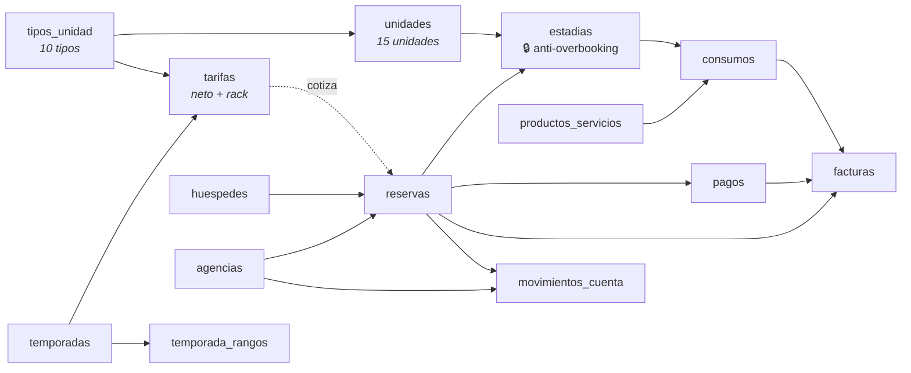

# Modelo de datos

**43 tablas**, todas con RLS activo, creadas por **67 migraciones SQL numeradas**
en `supabase/migrations/`. Nombres y comentarios en español, `snake_case`.

Una migración ya aplicada **no se edita nunca**: se crea la siguiente con el
número que sigue.

---

## El flujo central

Se lee así: una **reserva** es el acuerdo comercial con un huésped; una
**estadía** es la ocupación concreta de una unidad entre dos fechas. Son tablas
distintas porque una reserva de grupo genera varias estadías, y porque la
restricción que impide el overbooking se aplica sobre la ocupación, no sobre el
acuerdo.

---

## Las 43 tablas, por dominio

### Inventario y catálogo (7)

| Tabla | Qué guarda |
|---|---|
| `tipos_unidad` | Los 10 tipos: capacidad, categoría (hostería / cabaña), amenities |
| `unidades` | Las 15 unidades físicas, con piso y bloque |
| `temporadas` | Baja, media, alta |
| `temporada_rangos` | Las fechas de cada temporada, con **anti-solape** por restricción de exclusión |
| `tarifas` | Precio **neto** y **rack** por tipo y temporada, **sin IVA** |
| `promociones` | Descuentos aplicables |
| `politicas_cancelacion` | Los umbrales del tarifario, como datos y no como código |

### Reservas y huéspedes (4)

| Tabla | Qué guarda |
|---|---|
| `reservas` | El acuerdo: estado, canal, plan, garantía, segmento, VIP, desglose de ocupantes, total |
| `estadias` | **La ocupación**: unidad + período. Es donde vive la garantía anti-overbooking |
| `huespedes` | Datos personales, documento, residencia en el exterior |
| `reserva_huespedes` | Los acompañantes de una reserva |

### Dinero (7)

| Tabla | Qué guarda |
|---|---|
| `pagos` | Cada cobro. `monto` **siempre en USD**; lo realmente cobrado va en `monto_cobrado` + `moneda` + `cotizacion` |
| `facturas` | Comprobantes, **inmutables** y con numeración sin huecos por exigencia fiscal |
| `consumos` | Lo que el huésped consume durante la estadía |
| `productos_servicios` | El catálogo de lo consumible |
| `cotizaciones` | El tipo de cambio, con su fuente declarada |
| `movimientos_cuenta` | Cuenta corriente de agencias |
| `movimientos_proveedor` | Cuentas por pagar |

### Socios (2)

`agencias` · `proveedores` — ambas con un `token` para el portal de socios, que
**tiene el `select` revocado por columna**: ni siquiera el staff lo lee con su
propio cliente.

### Punto de venta (2)

`puntos_venta` · `departamentos` — la jerarquía de departamentos es de **dos
niveles, con un trigger que rechaza el tercero**. Un árbol arbitrario obligaría a
consultas recursivas en la cuenta del huésped, y el hotel no lo necesita.

### Operación diaria (6)

`ordenes_mantenimiento` · `planes_mantenimiento` (preventivo) ·
`objetos_perdidos` · `encuestas_satisfaccion` (NPS) · `avisos` (internos) ·
`mensajes` (conversaciones del staff en tiempo real).

### Contratos (2)

`contratos` · `firmas` — la firma electrónica es por token, con verificación de
integridad por hash.

### Canales de venta (8)

`canales` · `canal_config` · `canal_reservas` · `canal_sincronizaciones` ·
`canal_mensajes` · `canal_resenas` · `canal_cargos` · `canal_mapeos_columnas`.

Todas revocan el `select` a `anon` explícitamente.

### Sistema (5)

| Tabla | Qué guarda |
|---|---|
| `perfiles` | El rol de cada usuario. Un alta nace `sin_rol` y `activo = false` |
| `auditoria` | Rastro **append-only** de operaciones sensibles: el staff lee, no escribe |
| `intentos_limitados` | Límite de tasa por IP, atómico (inserta y después cuenta) |
| `consultas_bot` | Lo que le preguntan al asistente del portal |
| `respaldos` | El registro de cada exportación de datos operativos |

---

## Las garantías que impone la base

Esto es lo que hace que el sistema pueda confiar en sus propios datos aunque la
aplicación falle.

### 1. Anti-overbooking, por restricción de exclusión

Sobre `estadias`: `unidad_id WITH =, periodo WITH &&`, limitada a los estados que
ocupan inventario. **Dos estadías no pueden solapar la misma unidad.** Lo rechaza
Postgres, así que da igual si el error viene de la pantalla, de la API, de una
importación o de una consulta escrita a mano ([ADR 0002](Decisiones-de-arquitectura)).

Los estados que ocupan son `pendiente`, `confirmada`, `pagada` e `in_house`.
`cancelada`, `no_show` y `checkout` liberan la unidad.

### 2. `check_in` y `check_out` son columnas **generadas**

Se derivan de `periodo` y **no se pueden escribir**. Esa es la garantía de que no
se desincronizan.

Existen porque PostgREST no expone `lower()` de un rango: sin ellas, «las que
llegan hoy» había que escribirlo con operadores de rango negados, donde un signo
cambiado da un resultado **plausible y equivocado**.

### 3. No se borra dinero

El rol `authenticated` **no tiene `delete`** sobre reservas, estadías, pagos,
agencias, proveedores, tarifas ni perfiles. El camino es la máquina de estados o
la baja lógica. Lo que sí se borra —consumos, huéspedes, avisos, rangos de
temporada, mapeos— queda **auditado por trigger**.

### 4. Nunca se guarda un número de tarjeta

Hay un **test-contrato** que recorre las 67 migraciones y falla si aparece una
columna que pueda contener uno, más restricciones en la base que rechazan doce o
más dígitos seguidos. Es lo que mantiene al hotel dentro del alcance **SAQ-A de
PCI-DSS** ([ADR 0025](Decisiones-de-arquitectura)).

### 5. Las facturas son inmutables y su numeración no tiene huecos

Y es lo contrario de la numeración de comandas del punto de venta, que **sí admite
huecos** porque es una secuencia. Son dos mecanismos distintos a propósito: uno
responde a una exigencia fiscal y el otro no. No hay que intercambiarlos.

---

## Reglas de escritura, para quien programe acá

- **RLS activado en todas las tablas.** Lectura pública sólo del catálogo; los
  datos personales, nunca.
- En local hay que declarar los `GRANT` a `anon` / `authenticated` /
  `service_role`; en la plataforma los aplica ella. La seguridad real la impone
  RLS, no el `GRANT`.
- **`alter type ... add value` y el primer uso de ese valor no van en la misma
  migración.** El CLI envuelve cada archivo en una transacción y Postgres corta
  con SQLSTATE 55P04 — y el `db reset` **no aplica nada de lo que sigue**. En
  cambio `create type` sí puede usarse en el archivo que lo crea.
- **Dos migraciones con el mismo número no conviven.** Supabase registra la
  versión por el prefijo, da la segunda por aplicada y **la saltea en silencio**.
- **Contar filas es `count: 'exact', head: true`.** PostgREST corta en 1000 filas
  con HTTP 200 y sin aviso: contar en JavaScript da un número equivocado a partir
  de la fila 1001 y nada falla. Hay un test que lo demuestra.

Más trampas de este tipo, en [Preguntas frecuentes](Preguntas-frecuentes).
