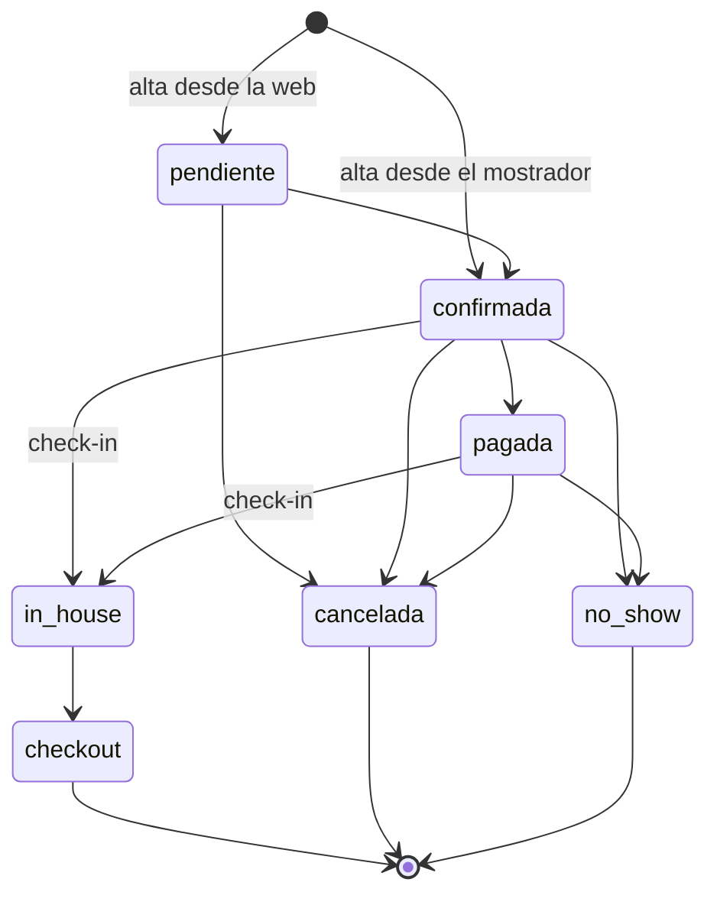

# Reglas de negocio

Todas viven en `lib/domain/`, en módulos **puros**: sin base de datos, sin React,
sin `zod`. Se testean solas y las pantallas sólo las muestran.

---

## La máquina de estados de una reserva

**Cuatro estados ocupan inventario** y bloquean la unidad en el motor
anti-overbooking: `pendiente`, `confirmada`, `pagada` e `in_house`. Los otros tres
—`cancelada`, `no_show`, `checkout`— la liberan.

### ⚠️ `pendiente → pagada` no existe

Hay que pasar por `confirmada`. Una reserva de la web nace `pendiente`, así que
cuando se conectó el cobro en línea el salto directo **se descartaba en silencio**:
la reserva quedaba pendiente, la expiración liberaba la unidad a los cinco días y
el hotel la revendía **con el importe del huésped ya cobrado**.

Se resuelve con `caminoDeEstados` + `estadoSegunPagos`, nunca con un `update` de
estado a mano.

---

## Precios

### Doble tarifa: neto y rack

| | Para quién | Cómo se aplica |
|---|---|---|
| **Neto** | Agencias y operadores | Lo define el canal de la reserva |
| **Rack** | Mostrador y web propia | Lo define el canal de la reserva |

Ninguna de las dos incluye IVA: **`tarifas.precio_rack` se guarda sin IVA** y el
impuesto se suma al cotizar ([ADR 0004](Decisiones-de-arquitectura)).

🔒 **El precio neto está fuera del alcance del rol público.** `anon` no puede leer
la columna `precio_neto` ni ejecutar la función que cotiza una estadía: eran los
dos caminos por los que se filtraba el precio mayorista a cualquiera que abriera
la web ([ADR 0016](Decisiones-de-arquitectura)).

### Temporadas

Tres —baja, media, alta— con sus rangos de fecha, protegidos por una restricción
que impide que se solapen.

Los rangos son **`[desde, hasta)`, con el fin excluido**. Para mostrarlos va
`textoRango()`, que resta el día: si no, una temporada que termina el 30 de
noviembre se anuncia terminando el 1 de diciembre.

⚠️ **Junio, julio y agosto no tienen temporada, a propósito.** El tarifario del
hotel (Anexo A) no publica precio de invierno. Consecuencia operativa: en esos tres
meses **el sistema no cotiza** y el portal ofrece «consultar» en vez de inventar un
número.

### IVA

Se calcula en el dominio y **nunca se almacena sumado**, para que
`neto + iva = total` siga siendo verificable.

**La exención al turista del exterior se deriva, no se tilda.** No existe ni debe
existir un campo «exento»: sale de `huespedes.residente_exterior` +
`reservas.pago_desde_exterior`. Un extranjero que paga en efectivo **no está
exento**, y ése es el error caro ([ADR 0024](Decisiones-de-arquitectura)).

En la factura, `exento` es un **subconjunto de `neto`**, no un sumando.

### Monedas

**USD es la base.** El precio de lista está en dólares y el saldo de una reserva se
mide en dólares, siempre.

El cobro puede ser en pesos, a la cotización del día, que sale de una fuente
pública con respaldo manual: si la fuente no responde, el sistema **usa el valor
que cargó un admin** en vez de inventar uno, y la pantalla declara de dónde salió
([ADR 0020](Decisiones-de-arquitectura)).

⚠️ **`pagos.monto` está SIEMPRE en USD**, sin importar en qué moneda se cobró. La
función que decide si la reserva quedó saldada suma esa columna y **no mira la
moneda**: un cobro de ARS 350.000 guardado ahí se sumaría como si fueran dólares y
el huésped se iría sin pagar. Lo que realmente pasó por la pasarela va en
`monto_cobrado` + `moneda` + `cotizacion`, con `check` en la base que lo obligan.

⚠️ **La cotización se congela al crear el link de pago, no al confirmarlo.**
Recalcularla movería el saldo con el dólar del día siguiente, y no habría forma de
explicar de dónde salió el importe que lo saldó.

---

## Política de cancelación

La del Tarifario Blanca Patagonia, modelada como umbrales en la base y no como
código:

| Cuándo cancela | Cargo |
|---|---|
| Más de 14 días antes del check-in | Sin cargo |
| Entre 14 y 7 días | La primera noche |
| Dentro de los 7 días | 100 % de la estadía |
| No-show | 100 % de la estadía |

Se aplica la primera regla —ordenadas de mayor a menor umbral— cuyo umbral sea
menor o igual a los días de anticipación.

La pantalla muestra **la vista previa del cargo antes de confirmar la
cancelación**: quien atiende tiene que poder decirle al huésped cuánto se le cobra
antes de confirmar la operación.

⚠️ Un detalle de unidades que fue un bug real: el precio por noche que se guarda
está **sin IVA y promediado**, mientras que el total de la reserva **sí** lleva
IVA. Pasarlos juntos a la regla comparaba peras con manzanas y le anunciaba al
huésped un número mal calculado.

---

## Garantía de la reserva

Cinco tipos: `sin_garantia`, `tarjeta`, `deposito`, `agencia`, `contrato`. Los
cuatro últimos son **cobrables**: es el dato que dice si hay de dónde cobrar un
no-show.

🔒 **Nunca se guarda un número de tarjeta.** La verificación es por
**preautorización tokenizada**: el hotel guarda un token, no un PAN. Y el simulador
**declara que no puede verificar**, en vez de inventar un «válida»
([ADR 0025](Decisiones-de-arquitectura)).

---

## Ocupantes

El desglose es **adultos / menores / bebés**, por separado, porque cada uno paga
distinto.

⚠️ **Los bebés no cuentan para la ocupación**: `estadias.huespedes` se deriva de
`adultos + menores`. No hay un `check` en la base que lo garantice, y fue
deliberado —habría roto las mudanzas de habitación y las reprogramaciones—. La
coherencia se garantiza en `crear_reserva`, que es el **único** lugar donde nacen
estadías. Si algún día se agrega otro camino de alta, hay que replicar la
derivación ahí.

---

## La cuenta del huésped

- **Folios A y B**, con división de cuenta: en una habitación compartida, uno paga
  lo suyo y el otro lo suyo.
- Los consumos se agrupan por **departamento**, en una jerarquía de dos niveles.
- ⚠️ **La cuenta se cierra con la FACTURA, no con el check-out.** Es lo que permite
  cobrarle el desayuno al que llegó a las 9 de la mañana y al que se va a las 10.

---

## Comisión de canal

Se contabiliza **en dos capas**: lo que el huésped paga y lo que el canal se lleva
son dos hechos distintos, y mezclarlos hace que el ingreso reportado no cierre con
lo que entró a la cuenta ([ADR 0023](Decisiones-de-arquitectura)).

---

## Reservas pendientes y expiración

Una reserva de la web nace `pendiente` y **bloquea la unidad**. Si no se confirma,
expira a los cinco días y libera el inventario.

Ese mecanismo es también el motivo del **límite de tasa** en el alta pública. El
caso que lo motivó no era spam: con 15 unidades, unas decenas de reservas
pendientes falsas dejaban al hotel **sin inventario vendible durante una semana**.
